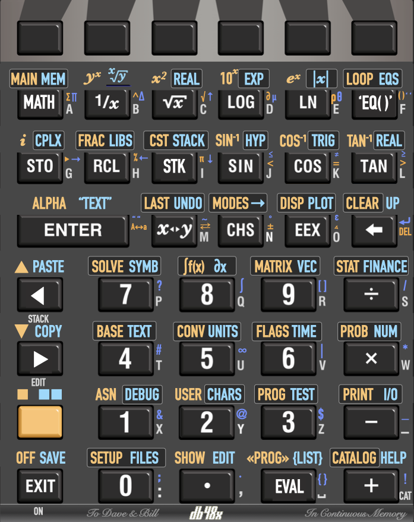

# DB48X on DM42

The DB48X project intends to rebuild and improve the user experience of the
legendary HP48 family of calculators, notably their "Reverse Polish Lisp" (RPL)
language with its rich set of data types and built-in functions.

The project in this repository is presently targeting the [SwissMicro DM42
calculator](https://www.swissmicros.com/product/dm42), and leveraging its
built-in software platform, known as
[DMCP](https://technical.swissmicros.com/dmcp/doc/DMCP-ifc-html/).

In the long-term, the vision is to be able to port DB48X on a number of
[different physical calculator platforms](https://www.youtube.com/watch?v=34pPycq8ia8),
like the ARM-based
[HP50 and related machines (HP49, HP48Gii, etc)](https://en.wikipedia.org/wiki/HP_49/50_series),
and the [HP Prime](https://en.wikipedia.org/wiki/HP_Prime)
(at least the G1, since the G2 seems a bit more locked down), maybe others.
The basis for that work can be found in the [DB48X](../db48x) project.

This project was presented at [FOSDEM 2023][fosdem]

[fosdem]: https://fosdem.org/2023/schedule/event/reversepolishlisp/

## Why name the project DB48X?

DB stands for "Dave and Bill", who are more commonly known as Hewlett and
Packard. The order is reversed compared to HP, since they reportedly chose the
order at random, and it's about time Dave Packard was given preeminence.

One of Dave and Bill's great legacy is a legendary series of calculators.
The [HP48](https://en.wikipedia.org/wiki/HP_48_series) remains one of my
favorites, notably for its rich built-in programming language, known as [Reverse
Polish Lisp (RPL)](https://en.wikipedia.org/wiki/RPL_(programming_language)).
This project aims at recreating a decent successor to the HP48, at least in
spirit.

## State of the project

This is currently **UNSTABLE** and **INCOMPLETE** software. Please only consider
installing this if you are a developer and interested in contributing. Or else,
have a paperclip at hand just in case you need to reset your calculator.

The detailed current status is described in the [STATUS file](STATUS.md).

## How to build this project

There is a separate document explaining [how to build this project](BUILD.md).
The simulator includes a test suite, which you should run before submitting
patches. To run these tests, pass the `-T` option to the simulator, or hit the
**F12** key in the simulator.

## Design overview

The objective is to re-create an RPL-like experience, but to optimize it for the
existing DM42 physical hardware, with minimal changes in the keyboard
layout. Ideally, db48x should be fully usable without a keyboard overlay. though
one is [being worked on](Keyboard-Layout.png).

Compared to the original HP48, the DM42 has a much larger screen but all bitmap
(no annunciators). It has a keyboard with dedicated soft-menu (function) keys,
but has only one shift key, lacks a dedicated alpha key, has no left or right
arrow keys (only up and down), and no `SPC` (space) key.

### Keyboard interaction

The keyboard differences force us to revisit the user interaction with the
calculator compared to the HP48:

* The single *Shift* key cycles between **Shift**, **Right Shift** and no shift.
  This double-shift shortcut appears necessary because RPL calculators like the
  HP48 have a rather full keyboard even with two shift keys. In the rest of this
  document, **Right Shift** refers to the state where the annunciators
  contains an indicator that looks like HP's right shift key. This will be used
  for less-frequently used functions and menu.

* Since RPL uses Alpha entry a lot more than the HP42, making it quickly
  accessible seems important, so holding the *Shift* key enters Alpha mode.
  Entering names can be done quickly using the `XEQ` key, which automatically
  enters **Alpha** mode. This is intended to be reminiscent of the usage of
  `XEQ-Alpha` on the HP41 series. You can usefully remember `XEQ` as meaning
  _eXpression/EQuation_ on DB48X.

* It is also possible to enter Alpha mode with **Shift `ENTER`** to match
  the labelling on the DM42. Furthermore, repeating **Shift `ENTER`** also
  cycles between uppercase and lowercase alphabetical entry.

* Alpha mode is always sticky. In other words, there is no equivalent of the
  HP48's "single-Alpha" mode. This is true whether you enter it with a long
  shift or using *Shift* `ENTER`. Alpha mode is also exited when pressing
  `ENTER` or `EXIT`.

* Since the DM42's Alpha keys overlap with the numeric keys, as well as with and
  `×` and `÷`, using **Shift** in Alpha mode brings back numbers and the four
  arithmetic operators. This means **Shift** cannot be used for lowercase, hence
  the **Shift `ENTER`** shortcut to switch cases.

* The `🔼` and `🔽` keys are generally interpreted as `◀️` and `▶️` instead.
  To get `🔼` and `🔽` functionality, use **Shift**. When not editing, `🔼` and
  `🔽` behave like they do on the HP48, where `🔼` enters the _Interactive
  stack_ mode, and `🔽` edits an object.

* Long-pressing arrow keys, the **⭠** (**Backspace**) or text entry keys in
  Alpha mode activates auto-repeat.

* Long-pressing keys that would directly trigger a function (e.g. `SIN`),
  including function keys associated with a soft-menu, will show up the built-in
  help for the corresponding function.

* Some keys that have little use or no direct equivalent for RPL are remapped,
  trying to preserve a meaning that is close to the original while maximizing
  typing efficiency. For example, **Σ+** is mapped to the `MathMenu` and
  shift-mapped to `MainMenu` and `MemMenu`. `XEQ` can be used to enter algebraic
  expressions and equations, and is shift-mapped to `BranchesMenu` and
  `EquationsMenu`. The planned keyboard layout on DB48X is shown below. This is
  still subject to changed based on actual usage. Feedback is welcome.

### Soft menus

The DM42 has 6 dedicated soft-menu keys at the top of the keyboard. Most of the
advanced features of DB48X can be accessed through these soft menus.

Menus are organized internally as a hierarchy, where menus can refer to other
menus. A special menu, `MainMenu`, accessile via the **Σ-** key label
(Shift-**Σ+**), contains all other menus.

Menus can contain up to 12 entries at once, 6 being directly accessible, and 6
more being shown when using the Shift key. Since function keys are designed for
rapid access to features, a right-shift access does not really make sense,
since that would require a long press of the shift key. A long press on a
function key invokes the on-line help for the associated function.

When a menu contains more than 12 entries (which rarely happens, built-in menus
being designed to avoid that situation, but can happen for example for the
`VariablesMenu` listing user variables), then the F6 function key turns into a
`▶︎`, and into `◀`︎ when shifted. These keys can be used to navigate across the
available menu entries.

For example:

* A softkey menu containing 6 entries or less, such as the `DirectoryPathMenu`,
  which contains `CurrentPath`, `CreateDir`, `PurgeDir`, `VariableList`,
  `TypedVariables` and `OrderVariables`, would show (using short names for menu
  labels) as `Path` `CrDir` `PgDir`, `Vars`, `TVars`, `Order`. Since there are
  6 entries or less, Shift has no effect.

* A softkey menu containing between 6 and 12 entries, such as the `MathMenu`,
  would show the first six entries, `VectorMenu`, `MatrixMenu`, `ListMenu`,
  `HyperbolicMenu`, `RealMenu`, `BasedNumbersMenu`, showing in short form as
  `Vectr`, `Matrx`, `List`, `Hyp`, `Real`, `Base`. Hitting the Shift key would
  have the same effect as the **NXT** key on the HP48, showing the four
  remaining entries, `ProbabilitiesMenu`, `FastFourierTransformMenu`,
  `ComplexMenu`, `ConstantsMenu`, showing in short form as `Proba`, `Fourier`,
  `Complex`, `Constants`.

* An `ExampleMenu` containing the spelling of thirty numbers in English would
  show `One`, `Two`, `Three`, `Four` and `Five` for keys **F1** through **F5**,
  and `▶` for key **F6**. With Shift, it would show `Six`, `Seven`, `Eigh`,
  `Nine`, `Ten` and `◀`︎︎. Hitting `▶` with **F6** would switch to the next ten
  elements, `Eleven`, `Twelve`, `Thirteen`, `Fourteen`, `Fifteen` and `▶`,
  with Shift showing `Sixteen`, `Seventeen`, `Eighteen`m `Nineteen`, `Tzenty`
  and `◀`. The Shift **F6** key would return to the previous ten entries
  beginning with `One`, the **F6** key would go to the next ten entries
  beginning with `TwentyOne`.

The `Variables` menu is special in the sense that selecting an entry evaluates
that menu entry, while Shift recalls its name without evaluating it. This is one
case where right shift applies to a function key, and is used to directly
store a value in the associated variable. As a result, at most 5 variables are
shown at a time, the Shift state showing the variable name with tick marks, like
`'X'`, and the right-shift state  showing the variable name with a `Store`
indicator, as in `▶︎X`.

For example, if the first variable is called `X` and contains the program
`« 1 + »`, then

1. typing `3` and hitting **F1** with show `4`, having evaluted the program in
   `X` which adds one to the value on the stack. The associated label is `X`.

2. The shifted menu entry associated to **F1** will be labelled `X▶`, and it
   will _recall_ the value of `X` on the stack, i.e. the program `« 1 + »` in
   our case.

3. The right-shifted menu entry associated to **F1** will be labelled `▶X`, and
   it will _store_ the top of stack in `X`.

When editing a program, the first operation would generate `X` in the program
code, the second operation would generate `'X' Recall`, and the third operation
would generate `'X' Store`.

### Some design differences with the original HP48

There are a number of intentional differences in design compared to the HP48:

* DB48X features an extensive built-in help system. The built-in help uses a
  restricted [Markdown](https://www.markdownguide.org) syntax, which makes it
  very compact, and it is generated by combining files under the [docs](doc/)
  directory. For example, the introduction section comes straight from
  [this file](docs/0-Overview.md). This approach ensures that the on-line help
  is consistent with what is shown on this web site. Softmenu keys are used to
  navigate the links in the on-line help.

* Many RPL commands and functions exist in short and long form, and a user
  preference selects how a program shows. For example, what the HP48 calls `NEG`
  can display, based on user preferences, as `NEG`, `neg`, `Neg` or
  `Negate`. The on-line help [generally refers](doc/commands/base.md##Negate) to
  the long-form and indicates the historical HP-48 form in parentheses.

* Inspired by [newRPL](../db48x), DB48X features a **Catalog** of functions with
  auto-completion, which is available with the `Catalog` function (`Shift +`).
  When in alpha mode, simply hitting the `+` key activates the catalog. As you
  type, the soft key menus are populated with available functions that match
  what you typed. For example, if you type `A`, you will see `+` (because it is
  also named `Add`), `abs`, `and`, and so on. If you type `B`, you will then see
  the function `ABS`, which you can select by hitting the **F1** key.

* The DB48X dialect of RPL is not case sensitive, but it is case-respecting. For
  example, if your preference is to display built-in functions in long form,
  typing `inv` or `INV` will show up as `Invert` in the resulting program. If
  you have a named variable called `FooBar`, typing `foobar` will compile as a
  program that refers to `FooBar`.

* Internally, the calculator deals with various representations for
  numbers. Notably, it will keep integer values and fractions in exact form for
  as long as possible.

  * When adding `1` and `2`, the internal representation of
    the result is an integer, which uses less memory and allows faster
    computations.

  * And integer will be promoted to a floating-point value only if you use a
    function that requires it, like `exp`.

  * Performing a division like `8` divided by `4` will result in an integer.

  * Performing a division between integers with a remainder will keep the result
    in reduced fraction form, for example `3/4` or `7/31`.

* The calculator currently features 3 floating-point precisions using 32-bit,
  64-bit and 128-bit respectively, but performs computations using the 128-bit
  format.

  * Long-term, variable floating-point precision as in newRPL will probably be
    implemented.

  * The selection of which precision to use for floating-point numbers will be
    decided by the `SetPrecision` function when converting from integer or
    fraction.

  * The precision of numbers stored in a program will be based on user
    input. For example, storing `1.3` in a program will always use the 32-bit
    floating-point format, since it's sufficient for that number.

* Based numbers like `#123h` keep their base, which makes it possible to show on
  stack binary and decimal numbers side by side. Mixed operations convert to the
  base in stack level X, so that `#10d #A0h +` evaluates as `#AAh`.

* The storage of data in memory uses a denser format than on the HP48.
  Therefore, objects will almost always use less space on DB48X.

  * The most frequently used RPL functions and data types consume only one byte,
    as opposed to 5 nibbles, or 2.5 bytes, on HP's implementation.

  * No built-in command requires more than two bytes, as opposed to 2.5 bytes on
    HP's implementation.

  * Lengths are also coded more efficiently. For example, a string like
  `"Hello"` requires only 7 bytes on DB48X, as opposed to 10 bytes on an HP48.

  * In general, there will be no effort made to make the internal representation
    match the historical binary representation in the HP-48 calculators, which
    varies between generations of the calculator.

* The garbage collector is very simple, and moves objects in use only once per
  collection cycle. Memory allocation is also streamlined.

* In addition to algebraic expressions, DB48X might one day gain Support for
  algebraic-style programs, using a general parser derived from the
  [XL programming language](https://github.com/c3d/xl).

* There are several minor changes to RPL, e.g. using `=` for equality test in
  addition to `==`, where `==` means "same object representation", and `=` means
  "mathematically equal" (thus, `0=-0` is true, but `0==-0` is false). Ideally,
  such changes will be documented in the help associated with each command.

* Like later generations of HP RPL calculators, DB48X can perform integer
  arithmetric with arbitrary precision. Unlike HP calculators, this support
  extends to based numbers. For example, you can multiply two 128-bit numbers
  safely and get a 256-bit result if necessary.

* Support for extended-precision integer and floating-point numbers, with at
  least 30+ digits decimal 128 is already working. It uses a decimal
  representation for "human-friendly" rounding. Ideally, there will some day be
  support for variable-precision floating-point computations.

* DB48X borrows to the DM42 the idea of _special variables_, which are variables
  with a special meaning. For example, the `Precision` special variable is the
  current operating precision for floating point, in number of digits. While
  there is a `SetPrecision` command, it is also possible to use `'Precision'
  STO`. This does not imply that there is an internal `Precision` variable
  somewhere. This will be used for a number of settings.

* All built-in soft-key menus are named, with names ending in `Menu`. For
  example, the `VariablesMenu` is the menu listing global variables in the
  current directory. There is no menu number, but the `Menu` special variable
  holds the name of the current menu, and `LastMenu` the name of the previous
  one.

* The DB48X also provides full-screen setup menus, taking advantage of the DM42
  existing system menus. It is likely that the same menu objects used for
  softkey menus will one day be able to control system menus, with a different function
  to start the interaction.

* The whole banking and flash access storage mechanism of the HP48 will be
  replaced with a system that works well with FAT USB storage. It should be
  possible to directly use a part of the flash storage to store RPL programs
  directly, either in source or compiled form.

## Other documentation

There is DMCP interface doc in progress see [DMCP IFC doc](http://technical.swissmicros.com/dmcp/doc/DMCP-ifc-html/)
(or you can download html zip from [doc directory](http://technical.swissmicros.com/dmcp/doc/)).

The [source code of the `DM42PGM` program](https://github.com/swissmicros/DM42PGM)
is also quite informative about the capabilities of the DMCP.
