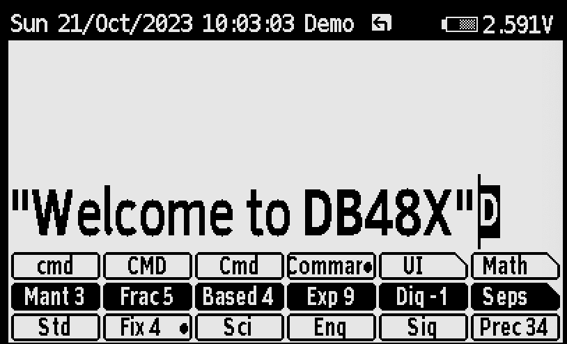

# Overview

## DB48X on DM42

The DB48X project intends to rebuild and improve the user experience of the
legendary HP48 family of calculators, notably their *"Reverse Polish Lisp"*
 [(RPL)](#Introduction-to-RPL)
language with its rich set of data types and built-in functions.

This project is presently targeting the **SwissMicro DM42 calculator**
and leveraging its built-in software platform, known as **DMCP**. This is
presumably the calculator you are currently running this software on.

## Table of contents

* [Using the on-line help](#help)
* [Quickstart guide](#quickstart-guide)
* [State of the project](#state-of-the-project)
* [Design overview](#design-overview)
* [Keyboard interaction](#keyboard-interaction)
* [Soft menus](#soft-menus)
* [Differences with other RPLs](#differences-with-other-RPLs)
* [Built-in help](#help)
* [Acknowledgements and credits](#acknowledgements-and-credits)
* [Release notes](#release-notes)
* [Performance](#performance-measurements)

## State of the project

This is currently **SEMI-STABLE** software, meaning that the implemented
features appear to work somewhat reliably, but that some features are still
being added with each new release. This is **NOT PRODUCTION READY** and should
not be used for any mission-critical computation.

At this point in time, you should only installing this if you are interested in
contributing to the project, whether it is in the form of code, feedback or
documentation changes. Please refer to the web site of the project on GitHub or
GitLab for details and updates. The best way to
[report an issue](https://github.com/c3d/DB48X-on-DM42/issues),
[request an improvement](https://github.com/c3d/DB48X-on-DM42/issues/new)
or [submit a proposed change](https://github.com/c3d/DB48X-on-DM42/pulls) is
on the project's [GitHub page](https://github.com/c3d/DB48X-on-DM42).

The [implementation status](#implementation-status) section categorizes all the
RPL commands in the HP50G and in DB48X into "implemented", "not implemented" and
"DB48X only" lists.

## Design overview

The objective is to re-create an RPL-like experience, but to optimize it for the
existing DM42 physical hardware.
<!--- DM42 --->
Ideally, DB48X should be fully usable without a
keyboard overlay. though one is
[being worked on](https://github.com/c3d/DB48X-on-DM42/blob/stable/Keyboard-Layout.png).

Compared to the original HP48, the DM42 has a much larger screen, but no
annunciators (it is a fully bitmap screen). It has a keyboard with dedicated
soft-menu (function) keys, but only one shift key (whereas the HP48 has two),
lacks a dedicated alpha key, does not provides left or right arrow keys (only up
and down), and has no space key (_SPC_ on the HP48).
<!--- !DM42 --->
<!--- DM32 --->
The DM32 keyboard layout is really different compared to the DB48X expected
layout. For example, the DM32 does not have unshifted arrow keys, and has two
shift keys. For that reason, when running DB48X on a DM32, it is highly
recommended to use a
[keyboard overlay](https://github.com/c3d/DB48X-on-DM42/blob/stable/Keyboard-Layout.png).

Compared to the original HP48, the DM32 has a much larger screen, but no
annunciators (it is a fully bitmap screen). It has a keyboard with dedicated
soft-menu (function) keys, but no arrow keys (whereas the HP48 has four),
lacks a dedicated alpha key, and has no space key (_SPC_ on the HP48).
<!--- !DM32 --->

## Keyboard interaction

The keyboard differences force us to revisit the user interaction with the
calculator compared to the HP48:

<!--- DM42 --->
* When running DB48X on the DM42, the single yellow shift key cycles between
  three states, *Shift* (shown in the documentation as 🟨), *Right Shift* (shown
  in the documentation as 🟦), and no shift.  This double-shift shortcut appears
  necessary because RPL calculators like the HP48 have a rather full keyboard
  even with two shift keys.
<!--- !DM42 --->

<!--- DM32 --->
* When running DB50X on the DM32, the blue shift key cycles between three
  states, *Shift* (shown in the documentation as 🟨), *Right Shift* (shown in
  the documentation as 🟦) and no shift. The physical yellow shift key is
  actually used as a down/right cursor key, and will be shown as _▶︎_ in the rest
  of this document. Similarly, the _XEQ_ key is used as an up/left cursor key,
  and will be shown as _◀︎_ in the rest of this document. This remapping of keys
  appears necessary because RPL calculators like the HP48 are command-line
  oriented and absolutely need at least two unshifted cursor keys. Sacrificing a
  physical shift key while preserving two shifted function seems like the best
  compromise.
<!--- !DM32 --->

* A first press on the shift key is shown as 🟨 in the documentation, and
  activates functions shown in yellow in the keyboard overlay. A second press is
  shown as 🟦 in the documentation, and activates functions shown in blue in the
  keyboard overlay. On the screen, the shift state is indicated in the header
  area. When a [soft menu](#soft-menus) is visible on the screen, the selected
  row of functions is highlighed.

In the rest of this document, the shift key is referred to as 🟨, and pressing
it twice is referred to as 🟦, irrespective of the appearance of the physical
shift key on your particular hardware.

Other aspects of the keyboard interaction are fine-tuned for RPL usage:

* Since RPL uses alphabetic entry (also called *Alpha* mode) a lot more
  frequently than on RPN models like the HP41 or HP42, making it quickly
  accessible seems important, so there are
  [three distinct ways to activate it](#alpha-mode).

<!--- DM42 --->
* The _▲_ and _▼_ keys move the cursor *left* and *right* while editing
  instead of *up* and *down*. These cursor movements are much more useful for a
  text-based program editing as found in RPL. In the rest of this document,
  they are described as _◀︎_ and _▶︎_ respectively.
<!--- !DM42 --->

* Using 🟨 _◀︎_ and 🟨 _▶︎_ moves the cursor up and down.  When not editing, _◀︎_
  and _▶︎_ behave like _▲_ and _▼_ on the HP48, i.e. _◀︎_ enters the *interactive
  stack* (not yet implemented) and _▶︎_ edits the object on the first level of
  the stack.

* Long-pressing arrow keys, the _←_ (also known as *Backspace*) or text entry
  keys in Alpha mode activates auto-repeat.

* Long-pressing keys that would directly trigger a function (e.g. _SIN_),
  including function keys associated with a soft-menu, will show up the
  [built-in help](#help) for the corresponding function.

### Alpha mode

Entering alphabetic characters is done using *Alpha* mode. These alphabetic
characters are labeled on the right of each key on the DM42's keyboard.

When *Alpha* mode is active, an _ABC_ indicator shows up in the annunciator area
at the top of the screen. For lowercase entry, the indicator changes to
_abc_.

There are three ways to enter *Alpha* mode:

* The first method is to use 🟨 _ENTER_ as indicated by the _ALPHA_ yellow label
  on the DM42 ENTER key. This cycles between *Alpha* _ABC_, *Lowercase* _abc_
  and *Normal* entry modes.

* The second method is to hold 🟨 for more than half a second. This cycles
  between *Alpha* _ABC_ and *Normal* entry modes, and cannot be used to type
  lowercase characters.

* The third method is to hold one of the arrow keys _◀︎_ or _▶︎_ *while* typing on
  the keyboard. This is called *transient alpha mode* because *Alpha* mode ends
  as soon as the arrow key is released. Using _◀︎_ enters uppercase characters,
  while _▶︎_ uses lowercase characters.

There is no equivalent of the HP48's "single-Alpha" mode. Alpha mode is either
_transient_ (when you hold one of the arrow keys) or _sticky_ (with 🟨 _ENTER_
or by holding 🟨).

Alpha mode is cancelled when pressing _ENTER_ or _EXIT_.

Since the DM42's alphabetic keys overlap with the numeric keys (unlike the
HP48), as well as with operations such as _×_ and _÷_, using 🟨 in Alpha mode
brings back numbers. This means 🟨 cannot be used for lowercase, but as
indicated above, there are two other methods to enter lowercase
characters.

Using 🟨 or 🟦 in combination with keys other than the numeric keypad
gives a variety of special characters.

### Key mapping

The layout of keys on DB48X was carefully chosen to offer a good compromise
between immediate applicability for calculations and giving access to numerous
advanced functions through menus.

DB48X keyboard overlays for DM-42 and DM-32 SwissMicros calculators are
[already available](https://www.hpmuseum.org/forum/thread-20113.html).

In the rest of this document, keys bindings will usually be described using the
alphabetic key, to make it easier to locate on the keyboard, followed by the
standard label on the DB48X layout. For example, the assignment for the `sin`
function will be described as _J_ (_SIN_). The shifted functions of the same key
will be described as 🟨 _J_ (_SIN⁻¹_) or 🟦 _J_ (_HYP_) respectively.

In some cases, the label between parentheses may refer to another calculator
model, which will be indicated as follows. For example, the _A_ key can be
described as _A_ (_⚙️_, DM-42 _Σ+_, DM-32 _√x_).

<!--- DM42 --->
However, if you are using DB48X on a DM42, it is possible to do it without a
keyboard overlay, because great care was taken to have the DB48X keboard layout
remain close to that of the DM42, in order to preserve muscle memory. New
features were positioned on the keyboard at positions that are close to what is
familiar in the original DM42 firmware.

A few keys that have little use in RPL are reassigned to features that you
should be able to quickly remember. For example, the DM-42 _RCL_ key is used for
the DB48X _VAR_ key, which invokes the [VariablesMenu](#VariablesMenu).

Note that the _LOG_ and _e^x_ keys are swapped relative to the DM-42. The HP42
has _LOG_ and _LN_ with shifted _10^x_ and _e^x_. DB48X has _e^x_ and _LN_
with shifted _10^X_ and _LOG_, so that the more frequently used mathematical
functions are available without shifting. Note that in the future, full
keyboard remapping similar to the HP41 or HP48 will allow you to change that
if you prefer.
<!--- !DM42 --->

<!--- DM32 --->
Using DB50X with the DM32 is quite difficult without a keyboard overlay.

In particular, an unfortunate difference between the DM32 and the keyboard
layout used by DB50X is that the placement of all letters after `M` is shifted
by one position on the keyboard, and the first row of scientific functions
(starting with square root and ending with _Σ+_) is inconsistent. The reason is
that the layout for DB50X is heavily based on the DM-42 model.

Also, while the DM32 has two shift keys, a blue and a yellow one, it lacks
dedicated cursor movement arrow keys, a limitation that is visible in the
calculator's firmware menus.  While the two arrow shift keys would be welcome,
not having arrow keys for cursor movement is just not an option. As a result,
only the blue shift key is kept as a shift key, and the yellow shift key is
converted to an arrow key, along with the DM32 _XEQ_ key.
<!--- !DM32 --->

Here are a few of the interesting RPL-specific key mappings:

* _A_ (_⚙️_, DM-42 _Σ+_, DM-32 _√x_) is used to invoke a context-sensitive
  [ToolsMenu](#ToolsMenu), which select a softkey menu based on what is on the
  stack and other context.

* 🟨 _A_ (_←MENU_, DM-42 _Σ-_, DM-32 _x²_) selects the [LastMenu](#LastMenu)
  command, which displays the previously selected menu.

* 🟦 _A_ (_MAIN_, DM-32 _PARTS_) selects the [MainMenu](#MainMenu), a top-level
  menu giving indicrect access to all other menus and features in DB48X (see
  also the [Catalog](#CatalogMenu) feature).

* _F_ (_' ()_, DM-42 _XEQ_, DM-32 _Σ+_) opens an algebraic expression, i.e. it
  shows `''` on the command-line and switches to equation entry. If already
  inside an equation, it inserts a pair of parentheses. This can be used to
  evaluate expressions in [algebraic mode](#algebraic-mode) instead of
  RPN.

* 🟨 _G_ (_CPLX_, DM-42 _COMPLEX_, DM-32 _CMPLX_) lets you work with complex
  numbers. It opens the [ComplexMenu](#ComplexMenu), which can be used to enter
  complex numbers in rectangular or polar form, and perform common operations on
  these numbers. The same menu can be accessed without shift using _A_ (_⚙️_)
  when there is a complex number on the stack.

* _H_ (_VAR_, DM-42 and DM-32 _RCL_) opens the [VariablesMenu](#VariablesMenu)
  showing user variables in the current directory.

* _I_ (_STK_, DM-42 and DM-32 _R↓_) will open the [StackMenu](#StackMenu),
  giving access to stack operations.

* 🟨 _I_ (_CONST_, DM-42 _π_, DM-32 _HYP_) will show a
  [ConstantsMenu](#ConstantsMenu) giving access to various constants. In a
  future version of the firmware, you will be able to provide your own constants
  in a `CONSTANTS.CSV` file on disk.

* _M_ (_X⇆Y_) executes the RPL [Swap](#swap) function

* 🟨 _M_ (_LAST_, DM-42 _LAST x_, DM-32 _MEM_) is [LastArg](#LastArguments),
  which recalls the arguments of the last command.

* 🟦 _M_ (_Undo_, DM-32 _X⇆_) restores the previous state of the stack. This is
  like `Last Stack` on the HP48, but on DB48X, it is a real command that can be
  used in programs.

* _N_ (_+/-_) executes the equivalent RPL `Negate` function. While editing, it
  changes the sign of the current number on the command-line.

* _O_ (_EEX_, DM-42 and DM-32 _E_) is used to enter the exponent of a number in
  scientific notation. However, when not entering or editing values, it invokes
  the [Cycle](#Cycle) command, which cycles between various representations of
  a number, for example polar and rectangular for a complex number, or fraction
  and decimal for a decimal number.

* _EXIT_ (DM-32 _ON_) corresponds to what the HP48 manual calls _Attn_, and
  typically cancels the current activity. It can also be used to interrupt a
  running program.

* 🟨 _EXIT_ (_OFF_) shuts down the calculator. The state of the calculator is
  preserved.

* 🟦 _EXIT_ (_SAVE_) saves the current state of the calculator to disk. This
  state can be transferred to another machine, and survives system reset or
  firmware upgrades.

* 🟨 _0_ (_SETUP_) shows the firmware's [SystemMenu](#SystemMenu), for example
  to load the original DM-42 or DM-32 program, activate USB disk, and to access
  some calculator preferences.

* The _R/S_ keys inserts a space in the editor, an `=` sign inside equations,
 and maps to [Evaluate](#evaluate) otherwise.

* 🟨 _R/S_ (_«PROG»_, DM-42 and DM-32 _PRGM_) inserts the delimiters for an RPL
  program, `«` and `»`, while 🟦 _R/S_ (_{LIST}_) inserts the list delimiters,
  `{` and `}`.

* 🟨 _+_ (_CAT_, DM-42 _CATALOG_, DM-32 _LBL_) shows a complete
  context-sensitive [catalog](#CatalogMenu) of all available functions, and
  enables auto-completion using the soft-menu keys. Note that the `+` key alone
  (without shift) activates the catalog while in *Alpha* mode.

* 🟦 _+_ (_HELP_, DM-32 _RTN_) activates the context-sensitive help system.

## Soft menus

The DM42 has 6 dedicated soft-menu keys at the top of the keyboard. Most of the
advanced features of DB48X can be accessed through these soft menus. Soft menu
keys have no label on the physical calculator, but in this documentation, they
may sometimes be referred to as _F1_ through _F6_.

All built-in soft-key menus are named, with names ending in [Menu](#Menu). For
example, the [VariablesMenu](#VariablesMenu) is the menu listing global
variables in the current directory. Unlike HP RPL calculators, menus cannot be
accessed by number, but they can be accessed by name. In a future version of the
firmware, a [Menu](#Menu) special variable will return the name of the current
menu. The [LastMenu](#LastMenu) command selects the previous menu.

Menus are organized internally as a hierarchy, where menus can refer to other
menus. A special menu, [MainMenu](#MainMenu), accessible via the 🟦 _A_,
contains all other menus.

Menus can contain up to 18 entries at once, 6 being directly accessible, 6
more being shown when using the 🟨 key, and 6 more with 🟦. Three rows of
functions are shown on screen, with the active row highlighted.

A long press on a function key invokes the on-line help for the associated
function.

When a menu contains more than 18 entries, then the _F6_ function key turns into
a `▶︎`, and 🟨 _F6_ turns into `◀`︎. These keys can be used to
navigate across the available menu entries. This replaces the _NXT_ and _PREV_
keys on HP calculators.

The [VariablesMenu](#VariablesMenu) is used to access global varibales. It is
invoked using the _H_ key, which is labeled _RCL_ on SwissMicros hardware. This
menu is special in the sense that:

* Selecting an entry *evaluates* that menu entry, for example to run a program

* The 🟨 function *recalls* its name without evaluating it.

* The 🟦 function *stores* into the variable.

## Differences with other RPLs

Multiple implementations of RPL exist, most of them from Hewlett-Packard.
A good reference to understand the differences between the various existing
implementations from HP is the
[HP50G Advanced User's Reference Manual](https://www.hpcalc.org/details/7141).

There are a number of intentional differences in design between DB48X and the
HP48, HP49 or HP50G's implementations of RPL. There are also a number of
unintentional differences, since the implementation is completely new.

### User interface

* DB48X features an extensive built-in help system, which you are presently
  using. Information for that help system is stored using a regular *markdown*
  file named `/HELP/DB48X.md`, stored in the calculator's flash storage.

* DB48X features auto-completion for commands while typing, through
  the  _Catalog_ key ([CatalogMenu](#CatalogMenu)).

* Many RPL words exist in short and long form, and a user preference selects how
  a program shows. For example, the [Negate](#negate) command, which the HP48
  calls `NEG`, can display, based on user preferences, as `NEG`, `neg`, `Neg` or
  `Negate`. In the help, it will be shown as **Negate (NEG)**.

* The DB48X dialect of RPL is not case sensitive, but it is case-respecting.
  For example, if your preference is to display built-in functions in long form,
  typing `inv` or `INV` will show up as `Invert` in the resulting program.
  This means that the space of "reserved words" is larger in DB48X than in other
  RPL implementations. Notably, on HP's implementations, `DUP` is a keyword but
  you can use `DuP` as a valid variable name. This is not possible in DB48X.

* The saving of the stack arguments for the `LastArg` command is controled
  independently by two distinct settings, `SaveLastArg` and
  `SaveLastArgInPrograms`. The first one controls if `LastArg` is saved for
  interactive operations, and is enabled by default. The second one controls if
  `LastArg` is saved before executing commands while running a program or
  evaluating an expression, and is disabled by default. This impacts commands
  that evaluate programs, such as `ROOT`. On the HP48, `LastArg` after running
  `ROOT` interactively gives arguments used by some operation within `ROOT`,
  whereas on DB48X with the default settings, it returns the arguments to
  `ROOT`.

### Representation of objects

* Internally, the calculator deals with various representations for
  numbers. Notably, it keeps integer values and fractions in exact form for
  as long as possible to optimize both performance and memory usage.
  This is somewhat similar to what the HP49 and HP50 implemented, where there is
  a difference between `2` (where `TYPE` returns 28) and `2.` (where `TYPE`
  return 0).

* The calculator features at least 3 floating-point precisions using 32-bit,
  64-bit and 128-bit respectively, provided by the DMCP's existing Intel Binary
  Decimal Floating-Point library. The 128-bit format gives the calculator 34
  significant digits of precision, like the DM42. DB48X may support other
  formats in the future, like the arbitrary-precision floating-point found in
  newRPL. The `Precision` command (in the `DisplayModesMenu`) can be used to
  select the precision for arithmetic operations.

* Based numbers with an explicit base, like `#123h` keep their base, which makes
  it possible to show on stack binary and decimal numbers side by side. Mixed
  operations convert to the base in stack level X, so that `#10d #A0h +`
  evaluates as `#AAh`. Based numbers without an explicit base change base
  depending on the `Base` setting, much like based numbers on the HP48.

* The storage of data in memory uses a denser format than on the HP48.
  Therefore, objects will almost always use less space on DB48X. Notably, the
  most frequently used functions and data types consume only one byte on DB48X,
  as opposed to 5 nibbles (2.5 bytes) on the HP48.

* Numerical equality can be tested with `=`,  whereas object equality is tested
  using `==`. For example, `0=0.0` is true, but `0==0.0` is false, because `0`
  is an integer whereas `0.0` is a floating-point.

* Because of differences in internal representation that would require expensive
  computations to mimic the HP50G behaviour with limited benefit, `Size` returns
  1 for integers, algebraic expressions and unit objects.

### Alignment with SwissMicros calculators

* DB48X will borrow to the DM-42 the idea of _special variables_ for settings,
  which are variables with a special meaning. For example, the `Precision`
  special variable is the current operating precision for floating point, in
  number of digits. While there is a `Precision` command that sets the value, it
  is also possible to use `'Precision' STO` to set it, and `'Precision' RCL` to
  fetch the current value. This does not imply that there is an internal
  `Precision` variable somewhere. This applies to all settings and
  flags. Additionally, binary settings can be set with `SF` and `CF`, and
  queried with `SF?` and `CF?`. For example, `'HideDate' CF` will clear the
  `HideDate` flag, meaning that the date will show in the header.

* The DB48X also provides full-screen setup menus, taking advantage of the DM42
  existing system menus. It is likely that the same menu objects used for
  softkey menus will be able to control system menus, with a different function
  to start the interaction.

* The whole banking and flash access storage mechanism of the HP48 will be
  replaced with a system that works well with FAT USB storage. It should be
  possible to directly use a part of the flash storage to store RPL programs,
  either in source or compiled form.

### List operation differences

The application of a same operation on arrays or matrices has never been very
consistent nor logical across RPL models from HP.

* On HP48 and HP50, `{ 1 2 3 } 4 +` gives `{1 2 3 4}`. However, `{ 1 2 3} 4 *`
  gives a type error on the HP48 but applies the operation to list elements on
  the HP50, yielding `{ 4 8 12}`.

* For arrays, `[ 1 2 3 ] 4 +` fails on both the HP48 and HP50, but
  `[ 1 2 3 ] 4 *` works.

* The HP50 has a `MAP` function, which works both for list and matrices.
  `[ 1 2 3 ] « 3 + »` will return `[ 4 5 6 ]`, and `{ 1 2 3 } « 3 * »` will
  return `{ 3 6 9 }`. That function has no direct equivalent on the HP48.

DB48X considers lists as bags of items and treat them as a whole when it makes
sense, whereas arrays are focusing more on the values they contain, and will
operate on these items when it makes sense. Therefore:

* `{ 1 2 3 } 4 +` gives `{ 1 2 3 4 }`, `{ 1 2 3 } 2 -` gives `{ 1 3 }` (not yet
  implemented), and `{ 1 2 3 } 3 ×` gives `{ 1 2 3 1 2 3 1 2 3 }`. The `÷`
  operator is equivalent to the `ListDivide` function, and partitions a list in
  chunks of the given size and returns the number of partitions so generated
  (the last partition being possibly shorter), i.e. `{ 1 2 3 4 5 } 2 ÷` will
  generate `{1 2} {3 4} {5} 3` on the stack (this is not yet implemented).

* `[ 1 2 3 ] 4 +` gives `[ 5 6 7 ]`, `[ 1 2 3 ] 2 -` gives `[ -1 0 1 ]`,
  `[ 1 2 3 ] 3 ×` gives `[ 3 6 9 ]` and `[ 1 2 3 ] 5 ÷` gives
  `[ 1/5 2/5 3/5 ]`.

* Two lists can be compared using lexicographic order. This also applies to the
  `Min` and `Max` functions, which compares the entire lists, whereas on HP50G,
  it compares element by element (element-wise comparison applies to arrays).

### Vectors and matrices differences

* On DB48X, vectors like `[ 1 2 3 ]` are very similar to lists. The primary
  difference is the behavior in the presence of arithmetic operators.
  On lists, addition is concatenation, e.g. `{ 1 2 3} { 4 5 6} +` is
  `{ 1 2 3 4 5 6 }`, whereas on vectors represents vector addition, e.g.
  `[1 2 3] [4 5 6] +` is `[5 7 9]`. However, unlike on the HP original
  implementation, a vector can contain any type of object, so that you can
  do `[ "ABC" "DEF" ] [ "GHI" "JKL" ] +` and obtain `[ "ABCGHI" "DEFJKL" ]`.

* Size enforcement on vectors only happens _during these operations_, not while
  you enter vectors from the command line. It is legal in DB48X to have a
  non-rectangular array like `[[1 2 3] [4 5]]`, or even an array with mixed
  objects like `[ "ABC" 3 ]`. Size or type errors on such objects may occur
  if/when arithmetic operations are performed.

* In particular, a matrix is nothing but a vector of vectors. DB48X also
  supports arrays with dimensions higher than 2, like `[[[1 2 3]]]`.

* As a consequence, The `GET` and `GETI` functions work differently on
  matrices. Consider a matrix like `[[ 7 8 9 ][ 4 5 6 ][ 1 2 3 ]]`. On the HP48,
  running `1 GET` on this object gives `7`, and the valid range of index values
  is 1 through 9. On DB48X, that object is considered as an array of vectors, so
  `1 GET` returns `[7 8 9]`.  This is intentional. The behavior of `{ 1 1 } GET`
  is identical on both platforms, and is extended to multi-dimensional arrays,
  so that `[[[4 5 6]]] { 1 1 2 } GET` returns `5`.

* Matrices and vectors can contain integer values or fractions. This is closer
  to the HP50G implementation than the HP48's. In some cases, this leads to
  different results between the implementations. If you compute the inverse of
  `[[1 2 3][4 5 6][7 8 9]` on the HP48, you get a matrix with large values, and
  the HP48 finds a small, but non-zero determinant for that matrix. The HP50G
  produces a matrix with infinities. DB48X by default produces a `Divide by
  zero` error.

* DB48X accept matrices and vectors as input to algebraic functions, and returns
  a matrix or vector with the function applied to all elements. For example,
  `[a b c] sin ` returns `[ 'sin a' 'sin b' 'sin c' ]`.

* Similarly, DB48X accept operations between a constant and a vector or matrix.
  This applies the same binary operation to all components of the vector or
  matrix. `[ a b c ] x +` returns `[ 'a+x' 'b+x' 'c+x' ]`. Consistent with that
  logic, `inv` works on vectors, and inverts each component, so that
  `[1 2 3] inv` gives `[1/1 1/2 1/3]`.

* The `Min` and `Max` operations on arrays apply element by element, in a way
  similar to how these operations apply to lists on the HP50G (which seems to
  be undocumented).

### Unicode support

DB48X has almost complete support for Unicode, and stores text internally using
the UTF-8 encoding. The built-in font has minor deviations in appearance for a
few RPL-specific glyphs.

Overall, a text file produced by DB48X should appear reliably in your
favorite text editor, which should normally be GNU Emacs. This is notably the
case for state files with extension `.48S` which you can find in the `STATE`
directory on the calculator.

The `Size` operation when applying to text counts the number of Unicode
characters, not the number of bytes. The number of bytes can be computed using
the `Bytes` command.

The `Num` and `Chr` commands (also spelled `Char→Code` and `Code→Char`) deal
with Unicode codepoints, and do not use the special HP characters codes. In
addition, `Num` return `-1` for an empty string, not `0`. `0` is only returned
for a string that begins with a `NUL` codepoint.

The `Code→Char` command can also be spelled as `Code→Text`, and take a list of
Unicode codepoints as input. Conversely, `Text→Code` will generate a list of all
the codepoints in a text.

## Help

The DB48X project includes an extensive built-in help, which you are presently
reading. This help is stored as a `HELP/DB48X.md` file on the calculator. You
can also read it from a web browser directly on the GitHub page of the project.

The `Help` command makes it possible to access the built-in help in a contextual
way. It is bound to 🟦 _+_. If the first level of the stack contains a text
corresponding to a valid help topic, this topic will be shown in the help
viewer. Otherwise, a help topic corresponding to the type of data in the stack
will be selected.

The DB48X help viewer works roughly similarly to the DM42's, but with history
tracking and the ability to directly access help about a given function by
holding a key for more than half a second.

To navigate the help on the calculator, use the following keys:

* The soft menu keys at the top of the keyboard, references as _F1_ through
  _F6_, correspond to the functions shown in the six labels at the bottom of the
  screen.

* While the help is shown, the keys _◀︎_ and _▶︎_ on the keyboard scroll
  through the text.

* The _F1_ key returns to the [Home](#overview) (overview).

* The _F2_ and _F3_ keys (labels `Page▲` and `Page▼`) scroll the text one full
  page at a time.

* The _F4_ and _F5_ keys (labels `Link▲` and `Link▼`) select the previous and
  next link respectively. The keys _÷_ and _9_ also select the previous
  link, while the keys _×_ and _3_ can also be used to select the next link.

* The _F6_ key correspond to the `←Menu` label, and returns one step back in
  the help history. The _←_ key achieves the same effect.

* To follow a highlighted link, click on the _ENTER_ key.

## Acknowledgements and credits

DB48X is Free Software, see the LICENSE file for details.
You can obtain the source code for this software at the following URL:
https://github.com/c3d/DB48X-on-DM42.

### Authors

This software is (C) 2022-2023 Christophe de Dinechin and the DB48X team.

Additional contributors to the project include:

* Camille Wormser
* Jeff, aka spiff72

The authors would like to acknowledge

* [Hewlett and Packard](#hewlett-and-packard)
* [The Maubert Team](#the-maubert-team)
* [Museum of HP calculators](#hp-museum)
* [HPCalc](#hpcalc)
* [The newRPL project](#newrpl-project)
* [The WP43 and C47 projects](#wp43-and-c47-projects)
* [SwissMicro's DMCP](#swissmicros-dmcp)
* [Intel Decimal Floating-Point Math Library v2.2](#intel-decimal-floating-point-math)

This work was placed by Christophe de Dinechin under the patronage of
[Carlo Acutis](http://www.miracolieucaristici.org/en/Liste/list.html)

### Hewlett and Packard

Hand-held scientific calculators changed forever when Hewlett and Packard asked
their engineers to design and produce the HP35, then again when their company
introduced the first programmable hand-held calculator with the HP65, and
finally when they introduced the RPL programming language with the HP28.

Christophe de Dinechin, the primary author of DB48X, was lucky enough to meet
both Hewlett and Packard in person, and this was a truly inspiring experience.
Launching the Silicon Valley is certainly no small achievement, but this pales
in comparison to bringing RPN and RPL to the world.

### The Maubert Team

Back in the late 1980s and early 1990s, a team of young students with a passion
for HP calculators began meeting on a regular basis at or around a particular
electronics shop in Paris called "Maubert Electronique", exchanging
tips about how to program the HP28 or HP48 in assembly language or where to get
precious technical documentation.

It started with Paul Courbis, who carefully reverse-engineered and documented
[the internals of RPL calculators](https://literature.hpcalc.org/items/1584),
encouraging his readers to boldly cut open these wonderful little machines
to solder IR receivers acting as makeshift PC connection tools, or to waste
countless hours debugging [video games](https://www.hpcalc.org/hp48/games).

There were more serious efforts as well, notably the
[HP48 Metakernel](https://www.hpcalc.org/hp48/apps/mk/), which completely
reinvented the HP48 user interface, making it both much faster and better.  It
is fair to see DB48X as a distant descendent from such efforts. The Metakernel
was the work of many now well-known names in the HP community, such as Cyrille
de Brébisson, Jean-Yves Avenard, Gerald Squelart and Étienne de Foras. Many of
these early heroes would go on to actually change the [history of
Hewlett-Packard calculators](https://www.hpcalc.org/goodbyeaco.php) for the
better.

The original author of DB48X, Christophe de Dinechin, was part of this loose
team, focusing on [cross-development tools](https://github.com/c3d/HPDS),
which he used at the time to write several games for the HP48, notably
[PacMan](https://www.hpcalc.org/details/553) or
[Lemmings](https://www.hpcalc.org/details/530) clones. If DB48X exists, it's
largely because of that community.

### HP Museum

The [HP Museum](https://www.hpmuseum.org) not only extensively documents the
history of RPN and RPL calcuators, it also provides a
[very active forum](https://www.hpmuseum.org/forum/) for calculator enthusiasts
all over the world.

### HPCalc

Much of the work from [early enthusiasts](#the-maubert-team) can still be found
on [hpcalc.org](https://www.hpcalc.org) to this day.

Back in the 1990s, long before Internet was widely available, HP48 programs were
busily swapped over floppy disks, or propagated from machine to machine using
the built-in infrared ports. This may have been the first case of large-scale
viral distribution of software. This is probably the reason why all this
software. which originated from all over the world, can still be downloaded
and used today.

### newRPL project

[newRPL](https://newrpl.wiki.hpgcc3.org/doku.php) is a project initiated by
Claudio Lapilli to implement a native version of RPL, initially targeting
ARM-based HP calculators such as the HP50G.

DB48X inherits many ideas from newRPL, including, but not limited to:

* Implementing RPL natively for ARM CPUs
* Adding indicators in the cursor to indicate current status
* Integrating a catalog of functions to the command line

A first iteration of DB48X started as a
[branch of newRPL](https://github.com/c3d/db48x/), although the
current implementation had to restart from scratch due to heavy space
constraints on the DM42.

### WP43 and C47 projects

The DB48X took several ideas and some inspiration from the
[WP43](https://gitlab.com/rpncalculators/wp43) and
[C47](https://47calc.com) projects.

Walter Bonin initiated the WP43 firwmare for the DM42 as a "superset of the
legendary HP42S RPN Scientific".

C47 (initially called C43) is a variant of that firmware initiated by Jaco
Mostert, which focuses on compatibility with the existing DM42, notably with
respect to keyboard layout.

DB48X borrowed at least the following from these projects:

* The very idea of writing a new firmware for the DM42
* The idea of converting standard Unicode TrueType fonts into bitmaps
  (with some additional contributions from newRPL)
* How to recompute the CRC for QSPI images so that the DM42 loads them,
  thanks to Ben Titmus
* At least some aspects of the double-shift logic and three-level menus
* The original keyboard layout template and styling, with special thanks
  to DA MacDonald.

### SwissMicros DMCP

[SwissMicros](https://www.swissmicros.com/products) offers a range of
RPN calculators that emulate well-known models from Hewlett-Packard.
This includes the [DM42](https://www.swissmicros.com/product/dm42),
which is currently the primary target for the DB48X firmware.

Special thanks and kudos to Michael Steinmann and his team for keeping
the shining spirit of HP RPN calculators alive.

The DM42 version of the DB48X software relies on
[SwissMicro's DMCP SDK](https://github.com/swissmicros/SDKdemo), which
is released under the following BSD 3-Clause License:

Copyright (c) 2015-2022, SwissMicros
All rights reserved.

Redistribution and use in source and binary forms, with or without
modification, are permitted provided that the following conditions are met:

* Redistributions of source code must retain the above copyright notice, this
  list of conditions and the following disclaimer.

* Redistributions in binary form must reproduce the above copyright notice,
  this list of conditions and the following disclaimer in the documentation
  and/or other materials provided with the distribution.

* Neither the name of the copyright holder nor the names of its
  contributors may be used to endorse or promote products derived from
  this software without specific prior written permission.

THIS SOFTWARE IS PROVIDED BY THE COPYRIGHT HOLDERS AND CONTRIBUTORS "AS IS"
AND ANY EXPRESS OR IMPLIED WARRANTIES, INCLUDING, BUT NOT LIMITED TO, THE
IMPLIED WARRANTIES OF MERCHANTABILITY AND FITNESS FOR A PARTICULAR PURPOSE ARE
DISCLAIMED. IN NO EVENT SHALL THE COPYRIGHT HOLDER OR CONTRIBUTORS BE LIABLE
FOR ANY DIRECT, INDIRECT, INCIDENTAL, SPECIAL, EXEMPLARY, OR CONSEQUENTIAL
DAMAGES (INCLUDING, BUT NOT LIMITED TO, PROCUREMENT OF SUBSTITUTE GOODS OR
SERVICES; LOSS OF USE, DATA, OR PROFITS; OR BUSINESS INTERRUPTION) HOWEVER
CAUSED AND ON ANY THEORY OF LIABILITY, WHETHER IN CONTRACT, STRICT LIABILITY,
OR TORT (INCLUDING NEGLIGENCE OR OTHERWISE) ARISING IN ANY WAY OUT OF THE USE
OF THIS SOFTWARE, EVEN IF ADVISED OF THE POSSIBILITY OF SUCH DAMAGE.

### Intel Decimal Floating-Point Math

Floating-point computations in DB48X take advantage of
[Intel's decimal floating-point math library](https://www.intel.com/content/www/us/en/developer/articles/tool/intel-decimal-floating-point-math-library.html),
 which is released with the following end-user license agreement:

Copyright (c) 2018, Intel Corp.

All rights reserved.

Redistribution and use in source and binary forms, with or without modification,
are permitted provided that the following conditions are met:

* Redistributions of source code must retain the above copyright notice, this
  list of conditions and the following disclaimer.

* Redistributions in binary form must reproduce the above copyright notice,
  his list of conditions and the following disclaimer in the documentation
  and/or other materials provided with the distribution.

* Neither the name of Intel Corporation nor the names of its contributors
  may be used to endorse or promote products derived from this software
  without specific prior written permission.

THIS SOFTWARE IS PROVIDED BY THE COPYRIGHT HOLDERS AND CONTRIBUTORS "AS IS" AND
ANY EXPRESS OR IMPLIED WARRANTIES, INCLUDING, BUT NOT LIMITED TO, THE IMPLIED
WARRANTIES OF MERCHANTABILITY AND FITNESS FOR A PARTICULAR PURPOSE ARE
DISCLAIMED.

IN NO EVENT SHALL THE COPYRIGHT OWNER OR CONTRIBUTORS BE LIABLE FOR ANY DIRECT,
INDIRECT, INCIDENTAL, SPECIAL, EXEMPLARY, OR CONSEQUENTIAL DAMAGES (INCLUDING,
BUT NOT LIMITED TO, PROCUREMENT OF SUBSTITUTE GOODS OR SERVICES; LOSS OF USE,
DATA, OR PROFITS; OR BUSINESS INTERRUPTION) HOWEVER CAUSED AND ON ANY THEORY OF
LIABILITY, WHETHER IN CONTRACT, STRICT LIABILITY, OR TORT (INCLUDING NEGLIGENCE
OR OTHERWISE) ARISING IN ANY WAY OUT OF THE USE OF THIS SOFTWARE, EVEN IF
ADVISED OF THE POSSIBILITY OF SUCH DAMAGE.
