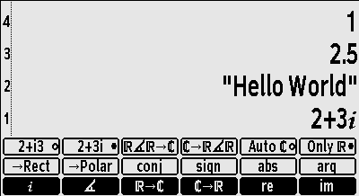
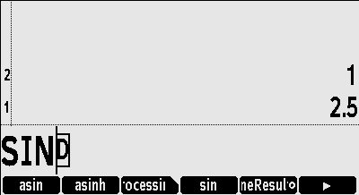

# Overview

## DB48X on DM42

The DB48X project intends to rebuild and improve the user experience of the
legendary HP48 family of calculators, notably their *"Reverse Polish Lisp"*
 [(RPL)](#Introduction-to-RPL)
language with its rich set of data types and built-in functions.

This project is presently targeting the **SwissMicro DM42 calculator**
and leveraging its built-in software platform, known as **DMCP**. This is
presumably the calculator you are currently running this software on.

## Table of contents

* [Using the on-line help](#help)
* [Quickstart guide](#quickstart-guide)
* [State of the project](#state-of-the-project)
* [Design overview](#design-overview)
* [Keyboard interaction](#keyboard-interaction)
* [Soft menus](#soft-menus)
* [Differences with other RPLs](#differences-with-other-RPLs)
* [Built-in help](#help)
* [Acknowledgements and credits](#acknowledgements-and-credits)
* [Release notes](#release-notes)
* [Performance](#performance-measurements)

## State of the project

This is currently **SEMI-STABLE** software, meaning that the implemented
features appear to work somewhat reliably, but that some features are still
being added with each new release. This is **NOT PRODUCTION READY** and should
not be used for any mission-critical computation.

At this point in time, you should only installing this if you are interested in
contributing to the project, whether it is in the form of code, feedback or
documentation changes. Please refer to the web site of the project on GitHub or
GitLab for details and updates. The best way to
[report an issue](https://github.com/c3d/DB48X-on-DM42/issues),
[request an improvement](https://github.com/c3d/DB48X-on-DM42/issues/new)
or [submit a proposed change](https://github.com/c3d/DB48X-on-DM42/pulls) is
on the project's [GitHub page](https://github.com/c3d/DB48X-on-DM42).

The [implementation status](#implementation-status) section categorizes all the
RPL commands in the HP50G and in DB48X into "implemented", "not implemented" and
"DB48X only" lists.

## Design overview

The objective is to re-create an RPL-like experience, but to optimize it for the
existing DM42 physical hardware.
Ideally, DB48X should be fully usable without a
keyboard overlay. though one is
[being worked on](https://github.com/c3d/DB48X-on-DM42/blob/stable/Keyboard-Layout.png).

Compared to the original HP48, the DM42 has a much larger screen, but no
annunciators (it is a fully bitmap screen). It has a keyboard with dedicated
soft-menu (function) keys, but only one shift key (whereas the HP48 has two),
lacks a dedicated alpha key, does not provides left or right arrow keys (only up
and down), and has no space key (_SPC_ on the HP48).


## Keyboard interaction

The keyboard differences force us to revisit the user interaction with the
calculator compared to the HP48:

* When running DB48X on the DM42, the single yellow shift key cycles between
  three states, *Shift* (shown in the documentation as 🟨), *Right Shift* (shown
  in the documentation as 🟦), and no shift.  This double-shift shortcut appears
  necessary because RPL calculators like the HP48 have a rather full keyboard
  even with two shift keys.


* A first press on the shift key is shown as 🟨 in the documentation, and
  activates functions shown in yellow in the keyboard overlay. A second press is
  shown as 🟦 in the documentation, and activates functions shown in blue in the
  keyboard overlay. On the screen, the shift state is indicated in the header
  area. When a [soft menu](#soft-menus) is visible on the screen, the selected
  row of functions is highlighed.

In the rest of this document, the shift key is referred to as 🟨, and pressing
it twice is referred to as 🟦, irrespective of the appearance of the physical
shift key on your particular hardware.


Other aspects of the keyboard interaction are fine-tuned for RPL usage:

* Since RPL uses alphabetic entry (also called *Alpha* mode) a lot more
  frequently than on RPN models like the HP41 or HP42, making it quickly
  accessible seems important, so there are
  [three distinct ways to activate it](#alpha-mode).

* The _▲_ and _▼_ keys move the cursor *left* and *right* while editing
  instead of *up* and *down*. These cursor movements are much more useful for a
  text-based program editing as found in RPL. In the rest of this document,
  they are described as _◀︎_ and _▶︎_ respectively.

* Using 🟨 _◀︎_ and 🟨 _▶︎_ moves the cursor up and down.  When not editing, _◀︎_
  and _▶︎_ behave like _▲_ and _▼_ on the HP48, i.e. _◀︎_ enters the *interactive
  stack* (not yet implemented) and _▶︎_ edits the object on the first level of
  the stack.

* Long-pressing arrow keys, the _←_ (also known as *Backspace*) or text entry
  keys in Alpha mode activates auto-repeat.

* Long-pressing keys that would directly trigger a function (e.g. _SIN_),
  including function keys associated with a soft-menu, will show up the
  [built-in help](#help) for the corresponding function.


### Alpha mode

Entering alphabetic characters is done using *Alpha* mode. These alphabetic
characters are labeled on the right of each key on the DM42's keyboard.

When *Alpha* mode is active, an _ABC_ indicator shows up in the annunciator area
at the top of the screen. For lowercase entry, the indicator changes to
_abc_.

There are three ways to enter *Alpha* mode:

* The first method is to use 🟨 _ENTER_ as indicated by the _ALPHA_ yellow label
  on the DM42 ENTER key. This cycles between *Alpha* _ABC_, *Lowercase* _abc_
  and *Normal* entry modes.

* The second method is to hold 🟨 for more than half a second. This cycles
  between *Alpha* _ABC_ and *Normal* entry modes, and cannot be used to type
  lowercase characters.

* The third method is to hold one of the arrow keys _◀︎_ or _▶︎_ *while* typing on
  the keyboard. This is called *transient alpha mode* because *Alpha* mode ends
  as soon as the arrow key is released. Using _◀︎_ enters uppercase characters,
  while _▶︎_ uses lowercase characters.

There is no equivalent of the HP48's "single-Alpha" mode. Alpha mode is either
_transient_ (when you hold one of the arrow keys) or _sticky_ (with 🟨 _ENTER_
or by holding 🟨).

Alpha mode is cancelled when pressing _ENTER_ or _EXIT_.

Since the DM42's alphabetic keys overlap with the numeric keys (unlike the
HP48), as well as with operations such as _×_ and _÷_, using 🟨 in Alpha mode
brings back numbers. This means 🟨 cannot be used for lowercase, but as
indicated above, there are two other methods to enter lowercase
characters.

Using 🟨 or 🟦 in combination with keys other than the numeric keypad
gives a variety of special characters.


### Key mapping

The layout of keys on DB48X was carefully chosen to offer a good compromise
between immediate applicability for calculations and giving access to numerous
advanced functions through menus.

DB48X keyboard overlays for DM-42 and DM-32 SwissMicros calculators are
[already available](https://www.hpmuseum.org/forum/thread-20113.html).


In the rest of this document, keys bindings will usually be described using the
alphabetic key, to make it easier to locate on the keyboard, followed by the
standard label on the DB48X layout. For example, the assignment for the `sin`
function will be described as _J_ (_SIN_). The shifted functions of the same key
will be described as 🟨 _J_ (_SIN⁻¹_) or 🟦 _J_ (_HYP_) respectively.

In some cases, the label between parentheses may refer to another calculator
model, which will be indicated as follows. For example, the _A_ key can be
described as _A_ (_⚙️_, DM-42 _Σ+_, DM-32 _√x_).

However, if you are using DB48X on a DM42, it is possible to do it without a
keyboard overlay, because great care was taken to have the DB48X keboard layout
remain close to that of the DM42, in order to preserve muscle memory. New
features were positioned on the keyboard at positions that are close to what is
familiar in the original DM42 firmware.

A few keys that have little use in RPL are reassigned to features that you
should be able to quickly remember. For example, the DM-42 _RCL_ key is used for
the DB48X _VAR_ key, which invokes the [VariablesMenu](#VariablesMenu).

Note that the _LOG_ and _e^x_ keys are swapped relative to the DM-42. The HP42
has _LOG_ and _LN_ with shifted _10^x_ and _e^x_. DB48X has _e^x_ and _LN_
with shifted _10^X_ and _LOG_, so that the more frequently used mathematical
functions are available without shifting. Note that in the future, full
keyboard remapping similar to the HP41 or HP48 will allow you to change that
if you prefer.


Here are a few of the interesting RPL-specific key mappings:

* _A_ (_⚙️_, DM-42 _Σ+_, DM-32 _√x_) is used to invoke a context-sensitive
  [ToolsMenu](#ToolsMenu), which select a softkey menu based on what is on the
  stack and other context.

* 🟨 _A_ (_←MENU_, DM-42 _Σ-_, DM-32 _x²_) selects the [LastMenu](#LastMenu)
  command, which displays the previously selected menu.

* 🟦 _A_ (_MAIN_, DM-32 _PARTS_) selects the [MainMenu](#MainMenu), a top-level
  menu giving indicrect access to all other menus and features in DB48X (see
  also the [Catalog](#CatalogMenu) feature).

* _F_ (_' ()_, DM-42 _XEQ_, DM-32 _Σ+_) opens an algebraic expression, i.e. it
  shows `''` on the command-line and switches to equation entry. If already
  inside an equation, it inserts a pair of parentheses. This can be used to
  evaluate expressions in [algebraic mode](#algebraic-mode) instead of
  RPN.

* 🟨 _G_ (_CPLX_, DM-42 _COMPLEX_, DM-32 _CMPLX_) lets you work with complex
  numbers. It opens the [ComplexMenu](#ComplexMenu), which can be used to enter
  complex numbers in rectangular or polar form, and perform common operations on
  these numbers. The same menu can be accessed without shift using _A_ (_⚙️_)
  when there is a complex number on the stack.

* _H_ (_VAR_, DM-42 and DM-32 _RCL_) opens the [VariablesMenu](#VariablesMenu)
  showing user variables in the current directory.

* _I_ (_STK_, DM-42 and DM-32 _R↓_) will open the [StackMenu](#StackMenu),
  giving access to stack operations.

* 🟨 _I_ (_CONST_, DM-42 _π_, DM-32 _HYP_) shows a
  [ConstantsMenu](#ConstantsMenu) giving access to various constants. You can
  provide your own constants in a `CONFIG/CONSTANTS.CSV` file on disk.

* _M_ (_X⇆Y_) executes the RPL [Swap](#swap) function

* 🟨 _M_ (_LAST_, DM-42 _LAST x_, DM-32 _MEM_) is [LastArg](#LastArguments),
  which recalls the arguments of the last command.

* 🟦 _M_ (_Undo_, DM-32 _X⇆_) restores the previous state of the stack. This is
  like `Last Stack` on the HP48, but on DB48X, it is a real command that can be
  used in programs.

* _N_ (_+/-_) executes the equivalent RPL `Negate` function. While editing, it
  changes the sign of the current number on the command-line.

* _O_ (_EEX_, DM-42 and DM-32 _E_) is used to enter the exponent of a number in
  scientific notation. However, when not entering or editing values, it invokes
  the [Cycle](#Cycle) command, which cycles between various representations of
  a number, for example polar and rectangular for a complex number, or fraction
  and decimal for a decimal number.

* _EXIT_ (DM-32 _ON_) corresponds to what the HP48 manual calls _Attn_, and
  typically cancels the current activity. It can also be used to interrupt a
  running program.

* 🟨 _EXIT_ (_OFF_) shuts down the calculator. The state of the calculator is
  preserved.

* 🟦 _EXIT_ (_SAVE_) saves the current state of the calculator to disk. This
  state can be transferred to another machine, and survives system reset or
  firmware upgrades.

* 🟨 _0_ (_SETUP_) shows the firmware's [SystemMenu](#SystemMenu), for example
  to load the original DM-42 or DM-32 program, activate USB disk, and to access
  some calculator preferences.

* The _R/S_ keys inserts a space in the editor, an `=` sign inside equations,
 and maps to [Evaluate](#evaluate) otherwise.

* 🟨 _R/S_ (_«PROG»_, DM-42 and DM-32 _PRGM_) inserts the delimiters for an RPL
  program, `«` and `»`, while 🟦 _R/S_ (_{LIST}_) inserts the list delimiters,
  `{` and `}`.

* 🟨 _+_ (_CAT_, DM-42 _CATALOG_, DM-32 _LBL_) shows a complete
  context-sensitive [catalog](#CatalogMenu) of all available functions, and
  enables auto-completion using the soft-menu keys. Note that the `+` key alone
  (without shift) activates the catalog while in *Alpha* mode.

* 🟦 _+_ (_HELP_, DM-32 _RTN_) activates the context-sensitive help system.


## Soft menus

The DM42 has 6 dedicated soft-menu keys at the top of the keyboard. Most of the
advanced features of DB48X can be accessed through these soft menus. Soft menu
keys have no label on the physical calculator, but in this documentation, they
may sometimes be referred to as _F1_ through _F6_.

All built-in soft-key menus are named, with names ending in [Menu](#Menu). For
example, the [VariablesMenu](#VariablesMenu) is the menu listing global
variables in the current directory. Unlike HP RPL calculators, menus cannot be
accessed by number, but they can be accessed by name. In a future version of the
firmware, a [Menu](#Menu) special variable will return the name of the current
menu. The [LastMenu](#LastMenu) command selects the previous menu.

Menus are organized internally as a hierarchy, where menus can refer to other
menus. A special menu, [MainMenu](#MainMenu), accessible via the 🟦 _A_,
contains all other menus.

Menus can contain up to 18 entries at once, 6 being directly accessible, 6
more being shown when using the 🟨 key, and 6 more with 🟦. Three rows of
functions are shown on screen, with the active row highlighted.

A long press on a function key invokes the on-line help for the associated
function.

When a menu contains more than 18 entries, then the _F6_ function key turns into
a `▶︎`, and 🟨 _F6_ turns into `◀`︎. These keys can be used to
navigate across the available menu entries. This replaces the _NXT_ and _PREV_
keys on HP calculators.

The [VariablesMenu](#VariablesMenu) is used to access global varibales. It is
invoked using the _H_ key, which is labeled _RCL_ on SwissMicros hardware. This
menu is special in the sense that:

* Selecting an entry *evaluates* that menu entry, for example to run a program

* The 🟨 function *recalls* its name without evaluating it.

* The 🟦 function *stores* into the variable.


## Differences with other RPLs

Multiple implementations of RPL exist, most of them from Hewlett-Packard.
A good reference to understand the differences between the various existing
implementations from HP is the
[HP50G Advanced User's Reference Manual](https://www.hpcalc.org/details/7141).

There are a number of intentional differences in design between DB48X and the
HP48, HP49 or HP50G's implementations of RPL. There are also a number of
unintentional differences, since the implementation is completely new.

### User interface

* DB48X features an extensive built-in help system, which you are presently
  using. Information for that help system is stored using a regular *markdown*
  file named `/HELP/DB48X.md`, stored in the calculator's flash storage.

* DB48X features auto-completion for commands while typing, through
  the  _Catalog_ key ([CatalogMenu](#CatalogMenu)).

* Many RPL words exist in short and long form, and a user preference selects how
  a program shows. For example, the [Negate](#negate) command, which the HP48
  calls `NEG`, can display, based on user preferences, as `NEG`, `neg`, `Neg` or
  `Negate`. In the help, it will be shown as **Negate (NEG)**.

* The DB48X dialect of RPL is not case sensitive, but it is case-respecting.
  For example, if your preference is to display built-in functions in long form,
  typing `inv` or `INV` will show up as `Invert` in the resulting program.
  This means that the space of "reserved words" is larger in DB48X than in other
  RPL implementations. Notably, on HP's implementations, `DUP` is a keyword but
  you can use `DuP` as a valid variable name. This is not possible in DB48X.

* The saving of the stack arguments for the `LastArg` command is controled
  independently by two distinct settings, `SaveLastArg` and
  `SaveLastArgInPrograms`. The first one controls if `LastArg` is saved for
  interactive operations, and is enabled by default. The second one controls if
  `LastArg` is saved before executing commands while running a program or
  evaluating an expression, and is disabled by default. This impacts commands
  that evaluate programs, such as `ROOT`. On the HP48, `LastArg` after running
  `ROOT` interactively gives arguments used by some operation within `ROOT`,
  whereas on DB48X with the default settings, it returns the arguments to
  `ROOT`.


### Numbers

* DB48X has several separate representations for numbers: integers, fractions
  and decimal. Notably, it keeps integer values and fractions in exact form for
  as long as possible to optimize both performance and memory usage.
  This is closer to the HP50G in exact mode than to the HP48. Like
  the HP50G, DB48X will distinguish `1` (an integer) from `1.` (a decimal
  value), and the `TYPE` command will return distinct values.

* Integer and fraction arithmetic can be performed with arbitrary
  precision, similar to the HP50G. The `MaxNumberBits` setting controls how much
  memory can be used for integer arithmetic.

* DB48X has true fractions. From a user's perspective, this is somewhat similar
  to fractions on the HP50G, except that fractions are first-class numbers,
  whereas the HP50G treats them like expressions. On the HP50G, `1 3 / TYPE`
  returns `9.`, like for `'A + B'`. On DB48X, the `TYPE` for fractions is
  different than for expressions. Fractions can be shown either as
  `MixedFractions` or `ImproperFractions`.

* On HP50G, decimal numbers often outperform integers or fractions, and
  benchmark code will contain `1.` instead of `1` for that reason. On DB48X,
  arithmetic on integers and fractions is generally faster.

* Like the HP Prime, DB48X displays a leading zero for decimal values, whereas
  HP RPL calculators do not. For example, it will display `0.5` and not `.5`.

* DB48X has two distinct representations for complex numbers, polar and
  rectangular, and transparently converts between the two formats as needed.
  The polar representation internally uses fractions of pi for the
  angle, which allows exact computations. By contrast, HP RPL implementations
  always represent complex numbers in rectangular form internally, possibly
  converting it to polar form at display time.

* DB48X features at least 3 floating-point precisions using 32-bit, 64-bit and
  128-bit respectively, provided by the DMCP's existing [Intel Binary Decimal
  Floating-Point library](#intel-decimal-floating-point-math). The 128-bit
  format gives the calculator 34 significant digits of precision, like the
  DM42. DB48X may support other formats in the future, like the
  arbitrary-precision floating-point found in newRPL. The `Precision` command
  (in the `DisplayModesMenu`) can be used to select the precision for arithmetic
  operations.

* Based numbers with an explicit base, like `#123h` keep their base, which makes
  it possible to show on stack binary and decimal numbers side by side. Mixed
  operations convert to the base in stack level X, so that `#10d #A0h +`
  evaluates as `#AAh`. Based numbers without an explicit base change base
  depending on the [Base](#base) setting, much like based numbers on the HP48,
  but with the option to any base between 2 and 36. In addition to the
  HP-compatible trailing letter syntax (e.g. `#1Ah`), the base can be given
  before the number (e.g. `16#1A`), which works for all supported bases.

### Representation of objects

* The storage of data in memory uses a denser format than on the HP48.
  Therefore, objects will almost always use less space on DB48X. Notably, the
  most frequently used functions and data types consume only one byte on DB48X,
  as opposed to 5 nibbles (2.5 bytes) on the HP48. A number like `123` consumes
  2 bytes on DB48X vs. 7 on the HP50 and 10.5 on the HP48.

* Numerical equality can be tested with `=`,  whereas object equality is tested
  using `==`. For example, `0=0.0` is true, but `0==0.0` is false, because `0`
  is an integer whereas `0.0` is a floating-point.

* Because of differences in internal representation that would require expensive
  computations to mimic the HP50G behaviour with limited benefit, `Size` returns
  1 for integers, algebraic expressions and unit objects.

* The `Type` command returns HP-compatible values that are sometimes imprecise
  (e.g. it cannot distinguish between polar and rectangular complex values).
  The `TypeName` command is an extension that returns more precise textual
  information, and should be preferred both for readability and future
  compatibility.

### Alignment with SwissMicros calculators

* DB48X will borrow to the DM-42 the idea of _special variables_ for settings,
  which are variables with a special meaning. For example, the `Precision`
  special variable is the current operating precision for floating point, in
  number of digits. While there is a `Precision` command that sets the value, it
  is also possible to use `'Precision' STO` to set it, and `'Precision' RCL` to
  fetch the current value. This does not imply that there is an internal
  `Precision` variable somewhere. This applies to all settings and
  flags. Additionally, binary settings can be set with `SF` and `CF`, and
  queried with `SF?` and `CF?`. For example, `'HideDate' CF` will clear the
  `HideDate` flag, meaning that the date will show in the header.

* The DB48X also provides full-screen setup menus, taking advantage of the DM42
  existing system menus. It is likely that the same menu objects used for
  softkey menus will be able to control system menus, with a different function
  to start the interaction.

* The whole banking and flash access storage mechanism of the HP48 will be
  replaced with a system that works well with FAT USB storage. It should be
  possible to directly use a part of the flash storage to store RPL programs,
  either in source or compiled form. As an example, using a text argument to
  `STO` and `RCL` accesses files on the USB disk, e.g. `1 "FOO.TXT" STO` stores
  the text representation of `1` in a file named `DATA/FOO.TXT` on the USB
  flash storage.

### List operation differences

The application of a same operation on arrays or matrices has never been very
consistent nor logical across RPL models from HP.

* On HP48 and HP50, `{ 1 2 3 } 4 +` gives `{1 2 3 4}`. However, `{ 1 2 3} 4 *`
  gives a type error on the HP48 but applies the operation to list elements on
  the HP50, yielding `{ 4 8 12}`.

* For arrays, `[ 1 2 3 ] 4 +` fails on both the HP48 and HP50, but
  `[ 1 2 3 ] 4 *` works.

* The HP50 has a `MAP` function, which works both for list and matrices.
  `[ 1 2 3 ] « 3 + »` will return `[ 4 5 6 ]`, and `{ 1 2 3 } « 3 * »` will
  return `{ 3 6 9 }`. That function has no direct equivalent on the HP48.

DB48X considers lists as bags of items and treat them as a whole when it makes
sense, whereas arrays are focusing more on the values they contain, and will
operate on these items when it makes sense. Therefore:

* `{ 1 2 3 } 4 +` gives `{ 1 2 3 4 }`, `{ 1 2 3 } 2 -` gives `{ 1 3 }` (not yet
  implemented), and `{ 1 2 3 } 3 ×` gives `{ 1 2 3 1 2 3 1 2 3 }`. The `÷`
  operator is equivalent to the `ListDivide` function, and partitions a list in
  chunks of the given size and returns the number of partitions so generated
  (the last partition being possibly shorter), i.e. `{ 1 2 3 4 5 } 2 ÷` will
  generate `{1 2} {3 4} {5} 3` on the stack (this is not yet implemented).

* `[ 1 2 3 ] 4 +` gives `[ 5 6 7 ]`, `[ 1 2 3 ] 2 -` gives `[ -1 0 1 ]`,
  `[ 1 2 3 ] 3 ×` gives `[ 3 6 9 ]` and `[ 1 2 3 ] 5 ÷` gives
  `[ 1/5 2/5 3/5 ]`.

* Two lists can be compared using lexicographic order. This also applies to the
  `Min` and `Max` functions, which compares the entire lists, whereas on HP50G,
  it compares element by element (element-wise comparison applies to arrays).


### Vectors and matrices differences

* On DB48X, vectors like `[ 1 2 3 ]` are very similar to lists. The primary
  difference is the behavior in the presence of arithmetic operators.
  On lists, addition is concatenation, e.g. `{ 1 2 3} { 4 5 6} +` is
  `{ 1 2 3 4 5 6 }`, whereas on vectors represents vector addition, e.g.
  `[1 2 3] [4 5 6] +` is `[5 7 9]`. However, unlike on the HP original
  implementation, a vector can contain any type of object, so that you can
  do `[ "ABC" "DEF" ] [ "GHI" "JKL" ] +` and obtain `[ "ABCGHI" "DEFJKL" ]`.

* Size enforcement on vectors only happens _during these operations_, not while
  you enter vectors from the command line. It is legal in DB48X to have a
  non-rectangular array like `[[1 2 3] [4 5]]`, or even an array with mixed
  objects like `[ "ABC" 3 ]`. Size or type errors on such objects may occur
  if/when arithmetic operations are performed.

* In particular, a matrix is nothing but a vector of vectors. DB48X also
  supports arrays with dimensions higher than 2, like `[[[1 2 3]]]`.

* As a consequence, The `GET` and `GETI` functions work differently on
  matrices. Consider a matrix like `[[ 7 8 9 ][ 4 5 6 ][ 1 2 3 ]]`. On the HP48,
  running `1 GET` on this object gives `7`, and the valid range of index values
  is 1 through 9. On DB48X, that object is considered as an array of vectors, so
  `1 GET` returns `[7 8 9]`.  This is intentional. The behavior of `{ 1 1 } GET`
  is identical on both platforms, and is extended to multi-dimensional arrays,
  so that `[[[4 5 6]]] { 1 1 2 } GET` returns `5`.

* Matrices and vectors can contain integer values or fractions. This is closer
  to the HP50G implementation than the HP48's. In some cases, this leads to
  different results between the implementations. If you compute the inverse of
  `[[1 2 3][4 5 6][7 8 9]` on the HP48, you get a matrix with large values, and
  the HP48 finds a small, but non-zero determinant for that matrix. The HP50G
  produces a matrix with infinities. DB48X by default produces a `Divide by
  zero` error.

* DB48X accept matrices and vectors as input to algebraic functions, and returns
  a matrix or vector with the function applied to all elements. For example,
  `[a b c] sin ` returns `[ 'sin a' 'sin b' 'sin c' ]`.

* Similarly, DB48X accept operations between a constant and a vector or matrix.
  This applies the same binary operation to all components of the vector or
  matrix. `[ a b c ] x +` returns `[ 'a+x' 'b+x' 'c+x' ]`. Consistent with that
  logic, `inv` works on vectors, and inverts each component, so that
  `[1 2 3] inv` gives `[1/1 1/2 1/3]`.

* The `Min` and `Max` operations on arrays apply element by element, in a way
  similar to how these operations apply to lists on the HP50G (which seems to
  be undocumented).


### Unicode support

DB48X has almost complete support for Unicode, and stores text internally using
the UTF-8 encoding. The built-in font has minor deviations in appearance for a
few RPL-specific glyphs.

Overall, a text file produced by DB48X should appear reliably in your
favorite text editor, which should normally be GNU Emacs. This is notably the
case for state files with extension `.48S` which you can find in the `STATE`
directory on the calculator.

The `Size` operation when applying to text counts the number of Unicode
characters, not the number of bytes. The number of bytes can be computed using
the `Bytes` command.

The `Num` and `Chr` commands (also spelled `Char→Code` and `Code→Char`) deal
with Unicode codepoints, and do not use the special HP characters codes. In
addition, `Num` return `-1` for an empty string, not `0`. `0` is only returned
for a string that begins with a `NUL` codepoint.

The `Code→Char` command can also be spelled as `Code→Text`, and take a list of
Unicode codepoints as input. Conversely, `Text→Code` will generate a list of all
the codepoints in a text.

## Help

The DB48X project includes an extensive built-in help, which you are presently
reading. This help is stored as a `HELP/DB48X.md` file on the calculator. You
can also read it from a web browser directly on the GitHub page of the project.

The `Help` command makes it possible to access the built-in help in a contextual
way. It is bound to 🟦 _+_. If the first level of the stack contains a text
corresponding to a valid help topic, this topic will be shown in the help
viewer. Otherwise, a help topic corresponding to the type of data in the stack
will be selected.

The DB48X help viewer works roughly similarly to the DM42's, but with history
tracking and the ability to directly access help about a given function by
holding a key for more than half a second.

To navigate the help on the calculator, use the following keys:

* The soft menu keys at the top of the keyboard, references as _F1_ through
  _F6_, correspond to the functions shown in the six labels at the bottom of the
  screen.

* While the help is shown, the keys _◀︎_ and _▶︎_ on the keyboard scroll
  through the text.

* The _F1_ key returns to the [Home](#overview) (overview).

* The _F2_ and _F3_ keys (labels `Page▲` and `Page▼`) scroll the text one full
  page at a time.

* The _F4_ and _F5_ keys (labels `Link▲` and `Link▼`) select the previous and
  next link respectively. The keys _÷_ and _9_ also select the previous
  link, while the keys _×_ and _3_ can also be used to select the next link.

* The _F6_ key correspond to the `←Menu` label, and returns one step back in
  the help history. The _←_ key achieves the same effect.

* To follow a highlighted link, click on the _ENTER_ key.


## Acknowledgements and credits

DB48X is Free Software, see the LICENSE file for details.
You can obtain the source code for this software at the following URL:
https://github.com/c3d/DB48X-on-DM42.


### Authors

This software is (C) 2022-2023 Christophe de Dinechin and the DB48X team.

Additional contributors to the project include:

* Camille Wormser (complex number fixes)
* Jeff, aka spiff72 (keyboard overlay)
* Conrado Seibel (help file fix)

The authors would like to acknowledge

* [Hewlett and Packard](#hewlett-and-packard)
* [The Maubert Team](#the-maubert-team)
* [Museum of HP calculators](#hp-museum)
* [HPCalc](#hpcalc)
* [The newRPL project](#newrpl-project)
* [The WP43 and C47 projects](#wp43-and-c47-projects)
* [SwissMicro's DMCP](#swissmicros-dmcp)
* [Intel Decimal Floating-Point Math Library v2.2](#intel-decimal-floating-point-math)

This work was placed by Christophe de Dinechin under the patronage of
[Carlo Acutis](http://www.miracolieucaristici.org/en/Liste/list.html)


### Hewlett and Packard

Hand-held scientific calculators changed forever when Hewlett and Packard asked
their engineers to design and produce the HP35, then again when their company
introduced the first programmable hand-held calculator with the HP65, and
finally when they introduced the RPL programming language with the HP28.

Christophe de Dinechin, the primary author of DB48X, was lucky enough to meet
both Hewlett and Packard in person, and this was a truly inspiring experience.
Launching the Silicon Valley is certainly no small achievement, but this pales
in comparison to bringing RPN and RPL to the world.


### The Maubert Team

Back in the late 1980s and early 1990s, a team of young students with a passion
for HP calculators began meeting on a regular basis at or around a particular
electronics shop in Paris called "Maubert Electronique", exchanging
tips about how to program the HP28 or HP48 in assembly language or where to get
precious technical documentation.

It started with Paul Courbis, who carefully reverse-engineered and documented
[the internals of RPL calculators](https://literature.hpcalc.org/items/1584),
encouraging his readers to boldly cut open these wonderful little machines
to solder IR receivers acting as makeshift PC connection tools, or to waste
countless hours debugging [video games](https://www.hpcalc.org/hp48/games).

There were more serious efforts as well, notably the
[HP48 Metakernel](https://www.hpcalc.org/hp48/apps/mk/), which completely
reinvented the HP48 user interface, making it both much faster and better.  It
is fair to see DB48X as a distant descendent from such efforts. The Metakernel
was the work of many now well-known names in the HP community, such as Cyrille
de Brébisson, Jean-Yves Avenard, Gerald Squelart and Étienne de Foras. Many of
these early heroes would go on to actually change the [history of
Hewlett-Packard calculators](https://www.hpcalc.org/goodbyeaco.php) for the
better.

The original author of DB48X, Christophe de Dinechin, was part of this loose
team, focusing on [cross-development tools](https://github.com/c3d/HPDS),
which he used at the time to write several games for the HP48, notably
[PacMan](https://www.hpcalc.org/details/553) or
[Lemmings](https://www.hpcalc.org/details/530) clones. If DB48X exists, it's
largely because of that community.


### HP Museum

The [HP Museum](https://www.hpmuseum.org) not only extensively documents the
history of RPN and RPL calculators, it also provides a
[very active forum](https://www.hpmuseum.org/forum/) for calculator enthusiasts
all over the world.


### HPCalc

Much of the work from [early enthusiasts](#the-maubert-team) can still be found
on [hpcalc.org](https://www.hpcalc.org) to this day.

Back in the 1990s, long before Internet was widely available, HP48 programs were
busily swapped over floppy disks, or propagated from machine to machine using
the built-in infrared ports. This may have been the first case of large-scale
viral distribution of software. This is probably the reason why all this
software. which originated from all over the world, can still be downloaded
and used today.


### newRPL project

[newRPL](https://newrpl.wiki.hpgcc3.org/doku.php) is a project initiated by
Claudio Lapilli to implement a native version of RPL, initially targeting
ARM-based HP calculators such as the HP50G.

DB48X inherits many ideas from newRPL, including, but not limited to:

* Implementing RPL natively for ARM CPUs
* Adding indicators in the cursor to indicate current status
* Integrating a catalog of functions to the command line

A first iteration of DB48X started as a
[branch of newRPL](https://github.com/c3d/db48x/), although the
current implementation had to restart from scratch due to heavy space
constraints on the DM42.


### WP43 and C47 projects

The DB48X took several ideas and some inspiration from the
[WP43](https://gitlab.com/rpncalculators/wp43) and
[C47](https://47calc.com) projects.

Walter Bonin initiated the WP43 firwmare for the DM42 as a "superset of the
legendary HP42S RPN Scientific".

C47 (initially called C43) is a variant of that firmware initiated by Jaco
Mostert, which focuses on compatibility with the existing DM42, notably with
respect to keyboard layout.

DB48X borrowed at least the following from these projects:

* The very idea of writing a new firmware for the DM42
* The idea of converting standard Unicode TrueType fonts into bitmaps
  (with some additional contributions from newRPL)
* How to recompute the CRC for QSPI images so that the DM42 loads them,
  thanks to Ben Titmus
* At least some aspects of the double-shift logic and three-level menus
* The original keyboard layout template and styling, with special thanks
  to DA MacDonald.


### SwissMicros DMCP

[SwissMicros](https://www.swissmicros.com/products) offers a range of
RPN calculators that emulate well-known models from Hewlett-Packard.
This includes the [DM42](https://www.swissmicros.com/product/dm42),
which is currently the primary target for the DB48X firmware.

Special thanks and kudos to Michael Steinmann and his team for keeping
the shining spirit of HP RPN calculators alive.

The DM42 version of the DB48X software relies on
[SwissMicro's DMCP SDK](https://github.com/swissmicros/SDKdemo), which
is released under the following BSD 3-Clause License:

Copyright (c) 2015-2022, SwissMicros
All rights reserved.

Redistribution and use in source and binary forms, with or without
modification, are permitted provided that the following conditions are met:

* Redistributions of source code must retain the above copyright notice, this
  list of conditions and the following disclaimer.

* Redistributions in binary form must reproduce the above copyright notice,
  this list of conditions and the following disclaimer in the documentation
  and/or other materials provided with the distribution.

* Neither the name of the copyright holder nor the names of its
  contributors may be used to endorse or promote products derived from
  this software without specific prior written permission.

THIS SOFTWARE IS PROVIDED BY THE COPYRIGHT HOLDERS AND CONTRIBUTORS "AS IS"
AND ANY EXPRESS OR IMPLIED WARRANTIES, INCLUDING, BUT NOT LIMITED TO, THE
IMPLIED WARRANTIES OF MERCHANTABILITY AND FITNESS FOR A PARTICULAR PURPOSE ARE
DISCLAIMED. IN NO EVENT SHALL THE COPYRIGHT HOLDER OR CONTRIBUTORS BE LIABLE
FOR ANY DIRECT, INDIRECT, INCIDENTAL, SPECIAL, EXEMPLARY, OR CONSEQUENTIAL
DAMAGES (INCLUDING, BUT NOT LIMITED TO, PROCUREMENT OF SUBSTITUTE GOODS OR
SERVICES; LOSS OF USE, DATA, OR PROFITS; OR BUSINESS INTERRUPTION) HOWEVER
CAUSED AND ON ANY THEORY OF LIABILITY, WHETHER IN CONTRACT, STRICT LIABILITY,
OR TORT (INCLUDING NEGLIGENCE OR OTHERWISE) ARISING IN ANY WAY OUT OF THE USE
OF THIS SOFTWARE, EVEN IF ADVISED OF THE POSSIBILITY OF SUCH DAMAGE.


### Intel Decimal Floating-Point Math

Floating-point computations in DB48X take advantage of
[Intel's decimal floating-point math library](https://www.intel.com/content/www/us/en/developer/articles/tool/intel-decimal-floating-point-math-library.html),
 which is released with the following end-user license agreement:

Copyright (c) 2018, Intel Corp.

All rights reserved.

Redistribution and use in source and binary forms, with or without modification,
are permitted provided that the following conditions are met:

* Redistributions of source code must retain the above copyright notice, this
  list of conditions and the following disclaimer.

* Redistributions in binary form must reproduce the above copyright notice,
  his list of conditions and the following disclaimer in the documentation
  and/or other materials provided with the distribution.

* Neither the name of Intel Corporation nor the names of its contributors
  may be used to endorse or promote products derived from this software
  without specific prior written permission.

THIS SOFTWARE IS PROVIDED BY THE COPYRIGHT HOLDERS AND CONTRIBUTORS "AS IS" AND
ANY EXPRESS OR IMPLIED WARRANTIES, INCLUDING, BUT NOT LIMITED TO, THE IMPLIED
WARRANTIES OF MERCHANTABILITY AND FITNESS FOR A PARTICULAR PURPOSE ARE
DISCLAIMED.

IN NO EVENT SHALL THE COPYRIGHT OWNER OR CONTRIBUTORS BE LIABLE FOR ANY DIRECT,
INDIRECT, INCIDENTAL, SPECIAL, EXEMPLARY, OR CONSEQUENTIAL DAMAGES (INCLUDING,
BUT NOT LIMITED TO, PROCUREMENT OF SUBSTITUTE GOODS OR SERVICES; LOSS OF USE,
DATA, OR PROFITS; OR BUSINESS INTERRUPTION) HOWEVER CAUSED AND ON ANY THEORY OF
LIABILITY, WHETHER IN CONTRACT, STRICT LIABILITY, OR TORT (INCLUDING NEGLIGENCE
OR OTHERWISE) ARISING IN ANY WAY OUT OF THE USE OF THIS SOFTWARE, EVEN IF
ADVISED OF THE POSSIBILITY OF SUCH DAMAGE.
# Introduction to RPL

The original RPL (*Reverse Polish Lisp*) programming language was designed and
implemented by Hewlett Packard for their calculators from the mid-1980s until
2015 (the year the HP50g was discontinued). It is based on older calculators
that used RPN (*Reverse Polish Notation*). Whereas RPN had a limited stack size of
4, RPL has a stack size only limited by memory and also incorporates
programmatic concepts from the Lisp programming language.

The first implementation of RPL accessible by the user was on the HP28C, circa
1987, which had an HP Saturn processor. More recent implementations (e.g., HP49,
HP50g) run through a Saturn emulation layer on an ARM based processor. These
ARM-based HP calculators would be good targets for a long-term port of DB48X.

DB48X is a fresh implementation of RPL on ARM, initially targetting the
SwissMicros DM42 calculator. This has [implications on the design](#design-overview)
of this particular implementation of RPL.

## The RPL stack

The RPL stack can grow arbitrarily in size.

By convention, and following RPN usage, this document gives the names `X`, `Y`,
`Z` and `T` to the first four levels of the stack. This is used to describe the
operations on the stack with synthetic stack diagrams showing the state of the
stack before and after the operation.

For example, the addition of two objects in levels 1 and 2 with the result
deposited in stack level 1 can be described in synthetic form using the
following stack diagram:

`Y` `X` ▶ `Y+X`

The duplication operation `Duplicate` (`DUP`) can be described in synthetic form
using the following synthetic stack diagram:

`X` ▶ `X` `X`


## Algebraic mode

Unlike earlier RPN calculators from Hewlett-Packard, RPL calculators from HP
includes complete support for algebraic objects written using the standard
precedence rules in mathematics. This gives you the best of both worlds,
i.e. the keyboard efficiency of RPN, requiring less keystrokes for a given
operation, as well as the mathematical readability of the algebraic
notation. Better yet, it is possible and easy to build an algebraic expression
from RPN keystrokes. These nice properties are also true for DB48X.

In RPL, algebraic expressions are placed between ticks. For
example, `'2+3×5'` will evaluate as `17`: the multiplication `3×5`, giving `15`,
is performed before the addition `2+15`, which gives `17`. An algebraic
expression can also be symbolic and contain unevaluated variables. For example,
`2+x` is a valid algebraic operation. If, having this expression on the stack,
you type `3` and then hit the `×` key, you will end up with `(2+x)×3`, showing
how the algebraic expression was built from RPN keystrokes.

Algebraic expressions are not evaluated automatically. The _R/S_ key (bound to
the [Evaluate](#evaluate) function) will compute their value as needed. On the
DB48X keyboard overlay, this key is also marked as `=` for that reason.

## Rich data types

Since introducing the first scientific pocket calculator, the HP-35, in 1972,
and with it the reverse polish notation (RPN), Hewlett-Packard perfected its
line-up for decades. This led to such powerhouses pocket computers such as as
the HP-41C series, or tiny wonders of pocket efficiency such as the HP-15C. Many
of these calculators, including the models we just cited, were capable of
advanced mathematics, including dealing with complex numbers, matrix operations,
root finding or numeric integration.

Then in 1986, everything changed with the HP-28C, which introduced a new user
interface called RPL. While the most evidently visible change was an unlimited
stack, what instantly made it both more powerful and easier to use than all its
RPN predecessors was the introduction of [data types](#types). Every value
on the stack, instead of having to be a number, could be a text, a name or an
equation. This made operations completely uniform irrespective of the data being
operated on. The same `+` operation that adds numbers can also add complex
numbers, vectors, matrices, or concatenate text. The exact same logic applies in
all case. This solved a decade-long struggle to extend the capabilities of
pocket calculators.

For example, whereas the HP-41C had some support for text, with an "Alpha" mode
and an alpha register, text operations were following their own logic, with for
example `ARCL` and `ASTO` dealing with at most 6 characters at a time, because
they were artificially fitted in a register designed to hold a numerical value.
Dealing with complex numbers on the HP-41C was
[similarly clunky](https://coertvonk.com/sw/hp41/complex-arithmetic-xmem-4426).
Even the HP-15C, which had built-in support for complex numbers, remained a bit
awkward to use in "complex mode" because its display could only show one half of
a complex number, e.g. the real or imaginary part. Similarly, matrix or
statistic operations had non-obvious interactions with numbered data registers.

All this was solved with RPL, because now a complex number, a matrix or a text
would occupy a single entry on the stack. So whereas adding two integers would
require a sequence like `1 ENTER 2 +` like in RPN, a very similar sequence would
add two texts: `"ABC" ENTER "DEF" +`, and the exact same logic would also add
two vectors in `[1 2 3] ENTER [4 5 6] +`.

DB48X adopts this extremely powerful idea, with a focus on making it as
efficient as possible for interactive calculations as well as for custom
programmed solution.
# Quickstart guide

This quickstart guide will rapidly give you an overview of the capabilities of
DB48X, and show you how to use it efficiently. Make sure that you have
[installed the latest version](#installation).

The _ON_ / _EXIT_ button is at the bottom left of the calculator. It can be used
to power the calculator on, but also to exit operations, for example aborting a
data entry.

DB48X is a RPL calculator, which means that:

* It inherits the stack-based "reverse polish" approach to operations that has
  been a central feature of practically all Hewlett-Packard scientific
  calculators since the HP-35. You enter arguments to a functions by pushing
  them on the stack, and the operation removes its arguments from the stack
  before putting its result(s). Unlike earlier HP calculators, the RPL stack is
  practically unlimited.

  

* Unlike simpler calculators, it uses a _command line_ for data entry, with
  advanced text editing capabilities, and a rich text-based command
  language. One way to access the hundreds of available commands is by simply
  typing their name.

  


[](https://www.youtube.com/watch?v=kzkjE8BZW10WU5Dg1mPkl8&list=PLz1qkflzABy-Cs1R07zGB8A9K5Yjolmlf "Long demo of v0.7.0")


## Arithmetic operations

Let's compute the area of a room made of a main section that is 6 meters by 8.3
meters, with an additional smaller section that is 3.5 meters by 2.8.

A first way to do it is to use the reverse polish stack-based approach, by
typing the following sequence of keys: _6_, _ENTER_, _8_, _._, _3_, _×_, _3_,
_._, _5_, _ENTER_, _2_, _._, _8_, _×_, _+_. The result, `59.6`, shows on the
stack. Prior to pressing the _+_ key, the intermediate results for the two
multiplications, `49.8` and `9.8`, could be seen on the stack.

<video src="https://github.com/c3d/DB48X-on-DM42/assets/1695924/e185f3e8-dd36-4beb-a6c5-03bf489d91a7"></video>

RPL also supports the standard algebraic notation. Begin the computation with
the _'()_ key. The editor contains quotes, `''` with the cursor between
them. The cursor shows the latter `A`, indicating algebraic entry. Type _6_,
_×_, _8_, _._, _3_, _+_, _3_, _._, _5_, _×_, _2_, _._, _8_. At this point,
the text editor should show the whole expression, `'6·8.3+3.5·2.8'`
or `'6×8.3+3.5×2.8'`. Press `ENTER` and the expression shows up on the
stack. Hitting the _=_ / _EVAL_ / _SPC_ key (located between the _._ and _+_
keys) evaluates the expression, to get the result `59.6`.

<video src="https://github.com/c3d/DB48X-on-DM42/assets/1695924/ba81f9f0-ec4d-4619-bf95-c56c14210fc3"></video>

Algebraic and reverse-polish computations are equivalent, and can be mixed and
matched during computations. Using one or the other is stricly a matter of
preference. Algebraic data entry makes it easier to view the entire
expression. Reverse-polish makes it easier to see intermediate results.


## Fractions

Let us now compute how many pies we need to feed 22 kids if we divide each pie
in 8 slices. Using the RPL approach, we would type _2_, _2_, _ENTER_, _8_,
_÷_. Using the algebraic notation, we would type _'()_, _2_, _2_, _÷_, _8_,
_ENTER_ and then use the _=_ to perform the computation.

<video src="https://github.com/c3d/DB48X-on-DM42/assets/1695924/89ebbf7a-f331-4729-a1b9-1527287daa3e"></video>

With the default settings, you should see a mixed fraction, `2 ³/₄`. Unlike many
calculators, DB48X by default perform exact computations on fractions instead of
using approximate decimal numbers.

You can convert that fraction to a decimal value and back using the `Cycle`
command, which is bound to the _EEX_ key. A first press will show `2.75`, and a
second press will show the value again as fraction `2 ³/₄`.


## Mathematical functions

DB48X features a number of mathematical functions. Some of the functions are
directly available on the keyboard.

We can compute the length of the diagonal of a rectangle with sides 2m and 3m
using the Pythagorean theorem, and display it in millimeters.

<video src="https://github.com/c3d/DB48X-on-DM42/assets/1695924/899ad5f3-fd0b-4695-86bb-0b682a191422"></video>

In RPL, we can type the following sequence: _2_, _x²_ (🟨 _C_), _3_, _x²_,
_+_, _√x_ (_C_), _1_, _0_, _0_, _0_, _×_. The decimal result,
`3 605.55127 546`, is shown on the stack. The digits in the whole part of the
decimal number are grouped 3 by 3, while the digits in the fractional part are
grouped 5 by 5.

In algebraic mode, we can type the following sequence:
_'()_, _1_, _0_, _0_, _0_, _×_, _√x_,
_2_, _x²_ (🟨 _C_), _+_, _3_, _x²_, _ENTER_. The mathematical
expresssion shows up on the stack graphically. It can then be evaluated using
the _=_ key, and shows the same result as for RPL mode.


## Mixing algebraic and reverse-polish operations

In the algebraic expression, we have multiplied by 1000 first, whereas in the
RPL case, we multiplied by 1000 last. We can also multiply by 1000 last in
algebraic mode. There are at least two ways to do it.

<video src="https://github.com/c3d/DB48X-on-DM42/assets/1695924/88cb7865-87cb-427e-b18b-33086bcbabd5"></video>

A first method is to use the arrow key to exit the parentheses around the
argument of the square root function, as follows: _'()_, _√x_,
_2_, _x²_, _+_, _3_, _x²_, _▶︎_, _×_, _1_, _0_, _0_, _0_,
_ENTER_. The expression with the multiplication is then shown on the stack, and
can then be evaluated with the _=_ key.

A second method is to mix and match algebraic and RPL, by typing
the following sequence: _'()_, _√x_, _2_, _x²_, _+_,
_3_, _x²_, _ENTER_. At this point, the expression without the
multiplication is on the stack. We can then multiply it by 1000 by typing
_1_, _0_, _0_, _0_, _×_. The expression with the multiplication is then shown on
the stack, and can then be evaluated with the _=_ key.


## Trigonometric functions

Consider that we need to build a plank ramp. We can ask a number of questions,
like:

* If the plank is 5 meters in length, and the slope is 10 degrees, how high
  will it reach?

* If we need to reach 60 cm above ground, what is the required slope?

<video src="https://github.com/c3d/DB48X-on-DM42/assets/1695924/a90b32c4-a903-4421-a768-c6b6b2afddec"></video>

In RPL, can answer the first question by typing _1_, _0_, _SIN_, _5_,
_×_. The result is shown in scientific format as `8.68240 88833 5×₁₀⁻¹`.
In algebraic mode, we would type _'()_, _5_, _×_, _SIN_, _1_, _0_, _ENTER_
and then evaluating the expression with _=_. This shows the same result.

We can answer the second question using RPL by typing _6_, _0_, _ENTER_, _5_,
_ENTER_, _1_, _0_, _0_, _×_, _÷_, _sin⁻¹_ (🟨 _J_). The result is shown as
`6.89210 25793 5 °`. This is an example of *unit object*: the value is
associated with a unit, in that case the `°` symbol indicating that we use
degrees. DB48X supports three other angle modes, radians, grads and fractions of
pi (piradians).

Answering the same question using algebraic mode introduces a new little
keyboard trick. Type _'()_,  _sin⁻¹_, _6_, _0_, _÷_, _'()_,
 _5_, _×_, _1_, _0_, _0_, _ENTER_, and then evaluating the expression with the
 _=_ key. Observe how the second use of the _'()_ key, which inserts parentheses
 when used inside an expression.


## Selecting display modes

The scientific notation may not be the most readable in that case. How do we
display this result with three digits? We will use a *menu* for that. Menus are
an essential component of the DB48X user interface.

<video src="https://github.com/c3d/DB48X-on-DM42/assets/1695924/be997041-74f9-489b-9583-b94036b9dc33"></video>

Let us type 🟨 _O_ (_Disp_). This shows the `DisplayModesMenu`. The menu
occupies three rows at the bottom of the screen, with six columns. Menus can
give a quick access to 18 functions directly, six more with a single shift 🟨,
and yet another six with the second shift 🟦. Hitting the shift key 🟨
repeatedly will highlight the different rows of the menu.

On the lower row of the menu, the second entry from the left is labeled `Fix`.
The `Fix` display mode shows a fixed number of digits after the decimal
separator. There are other modes, `Sci` to display in scientific notation, `Eng`
to display with engineering multiples (the exponent is a multiple of three), and
`Sig` to display at most a given number of digits.

We can type _3_, _F2_, where _F2_ is the second key from the left on the top row
of the keyboard. This activates the `Fix 3` mode, which shows three digits after
the decimal separator. The display changes to `0.868` for the answer to the
first question, and `6.892 °` for the answer to the second question.


## Displaying the on-line help for a function

Since the number of available commands in DB48X is quite high, it is useful to
be able to consult the built-in help. In order to get help on a command, simply
hold the corresponding key until the help shows up. For instance, to get
[help about the command](#std) under the `Std` label, simply hold the _F1_ key.

This also works for normal keyboard operations. For instance, if you hold the
_SIN_ key, you will get the [help about the sine command](#sin).

<video src="https://github.com/c3d/DB48X-on-DM42/assets/1695924/55d312a4-3977-421e-9cdf-65d8b5ff5036"></video>

You should refer to the on-line help whenever you have a question about a
specific command.


## Angle operations

The _sin⁻¹_ command we used previously returns an *angle* which was shown in
degrees, the default angle mode for DB48X. When applied to angles, the `Cycle`
command on the _EEX_ key cycles between various angle units: degrees, radians,
grads and pi-radians, i.e. a number of radians shown as a multiple of π.

<video src="https://github.com/c3d/DB48X-on-DM42/assets/1695924/5d23f388-b034-45cd-9d4d-7685b7f211f0"></video>

The function also alternates between decimal and fractional representations of
angles.

In order to access angle-related functions, we can use the Tools key _⚙️_ which
invokes the `ToolsMenu` command. That command picks up a menu that is suited for
the value on the stack. For angles, this shows the `AnglesMenu`, which can be
used to perform angle conversions directly.

We can select the `→Deg` command to convert an angle to degrees by hitting the
🟨 _F1_ key while the `AnglesMenu` is active, and similarly for `→Rad` with
🟨 _F2_, and so on. To convert the angle to a Degrees/Minutes/Seconds (DMS)
representation, we can select the `→DMS` using the 🟦 _F1_ key, since that
function is on the second level of the menu.

There is a quick way to manually enter angles in DMS format by using the _._
more than once during data entry. For example, to enter 10°20′30″, you simply
need to type _1_, _0_, _._, _2_, _0_, _._, _3_, _0_, _ENTER_.

On the command-line, this shows up as `10°20′30_hms`. Once you hit the _ENTER_
key, this shows on the stack as `10°20′30″`.

Using _._ more while on the command-line lets you add fractions of a second, for
example _1_, _0_, _._, _2_, _0_, _._, _3_, _0_, _._, _4_, _0_, _._, _5_, _0_,
_ENTER_, which will show on the stack as `10°20′30″4/5`.

You can add or subtract angles directly using normal arithmetic functions. For
example, hitting the _+_ key will add angles, correctly adjusting the angle
units as necessary.


## Complex number operations

DB48X support complex numbers both in rectangular and polar (phasor) form.
For example, in our effort to build a plank ramp, we may need more than one
plank. How far and how high can you reach if you have a 5 meter plank with a
slope of 10 degrees, followed by a 3 meters plank with a slope of 30 degrees?

<video src="https://github.com/c3d/DB48X-on-DM42/assets/1695924/a17d5404-ad05-4a4d-8c62-069f327b3428"></video>

We can add two complex numbers in phasor form to answer that question.
In order to enter the complex number representing the first plank, we need the
`ComplexMenu`, which is activated with the _CPLX_ key (🟨 _G_). The _F1_ key
will be used to enter complex numbers in rectangular form, and the _F2_ key to
enter complex numbers in polar form.

To solve our problem, we simply need to enter _CMPLX_ (🟨 _G_), then _5_, _F2_,
_1_, _0_, _ENTER_ to enter the first complex number. The stack shows the complex
value as `5∡10°`. We can enter the second complex number using _3_, _F2_, _3_,
_0_, and add the two values using the _+_ key. The result shows as
`7.522+2.368ⅈ`, which means that we can reach about 7.5 meters ahead and 2.3
meters above ground.


## Unit conversions

If you are living in the United States, having the results in meters might not
be convenient. You can use the DB48X built-in units in order to convert the
result above into feet, yards or inches.

<video src="https://github.com/c3d/DB48X-on-DM42/assets/1695924/1fd54b22-5d1e-42bc-ac3a-2be5770422cf"></video>

Select the `UnitMenu` with 🟨 _5_. This shows a catalog of unit categories. We
can select the `Length` category using the _F4_ key. In order to indicate that
our result is in meters, we select the `m` unit by hitting _F1_. Our result now
shows as `7.522+2.368ⅈ m` We can then convert that result in yards by selecting
the `→yd` command with the 🟨 _F2_ key.

You can convert to other units in the `Length` units menu the same way. This
menu is too large to fit on the screen, so the _F6_ key can be use to select the
next page in the menu with more units, such as `in` or `mm`. Note that DB48X
does not have a `NXT` key unlike HP calculators. Instead, when necessary, the
`NXT` and `PREV` features appear in the menu itself as _F6_ and 🟨 _F6_.


## Operations on whole numbers

[](https://www.youtube.com/watch?v=tT5az2CIcnk&list=PLz1qkflzABy-Cs1R07zGB8A9K5Yjolmlf)


### Entering whole numbers

### Arithmetic on integers

### Changing the sign of a number with +/-

### Exact division

### Computing on large numbers: 2^40, 25!

### Separators to make large numbers more readable

### Built-in functions: example of 1/x


## Using the shift key

### Primary function: 1/x

### First shifted function: y^x and square

### Second shifted function: Help

### The shift annunciator


## Invoking the on-line Help

### Long-press on a function key

### Moving up and down

### Following links

### Navigating back to a previous topic

### Exiting the on-line help

### Contextual help


## The annunciator area

### Battery level

### USB vs. battery power

### Showing or hiding the date and time

### Current state file name

### Future direction


## Decimal values

### Entering a decimal number

### Entering a number in scientific notation with EEX

### Arithmetic on decimal values

### Arithmetic on fractions

### Using EEX to cycle between decimal and fraction

### Separators for the fractional part

### Live separators during number editing


## Soft keys and menus

### Soft keys

### The DISP menu

### Effect of shift state on the menu

### Submenus

### Menu history (Last Menu)


## Displaying decimal values

### Standard display mode

### FIX display mode

### Switching to scientific mode

### Digits to show for small values

### SCI display mode

### ENG display mode

### SIG display mode

### Emulating HP48 standard display


## Scientific functions

### Square and power

### Square root and xroot

### Exponential and Log

### Exponential and log in base 10

### DM42 layout difference: EXP LN instead of LOG LN

### Trigonometric functions and their inverse

### Functions in menus: example of hyperbolic functions


## Using an infinite stack

### Showing multiple stack levels

### Result vs. other levels

### When a result is too large


### An example of complicated calculation - The Mach number benchmark

### How to proceeed with that computation

### Correcting an error in the middle

### Saving results for later with Duplicate

### Dropping results and cleaning up with Drop

### LastArg to recall last arguments

### Undo to restore previous stack state


## The command line

### Editing an object on the stack with Right key

### Moving left and right on the command line

### Repeating keys: Insert, left, right, delete

### Inserting characters in the middle

### Deleting characters left and right

### Space key on R/S

### Command line: entering three numbers at once


## The editor menu

### Selecting the editor menu

### Moving word by word

### Moving to beginning and end

### Selecting text

### Cut, copy and paste

### Incremental search

### Search and replace


## Command line history

### Recalling a previous command line

### Optimization of command-line space

### Exiting the command line

## Entering letters and symbols

### Alpha mode with Shift Enter

### Alpha mode with Long Shift

### Transient Alpha mode, upper and lowercase

### Shift on digits and operations while in Alpha mode

### Shifted characters

### 2nd shifted characters

### White cursor for Alpha mode

### C and L cursor indicators in text


## Entering names

### Executing a command by typing its name

### Catalog with + key

### Auto-completion

### Example: VERSION

### What happens if the name is not a command


## Multi-line text editor

### Multi-line Text editor

### Up and down by shifting

### Repeat up and down by holding key


## Entering text

### Entering text with 2nd shift ENTER

### The C and L cursors

### Mixed operations, e.g. adding text

### Multiplying text by a number


## Entering an algebraic expression

### The `' ()` key

### Entering an expression

### Evaluating an expression with `=`

### Cursor in algebraic mode

### Comparing the `sin` key in direct and algebraic mode

### Entering parentheses

### Automatic elimination of parentheses

### Symbolic algebraic expressions

### Performing RPN operations on algebraic expressions

### Automatic simplification of `0+x`, `1*x`, etc.


## The Tools menu

### Tools menu on empty stack

### Tools menu for a decimal value

### Tools menu for an integer

### Tools menu for a text

### Tools menu for an expression


## Computations on complex numbers

### The complex menu

### Entering numbers in rectangular form

### Entering numbers in polar form

### Switching between polar and rectangular with EEX

### Arithmetic on complex numbers

### Exact angles and exact computations: 2<45 * 3<90 ^ 8

### Functions on complex numbers, e.g. `sin` and `log`.

### Effect of angle mode on display in polar form


## Computations on vectors

### Entering a vector

### The M cursor

### Adding and subtracting vectors

### Component-wise multiplication and division

### Operations between vector and a constant

### Component-wise functions: 1/x

### The tools menu on vectors

### Computing the norm of a vector

### The Matrix menu


## Computations on matrices

### Entering a matrix

### Adding and subtracting matrices

### Multiplication and division by a constant

### Multiplying square matrices

### Multiplying a matrix and a vector

### Computing a determinant

### Computing an inverse with 1/x


## Advanced matrix operations

### Matrix of complex numbers

### Symbolic matrix

### Inverse and determinant of 2x2 symbolic matrix


## Entering data in lists

### Entering a list

### Adding elements to a list

### Applying a function to a list

### Repeating a list (multiply)

### Lists containing lists


## Computations with based numbers

### Entering based numbers

### Entering hexadecimal directly with A-F

### Logical operations

### Setting the word size

### Changing to common bases (2, 8, 10, 16)

### Changing to an arbitray base

### Entering number in arbitrary base

### The tools menu on based number

### Binary operations

### Emulating a 16-bit or 256-bit CPU

### The Cycle key on based numbers

### Adding a suffix to force a base (DM32 only)


## Unit objects

### Entering a value with a unit

### The units menus

### Applying a unit

### Converting to a unit

### Dividing by a unit


## Entering a program

### Computing a VAT

### Evaluating a program with `Evaluate`

### Modifying a program with LastArg

### Modifying a program with Undo

### Modifying a program with command-line history

### The three roles of the R/S key: Space, =, EVAL


## Storing values in global variables

### Storing a value in a new variable 'VATRate'

### Evaluating a variable

### Case insensitivity

### Naming a variable on the command line

### Using quotes to avoid evaluation

### Overwriting a variable value

### Expressions containing variables


## Storing and modifying programs

### Creating a new `VAT` command

### Evaluating a program by name

### Evaluting a program from variables menu

### Taking input and computing output


## The variables menu

### Showing the variables menu

### Evaluating a variable with F1

### Recalling a variable with shift F1

### Storing in an existing variable with xshift F1

### Rationale for the difference with HP48

### Using variables menu while editing a program


## Menus with too many entries

### Adding more variables overflows

### Going from 6 to 7 entries

### No next key, using F6 and shift F6 for next and previous


## Saving your state to disk

### The system menu

### Saving the calculator state

### Restoring another state

### Merging states

### Returning to the calculator

### Saving state quickly with xshift-EXIT


## Plotting a function

### Plotting a wave function sin(x * a) * cos(x * b)

### Plotting a polar function

### Plotting a parameteric function

### Drawing two functions on the same screen

### Changing line width

### Changing line patterm


## The numerical solver

### Solving an equation

### Expressions that must be zero

### Equations A=B

### Solving for different variables


## Numerical integration

### Integrating x^2 from 0 to 1 (exact results)

### What happens with 0.0 to 1.0

### Integration 1/x from 2 to 22

### Comparing with LN(2) - LN(2)


## Symbolic expression manipulation

### Collecting terms

### Expanding terms

### General expression rewriting facility


## Local variables

### Why use local variables

### Inserting local variables in a program

### Inserting local variables in equations


## Localized number display preferences

### Changing the decimal separator

### Changing the spacing for numbers

### Changing the character used for spacing


## User interface preferences

### Square and rounded menu styles

### 3-level, 1-level and flat menu styles

### Changing result font size

### Changing stack font size

### Changing editor font size

### Changing multi-line editor font size


## Comparisons and tests

### Truth: True, False, 0, 1

### Equality tests

### Differences between = and ==

### Relational operators

### Logical operations (AND, OR, NOT)


## More sophisticated programming

### Testing with IF THEN ELSE END

### Conditional expression with IFTE

### Counted loop with START NEXT

### Stepping loop with START STEP

### Named loop with FOR NEXT

### Named loop with FOR STEP

### WHILE conditional loop

### UNTIL conditional loop


## Enjoy the calculator!


<!-- ====================================================================== -->
<!--                                                                        -->
<!--   Installation guide                                                   -->
<!--                                                                        -->
<!-- ====================================================================== -->

## Installation

[](https://www.youtube.com/watch?v=rVWy4N0lBOI&list=PLz1qkflzABy-Cs1R07zGB8A9K5Yjolmlf)


### Downloading the software

You can download pre-built versions of the firmware from the releases page of
the project (https://github.com/c3d/DB48X-on-DM42/releases), or alternatively,
you can download the source code and build it yourself.

The pre-built firmware for the DM-42 is split into two components, `db48x.pgm`
and `db48x_qspi.bin`. The built-in help is stored in a file called `db48x.md`.


In addition, a file called `Demo.48s` contains a few sample RPL programs to
illustrate the capabilities of this new firmware, two comma-separated values
files `units.csv` and `constants.csv`, which define the units and constants
respectively.

### Connecting the calculator to a computer

The DM-42 calculator connects to your computer using a standard micro-USB cable.


### System menu

The `Setup` menu is displayed by using 🟨 _0_. This key combination is the same
on the stock DM42 firmware and on the new DB48X firmware, and it contains
similar entries. However, the setup menu entries are not necessarily in the same
order.

On the stock firmware, you need to successively select:

* `System`

* `Enter System Menu`

* `Reset to DMCP menu`

On the DB48X firmware, the required options are both directly available from the
`Setup` menu.


### Exposing internal storage as a USB disk

The `Activate USB Disk` option enables the calculator's USB disk mode, and
exposes 6MB of its internal storage as a regular flash disk that you can access
from your computer as an external disk.


### Copying DB48X installation files

The files should be copied as follows:

* `db48x.pgm` and `db48x_qspi.bin` in the root directory of the calculator's USB
  disk.

* `db48x.md` should be placed in a directory called `help`.


* `units.csv` and `constants.csv` should be placed in a directory called
  `config`. You can customize these files to add your own [units](#units) and
  [constants](#constants).


### Copying DM42 installation files

Refer to the SwissMicros installation instructions to install or reinstall the
original calculator firmware.


### Installing the DB48X QSPI file

To install the QSPI file, [select the system menu](#system-menu) and then select
the `Load QSPI from FAT` menu entry.

The `QSPI` in the menu label refers to the file ending with `_qspi.bin`. When
upgrading, you should load the new QSPI file first, and only then load the
program file.


### Installing the DB48X program file

To install the program file file, [select the system menu](#system-menu) and
then select the `Load program` menu entry.

After loading the DB48X program, the firmware loaded asks you to press a key,
and the new firmware automatically runs.


## Switching between DM42 and DB48X

Early releases of the DB48X firmware produced a QSPI image file that was capable
of running the stock DM42 program file. Unfortunately, this is no longer the
case due to space constraints.

Unfortunately, the installation procedure for the QSPI file erases the file
from the flash storage. This makes it relatively inconvenient to switch back and
forth between DB48X and original firmware, since that requires copying the
`_qspi.bin` file from your computer every time.


### Saving and restoring DB48X state

The DB48X `Setup` menu is displayed by using 🟨 _0_. It contains a `State` menu
entry to manage the DB48X state, which includes variables, programs and
preferences.

The `State` submenu includes the following options:

* `Load state`
* `Save state`
* `Clear state`
* `Merge state`
* `Activate USB Disk`
* `Show Disk Info`
# Types

DB48X, [like HP RPL](#rich-data-types), supports a wide variety of data types.


## Integers

The DB48X version of RPL distinguishes between integer values, like `123`, and
[decimal values](#decimal-numbers), like `123.` Integer values are represented
internally in a compact and efficient format, saving memory and making
computations faster. All values between -127 and 127 can be stored in two bytes.
All values between -16383 and 16383 in three bytes.

Integers can be [as large as memory permits](#big-integers).


## Big integers

The DB48X version of RPL can perform computations on arbitrarily large integers,
limited only by available memory, enabling for example the exact computation of
`100!` and making it possible to address problems that require exact integer
computations, like exploring the Syracuse conjecture.


## Decimal numbers

Decimal numbers are used to represent values with a fractional part.
DB48X supports three decimal numbers, using the 32-bit, 64-bit and 128-bit
[binary decimal representation](#intel-decimal-floating-point-math).
In memory, all decimal numbers use one additional byte: a 32-bit decimal number
uses 5 bytes, a 128-bit binary decimal number uses 17 bytes.

The 32-bit format offers a 7 digits mantissa and has a maximum exponent
of 96. The 64-bit format offers a 16 digits mantissa and has a maximum
exponent of 384. The 128-bit format offers a 34 digits mantissa and a maximum
exponent of 6144.

The [Precision](#precision) command selects the default precision.

Note that a future implementation of DB48X is expected to feature
variable-precision decimal numbers similar to [newRPL](#newRPL-project).


## Based numbers

Based numbers are used to perform computations in any base. The most common
bases used in computer science, 2, 8, 10 and 16, have special shortcuts.
The [Bases Menu](#bases-menu) list operations on based numbers.

Like integers, based numbers can be [arbitrary large](#big-integers).
However, operations on based numbers can be truncated to a specific number of
bits using the [WordSize](#wordsize) setting. This makes it possible to perform
computations simulating a 16-bit or 256-bit processor.


## Boolean values

DB48X has two boolean values, `True` and `False`. These values are typically
returned by operations such as tests that return a truth value.

In addition, numerical values are interpreted as being `False` if the value is
0, and `True` otherwise. This applies to conditional tests, conditional loops,
and other operations that consume a truth value.

## Complex numbers

Complex numbers can be represented in rectangular form or polar form.
The rectangular form will show as something like `2+3ⅈ` on the display, where
`2` is the real part and `3` is the imaginary part. The polar form will show as
something like `1∡90°` on the display, where `1` is the modulus and `90°` is the
argument. The two forms can be mixed and matched in operations. The calculator
typically selects the most efficient form for a given operation.

Available operations on complex numbers include basic arithmetic, trigonometric,
logarithms, exponential and hyperbolic functions, as well as a few specific
functions such as [conj](#conj) or [arg](#arg). These functions are available in
the [Complex Menu](#complex-menu).


## Expressions

Algebraic expressions and equations are represented between quotes, for example
`X+1` or `A+B=C`. Many functions such as circular functions, exponential, logs
or hyperbolic functions can apply to algebraic expressions.

An expression that contains an equal sign, e.g. `sin X + 1 = cos X`, is called
an *equation*. It can be given as an argument to the solver.


## Lists

Lists are sequence of items between curly braces, such as `{ 1 'A' "Hello" }`.
They can contain an arbitrary number of elements, and can be nested.

Operations such as `sin` apply to all elements on a list.


## Vectors and matrices

Vector and matrices represent tables of numbers, and are represented between
square brackets, for example `[1 2 3]` for a vector and `[[1 2] [3 4]` for a 2x2
matrix.

Vector and matrices follow their own arithmetic rules. Vectors are
one-dimensional, matrices are two-dimensional. DB48X also supports tables with a
higher number of dimensions, but only offers limited operations on them.

DB48X implements vector addition, subtraction, multiplication and division,
which apply component-wise. Multiplication and division are an extension
compared to the HP48.

DB48X also implements matrix addition, subtraction, multiplication and
division. Like on the HP48, the division of matrix `A` by matrix `B` is
interpreted as left-multiplying `A` by the inverse of `B`.

As another extension, algebraic functions such as `sin` apply to all elements in
a vector or matrix in turn.


## Units

Unit objects represent values with an associated unit. They are represented
using the `_` operator, e.g. `1_km/s`, although on display this operator is
shown as a thin space, e.g. `1 km/s`.

Units as implemented in DB48X are modernized compared to what the HP48
implements, and differ from the HP RPL implementation in the following ways:

* Add [recent SI prefixes](https://www.nist.gov/pml/owm/metric-si-prefixes),
  Z (zetta), Y (yotta), R (ronna) and Q (quetta) for large scale,
  z (zepto), y (yocto), r (ronto) and q (quecto) for small scale.

* Take into account the impact on unit conversions of the
  [revised 2023 definition of the foot](https://www.nist.gov/pml/us-surveyfoot/revised-unit-conversion-factors).

* Use exact (fraction-based) conversions wherever possible. This notably matters
  for the conversions of pre-2023 US Survey units, where the ratio is
  `1_ft = 1200/3937_m`, which is not well represented using decimal values.

* Add computer-related units, like the `byte`, the `bit`, the `baud`, as well
  as a menu supporting these units.

* In order to support the computer-related units better, also recognize the
  [power-of-two variants](https://en.wikipedia.org/wiki/Kilobyte),
  e.g. `1_kiB` is `1024_B`. Also recogize the `K` prefix in addition to `k`.

### Units file

The built-in units can be overriden by your own set of units, which is defined
in a CSV file called `config/units.csv` in the calculator. CSV stands for "Comma
separated values, and is a common interchange format for spreadsheet data.

Here is an example of file that would let you have a units menu called `Money`
to convert between various monetary units:

```
"Money"
"USD", "1_USD"
"EUR", "1.07_USD"
"GBP", "1.24_USD"
"CAD", "0.73_USD"
"AUD", "0.65_USD"
"CHF", "1.11_USD"
```

* All values must be placed between quotes. Separators between text values are
  mostly ignored.

* Rows in a file containing a single value denote unit menus, unless the value
  begins with an `=` sign.

* Rows in a file containing two ore more values denote unit menu entries, which
  will be added to the previous menu.

* The first column in these rows give the name of the unit as shown in the menu.

* The second column in these rows gives the definition of the unit.

* The definition should be reduced to `=` if the first column contains what
  would be a valid unit expression. For example, to place `km/h` in a menu, use
  `"km/h", "="` since `km` can be deduced from existing unit `m` using the
  standard "kilo" unit prefix, and `h` is an existing unit.

A unit where the value is `1` of the same unit is a base unit. This is the case
for `USD` in the example above, which is considered the base units for monetary
exchanges. Units that refer to the same base unit can be converted with one
another. For example, you can convert between `GBP` and `AUD` because they both
have the same `USD` base unit.

The commands `ShowBuiltinUnits` and `HideBuiltinUnits` indicate if the built-in
uits should be shown after the units loaded from the file. The default is that
when a units file is present, the built-in units are hidden. This only affects
the menus. Built-in units can always be used in expressions if they are typed
manually. However, units loaded from file will be looked up first, so that a
built-in unit can be overriden by the units file, which can be useful if a
definition changes like the US Survey foot changed on January 1st, 2023.

If you build a units file, it is recommended that you do not exceed 17 unit
submenus so that all unit categories fit on a single screen.


### Cycle command customization

The menu name `"=Cycle"` is reserved to define sequences of units that the
`Cycle` command (bound to the _EEX_ key) will recognize as special. For example,
you can ensure that `mm` and `in` convert to one another as follows:

```
"=Cycle"
"in", "mm"
"mm", "in"
"USD", "EUR"
"EUR", "CHF"
"CHF", "USD"
```

If you do provide a `Cycle` customization for a unit, other normal behaviours of
the `Cycle` command for units are disabled, notably conversion between various
relevant scales and conversion between fractions and decimal. To force a
particular conversion to happen in decimal, you can override the definition of
the corresponding unit in the units file, for example:

```
"in",   "25.4_mm"
```


## Constants

Constant objects represent named values like Euler's constant `e`, the ratio
between circumference and diameter of a circle `π`, or the speed of light `c`.
They are represented by a name, and have an associated value.

Like units, there are some built-in constants, and additional constants can be
provided by a `config/constants.csv` file, which has exactly the same format as
for the units file.


## Infinite results

Some operations such as `1/0` or `tan 90 °` are said to produce an
*infinite result*. Like HP calculators, DB48X can either generate an error or
produce a special result in these cases.

* If the `InfinityValue` (-22) flag is clear, corresponding to the
  `InfinityError` setting, then the operation generates a
  `Division by zero` error. Note that the text of the error is different than
  for Hewlett-Packard calculators, which generate an `Infinite result` error.

* If the `InfinityValue` flag is set and `NumericalConstants` (-2) flag
  is clear, corresponding to the `SymbolicConstants` setting, then the operation
  generates the `∞` (infinity) constant with the appropriate sign for the
  result, and the `InfiniteResultIndicator` (-26) flag is set.

* If the `InfinityValue` flag is set and `NumericalConstants` flag is set,
  then the operation generates the numerical value associated to the `∞`
  constant with the appropriate sign for the result, and set the
  `InfiniteResultIndicator` flag.

By default, the numerical value of the `∞` constant is set to `9.99999E999999`,
which is significantly smaller than what would actually cause a numerical
[overflow](#overflow-and-underflow), but is easy to read. This value can be
changed in the `config/constants.csv` file.


## Overflow and underflow

There is a maximum representable value for [decimal numbers](#decimal-numbers).
This value is significantly larger than on HP calculators. Whereas HP RPL
implementations could not represent decimal numbers with an exponent bigger than
499 or smaller than -499, DB48X supports exponents ranging from -2^60 to 2^60
(±1 152 921 504 606 846 976).

An *overflow* happens if the result would have an exponent higher than the
maximum. An *underflow* happens if the result would have an exponent lower than
the minimum. Like HP calculators, DB48X can either generate an error or
produce a special result in these cases.

* If the `UnderflowValue` (-20) or `OverflowValue` (-21) is clear,
  corresponding to the `UnderflowError` or `OverflowError`
  setting, then the operation generates a `Positive numerical underflow`,
  `Negative numerical underflow` or `Numerical overflow` error depending on the
  computation. Note that the text of the error is different than for
  Hewlett-Packard calculators, which generate an `Overflow`, `Positive
  Underflow` or `Negative Underflow` error.

* If the `UnderflowValue` or `OverflowValue` is set,
  and `NumericalConstants` (-2) flag is clear, corresponding to the
  `SymbolicConstants` setting, then overflowing operations generate the `∞`
  (infinity) constant with the appropriate sign for the result, and underflowing
  operations generate a zero value. The operation also sets the
  `NegativeUnderflowIndicator` (-23), `PositiveOverflowIndicator` (-24) or
  `OverflowIndicator` (-25) flag.

* If the `UnderflowValue` or `OverflowValue` is set, and
  `NumericalConstants` flag is set, then overflowing operations generate the
  numerical value associated to the  `∞` constant, and underflowing operations
  generate a zero value. The operation also sets the
  `NegativeUnderflowIndicator` (-23), `PositiveOverflowIndicator` (-24) or
  `OverflowIndicator` (-25) flag.


## Undefined

Some operations such as `0/0` are *undefined*, meaning that there isn't a single
possible answer.

If the `UndefinedValue` flag is set, such operations return the constant
`?`, and further operations on the value will keep returning the same undefined
result.

If the `UndefinedValue` flag is is clear, which corresponds to `UndefinedError`
being set, such operations will generate an `Undefined operation` error.
# Release notes

## Release 0.7.0 "Temple" - Graphics Equation Rendering

This release introduces a few major improvements, including graphical
rendering of equations and matrices, the `Show` command to display
large objects full-screen, customizable constants, and date-related
operations.

### New features

* Graphical rendering of equations, fractions, matrices, vectors and
  lists. In graphical rendering mode, variables are showin in italics.
* Constants in the `ConstantsMenu`, split into categories, and loading
  from an optional `config/constants.csv` file, in a way
  similar to what existed for units.
* Inverse trigonometric functions (`asin`, `acos` and `atan`) now
  produce unit objects with the current angle mode as a unit. This can
  be configured by the `SetAngleUnits` / `NoAngleUnits` flags.
* `Cycle` (EEX key) now cycles between angle units.
* `R→D` and `D→R` commands to convert between degree and radian in a
  purely numerical way (no unit). This is for compatibility with HP.
* Add `→Deg`, `→Rad`, `→Grad`, `→πr` commands, which convert a number
  to the target unit using current angle mode, and convert an angle to
  the target angle unit.
* Conversion from DMS to HMS and from HMS to DMS
* Rendering of dates: `19681205_date` renders as `Fri 5/Dec/1968`,
  with a format configuration using the same flags as for the header.
  Note that the date format is `YYYYMMDD`, _not_ the same as on HP
  calculators. This allows `YYYYMMDD.hhmmss` for dates with time.
* `Date` and `Time` command to return the current date and time.
  Additionally, `DateTime` returns both date and time, and
  `ChronoTime` returns the time with 1/100s precision.
* `→Date` and `→Time` commands to set the system date and time
* `Date+`, `DDays` and date arithmetic using `+` or `-`, using day
  units for the results. As an extension relative to HP calculators,
  these will accept fractional days, or other time units. For example,
  adding `1000000_s` to `19681205_date` generates a date with time
  result, `Tue 16/Dec/1968, 13:46:40`
* `JulianDayNumber` and `DateFromJulianDayNumber` commands to convert
  between dates and Julian day numbers. These commands also accept
  fractional input.
* `Show` command showing a full-screen graphical rendering of the
  result on the stack. The resut is size-adjusted. For example, you
  can display all digits in `200!`. If the result does not fit on the
  screen, you can scroll using the _◀︎_ and _▶︎_, as well as _8_, _6_,
  _4_ and _2_. The maximum pixel size for `Show` is set by `MaxW`
  (default is the width of the LCD), the maximum height is set by
  `MaxH` (default is 2048 pixels).
* `AutoScaleStack` and `NoAutoScaleStack` settings to automatically
  adjust the font size for the stack elements.
* Support for system flags -20 to -26 (infinite results, overflow and
  underflow).


### Bug fixes

* simulator: Adjust DMCP month off-by-one error
* Repair insertion of `while` loops and similar commands on the
  command line
* Use stack format when drawing an object with `DrawText` (`DISP`)
* Arithmetic on unit objects no longer auto-simplifies, e.g.
  `1_s 1_s -` returns `0_s` and not `0`.
* Perform computations for `→Q` using integer values, which avoids an
  issue where increasing the number of iterations with an unachievable
  precision could prodduce `1/1` as the fractional result.
* Repair auto-simplification for `i*i=-1`
* Display a negative mixed fraction as `-1 1/3` and not `1 -1/3`.
* Do not insert `()` after a multiplication in algebraic mode
* Accept units and tagged objects in `PolarToReal` and `RealToPolar`
* Accept angle units as input for `→DMS`
* Off-by-one clipping error in header, erasing the shift annunciator
* Fix help for `FC?` (incorrectly stating that it tested for flat set)
* Lookup units and constants in a case sensitive way
* Fix labels for `ExpFit` and `LinFit` in `RegressionMenu`.


### Improvements

* tests: Adjust tests to match bugs fixed in v0.6.5
* dms: Accept entering minutes without third dot, e.g. `1.2.3 ENTER`
* menus: Split the Time, Date and Alarm menus
* Split rendered objects at space boundaries. This notably ensures
  that large numbers are split at digit grouping boundaries, and makes
  it possible to display larger programs on the stack. The rendering
  of programs and matrices/vectors/lists has also been fine-tuned.
* The "white circle" glyph has a thicker border, makes it more
  readable in menus.
* doc: Update the list of unimplemented features
* menus: Draw a white circle for disabled flags, and allow the menu
  function to toggle the flag. This made it possible to reduce the
  number of menu entries for flag-heavy menus.
* Mixed fractions are now the default, as opposed to improper
  fractions
* doc: Improve the quickstart guide
* doc: Improve the documentation for sin, cos and tan
* tests: Make it possible to interrupt a running test
* help: Skip HTML tags, e.g. <video>
* simulator: Add screenshot capability, and reduce window height
* menus: `ToolsMenu` selects time, date or angle menu based on units


## Release 0.6.5 "Testimony": Small bug fixes

This release does not contain much because FOSDEM took a lot of energy.

## New features

* menu: Connect `ceil` and `floor` functions
* Add real to polar conversions
* units: Add `dms` unit to angles menu

## Bug fixes

* decimal: Compute `ln(0.002)` correctly
* integer: Do not parse degree sign if in a complex
* units: Fix parsing of angle units
* font: Add radian glyph


## Release 0.6.4 "Healing": Testing and fixes

This release focuses on heavy testing of the new variable-precision
decimal stack. Adding tests also means finding bugs.

Another significant change is support for fixed-precision
hardware-accelerated floating point, using 32-bit and 64-bit IEEE754
binary floating-point representation. Since this uses a binary format,
some decimal values do not map to decimal correctly. For example,
displaying 1.2 with a large number of decimals will show residue,
because 1.2 does not have an exact (zero-terminated) representation in
binary.

### New features:

* plotting: Make refresh rate configurable
* menu: Add `/` key to `FractionsMenu`
* hwfp: Add support for hardware-accelerated floating-point
* menus: Add hardware floating-point flag to `MathModesMenu`
* ui: Allow multiple uses of `.` to insert DMS separators
* HMS: Editing of HMS values in HMS format

### Bug fixes:

* stats: Fix crash on `variance` with single-column statistics
* algebraic: Clear error before evaluating the function
* functions: Correctly emit a type error for non-algebraics
* ui: Make sure we save stack if closing the editor
* logical: Fix mask for rotate left with 64-bit size
* logical: Make sure we save args for single-argument logicals
* flags: Update flags on `FlipFlag`, consume them from `BinaryToFlags`
* stack: Show multi-line objects correctly
* lists: Returns `Bad argument value` for index with bad arguments
* lists: Return an empty list for tail of empty list
* arithmetic: `→Frac` should not error on integers
* power: Do not shut down during `WAIT` if on USB power

### Improvements:

* menu: Shorten the labels `→QIter` and `→QPrec` to avoid scrolling
* stack: Avoid running same code twice on simulator
* ids: Add aliases for hardware floating point
* functions: Optimize abs and neg
* ui: Replace calls to `rt.insert` with calls to `insert`
* menu: Reorganize fractions menu
* dms: Do the DMS conversion using fractions
* list: Adjust multi-line rendering
* copyright: Update copyright to 2024
* text: Return null text when indexing past end of text

### Testing:

* tests: Increase the delay for help to draw
* tests: Add tests for hardware-accelerated floating-point
* tests: Add shifts and rotate tests
* tests: Check flag functions
* tests: Test DMS and HMS operations
* tests: Add test for `integrate` using decimal values
* tests: Test multi-line stack display
* tests: Add tests for `GETI`
* tests: Min and max commands
* tests: Repair last regression test
* tests: Check behaviour of 0^0
* tests: Avoid string overflow in case of very long message


## Release 0.6.3 "Come and See": Repair test suite

The focus of this release was to reactivate the test suite and fix the
problems that were found activating it.

### New features:

* HMS and DMS operations
* unit: Rendering of `dms` and `hms` units
* Allow `·` as a multiplication sign in equations
* ui: Display 'E' cursor inside parentheses
* graphics: Accept based integers as position for `DrawText`
* complex: Add setting to switch between `2+3i` and `2+i3`.

### Bug fixes:

* decimal: Fix precision loss for addition with carry
* Base: limit range of bases to 2-36
* files: Do not add a trailing zero when reading a text file
* decimal: Adjust `MinimumSignificantDigits` behaviour
* units: Do not auto-simplify `1.0` during conversion
* decimal: Normalize parsed numbers
* solver: Fix sign error in epsilon exponent for solve/integrate
* parser: Accept `x!` as input
* simulator: Avoid faulty break-through in switch statement
* complex: Make tag higher-priority than complex
* editor: Adjust cursor and select correctly during replace
* decimal: Fix display of 0.2 in NoTrailingDecimal mode
* complex: Save `this` in a GC pointer when it can move
* arithmetic: Do not fail because of surrounding error
* decimal: Clamp int32 conversions from decimal
* commands: Parse `exp10` correctly in expressions
* decimal: Avoid infinite loop computing `expm1`
* ids: Do not allow parsing of structures
* dmcp: Make sure the tests don't block on `wait_for_key`
* decimal: Use correct angle unit for negative gamma values

### Improvements:

* settings: Add classes that save/restore a given setting
* Add `XSHIFT` to shift to XSHIFT state directly
* Add NOSHIFT constant to simplify test writing
* ui: Add a variant of `close_editor` without trailing zero
* decimal: Cache gamma_ck values (accelerate gamma and lgamma)
* Replace magic constant `-1` with `EXIT_PGM`
* doc: Record performance data for 1000 iterations of SumTest
* decimal: Add tracing for gamma / lgamma function

### New tests:

* Add tests for arithmetic truncation on short bitsizes
* Add tests for on-line help
* Add test for plotting flags
* Add test for Unicode to text conversions
* Add test for rectangular complex display options
* Add tests for plot scaling functions
* Add tests for the sorting functions
* Add test for parsing text with quotes inside
* Add test for file-based `STO` and `RCL`
* Add test for 2^256 computation (buf #460)
* Fix indentation of `[PASS]` or `[FAIL]` for UTF8 characters
* Add tests for units and conversions
* Add a keyboard test checking the single-colon insert in text
* Add test for i*i=-1 auto-simplification
* Add basic test for numerical integration
* Add test for fraction formats
* Add solver test
* Add missing tests
* Add test for immediate `STO` (#390)
* Add tests for the `Cycle` command
* Add test for catalog feature
* Add test for "smart" keyboard shortcuts introduced in 0.4.6
* Add regression test for #371
* Add tests for editor operations
* Test stack operations
* Add test for `GXor`, `GOr` and `GAnd`
* Add test for `ResetModes`
* Add plotting test for every decimal function
* Add image checking for graphical tests
* Add tests for graphic and text drawing commands
* Make it possible to individually run tests.
* Add plotting tests
* Add test parsing the various spellings for commands

## Release 0.6.2 "Kephas": Restoring the test suite

The focus of this release was to complete the transition to the
variable-precision decimal code. The full regression test suite was
restored, with only two tests still failing (complex `asin` and
`asinh`). The two missing functions, `Gamma` and `LogGamma`, were
implemented. This also exposed many bugs that were fixed.

### New features:

* `NumberedVariables` setting to allow `0 STO` to ease RPN transcoding (#690)
* `ClearStack` (CLEAR) command
* Variable-precision `gamma` and `lgamma` functions (#710)

### Bug fixes:

* Do not leave bad expression on stack after error (#663)
* Reject unit conversion between undefined units (#664)
* Accept names of menus on the command line (#669)
* tests: CLEAR clears stack and errors (#672)
* The `:` characters now starts a tag on empty command line (#673)
* Do not evaluate tagged objects too early (#674)
* test: Entry and editing of equations (#677)
* test: `type` returns negative values in "detailed" mode (#678)
* Run loop end pointer not GC-adjusted for last allocated object (#679)
* Do not erase alpha indicator when clearing busy cursor (#680)
* Do not emit trailing space when rounding `1.999` to `2.` (#687)
* Allow expression rewrites to deal with `pow` (#694)
* Reject `«` character in symbols and commands (#695)
* Rendering of spacing for decimal numbers (#699)
* Improve precision of `atan` function
* Rendering of `+` and `-` operators in compatibility modes (#700)
* Rounding of decimal numbers no longer generates bad characters (#702)
* No longer error out rendering symbolic complex (#703)
* Parse complex numbers correctly inside equations (#704)
* Ensure `sqrt(-1)` has a zero real part (#705)
* Do not drop last digit of decimal subtraction (#706)
* Evaluate expressions during expression pattern matching (#708)
* `LastMenu` executes immediately while editing (#711)
* Add back missing angle glyphs in font (#712)
* Return correct angle quadrant for `atan2` (#715)
* `Get` no longer rejects arrays as index values (#718)
* `Get` returns correct error for bad argument types (#718)

### Improvements:

* Update `.gitignore` entry
* Automated testing of setting flags (#657)
* Automated testing of non-flag settings (#670)
* Test fixed-base based numbers using HP-compatible lowercase notation (#675)
* Test fraction rendering using fancy digits (#676)
* Add test for "compatible" variant of `type` command (#678)
* test: Recover from error during data entry (#681)
* Increase default `MaxNumberBits` to 4096 (#686)
* tests: Add test for cube root of -8 (#685)
* tests: Data entry for `Σ`, `∏` and `∆` (#689)
* Restrict `STO` to names, natural numbers and specific IDs (#688)
* doc: Document flas file access for `STO` and `RCL` (#691)
* list: Optimize iterators to avoid copies (#692)
* tests: spacing-independent testing of structure rendering (#693)
* tests: adjust test suite for variable-precision decimals (#696)
* tests: Automatically exit if `-T` option is given (#697)
* tests: Check we don't accept `.` as meaning `0.` for RPL compatibility
* Add `modulus` alias back for `abs` (#707)
* Improve convergence speed and accuracy for logarithms
* Add `decimal::make` to minimize risk of sign errors
* Display stack level at top of stack level, not bottom (#709)
* Improve complex `sqrt` accuracy on real axis (#714)
* tests: Test decimal functions at full 34 digits precision (#716)
* Complex `sqrt` and `cbrt` with full precision (#717)
* tests: Take into account additional expression simplifications

## Release 0.6.1 "Happy New Year": Quick bug fixes

A few quick bug fixes that make DB48X a bit more usable.

### New features

* Setting to display `2+i3` instead of `2+3i` (#660)
* HMS and DMS operations (#654)
* Special `1_dms` and `1_hms` units rendering in DMS / HMS (#650)

### Bug fixes

* Improve behavior of `+/-` key while editing (#658)
* Do not accept base 37 (#656)
* Insert `for` statement in program instead of executing it (#655)
* Hide trailing decimal separator for decimals with integer values (#653)
* Fix display of `19.8` with `0 FIX` (#652)
* Implement true decimal to integer conversion (#648)

### Improvements

* doc: Record performance data for 0.6.0
* doc: Udpate status file

## Release 0.6.0 "Christmas": Introducing variable precision

This release was a bit longer in coming than earlier ones, because we are about
to reach the limits of what can fit on a DM42. This release uses 711228 bytes
out of the 716800 (99.2%).

Without the Intel Decimal Library code, we use only 282980 bytes. This means
that the Intel Decimal Library code uses 60.2% of the total code space. Being
able to move further requires a rather radical rethinking of the project, where
we replace the Intel Decimal Library with size-optimized decimal code.

As a result, release 0.6.0 introduces a new table-free and variable-precision
implementation of decimal computations. In this release, most operations are
implemented, but some features are still missing (e.g. Gamma function). This
release will be simultaneous with 0.5.2, which is functionally equivalent but
still uses the Intel Decimal library. The new implementation is much more
compact, allowing us to return to normal optimizations for the DM42 and regain
some of the lost performance. On the other hand, having to switch to a table
free implementation means that it's significantly slower than the Intel Decimal
Library. The upside of course is that you can compute with decimal numbers that
have up to 9999 digits, and a decimal exponent that can be up to 2^60
(1 152 921 504 606 846 976).


### New features

Variable precision decimal floating point implementation for arithmetic,
trigonometrics, logs, exponential and integer factorial. Other functions may
still return "unimplemented error".

### Bug fixes

None. If anything, this release introduces bugs in computations and performance
regressions. However, it frees *a lot* of space for further DM42 development.

### Improvements

The `Precision` setting now sets the number of digits with a granularity of one,
between 3 and 9999. Ideal use of memory is with multiples of 12 digits, e.g. 12,
24 or 36 digits, where decimal packing does not cause lost bits.

Performance on the DM42 is somewhat improved, since it is now possible to return
to a higher level of optimization.

### Regressions

In addition to lower performance and unimplemented functions, this version no
longer builds a compatible QSPI. This means that returning to the DM42 requires
flashing *both* the QSPI and the PGM file.


## Release 0.5.2 "Christmas Eve": Reaching hard limits on the DM42

This release was a bit longer in coming than earlier ones, because we are about
to reach the limits of what can fit on a DM42. This release uses 711228 bytes
out of the 716800 (99.2%).

Without the Intel Decimal Library code, we use only 282980 bytes. This means
that the Intel Decimal Library code uses 60.2% of the total code space. Being
able to move further requires a rather radical rethinking of the project, where
we replace the Intel Decimal Library with size-optimized decimal code.

As a result, release 0.5.2 will be the last one using the Intel Decimal Library,
and is release in parallel with 0.6.0, which switches to a table-free and
variable-precisions implementation of decimal code that uses much less code
space. The two releases should otherwise be functionally identical

### New features

* Shift and rotate instructions (#622)
* Add `CompatibleTypes` and `DetsailedTypes` setting to control `Type` results
* Recognize HP-compatible negative values for flags, e.g. `-64 SF` (#625)
* Add settings to control multiline result and stack display (#634)

### Bug fixes

* Truncate to `WordSize` the small results of binary operations (#624)
* Fix day-of-week shortcut in simulator
* Avoid double-evaluation of immediate commands when there is no help
* Generate an error when selecting base 1 (#628)
* Avoid `Number too big` error on based nunbers
* Correctly garbage-collect menu entries (#630)
* Select default settings that allow solver to find solutions (#627)
* Fix display of decimal numbers (broken by multi-line display)
* Fix rendering of menu entries for `Fix`, `Std`, etc
* Detect non-finite results in arithmetic, e.g. `(-8)^0.3`m (#635, #639)
* Fix range-checking for `Dig` to allow `-1` value
* Accept large values for `Fix`, `Sci` and `Eng` (for variable precision)
* Restore missing last entry in built-in units menu (#638)
* Accept `Hz` and non-primary units as input for `ConvertToUnitPrefix` (#640)
* Fix LEB128 encoding for signed value 64 and similar (#642)
* Do not parse `IfThenElse` as a command
* Do not consider `E` as a digit in decimal numbers (#643)
* Do not parse `min` as a function in units, but as minute (#644)

### Improvements

* Add `OnesComplement` flag for binary operation (not used yet)
* Add `ComplexResults` (-103) flag (not used yet)
* Accept negative values for `B→R` (according to `WordSize`)
* Add documentation for `STO` and `RCL` accessing flash storage
* Mention `True` and `False` in documentation
* Rename `MaxBigNumBits` to `MaxNumberBits`
* Return HP-compatible values from `Type` function
* Minor optimization of flags implementation
* Catalog auto-completion now suggests all possible spellings (#626)
* Add aliases for `CubeRoot` and `Hypothenuse`
* Align based number promotion rules to HP calculators (#629)
* Expand the range of garbage collector integrity check on simulator
* Show command according to preferences in error messages (#633)
* Avoid crash in `debug_printf` if used before font initialization
* Update performance data in documentation
* Add ability to disable any reference to Intel Decimal Floating-point library
* Simplify C++ notations for safe pointers (`+x` and `operartor bool()`)
* Fix link to old `db48x` project in `README.md`


## Release 0.5.1 "Talents": More RPL commands

This release focuses on rounding up various useful RPL commands
and bringing RPL a bit closer to feature-complete.

### New features

* Portable bit pattern generation commands, `gray` and `rgb` (#617)
* Add support for packed bitmaps (#555)
* Implement RPL `case` statement, extended with `case when` (#374)
* `Beep` command (#50)
* `List→` command (#573)
* `Size` command (#588)
* `Str→` command (#590)
* `Obj→` command (#596)
* Add flag to control if `0^0` returns `1` or undefined behaviour (#598)
* Unicode-based `Num` and `Chr` commands, `Text→Code` and `Code→Text` (#597)
* `IP` and `FP` commands (#601)
* Percentage operations `%`, `%CH` and `%T` (#602)
* `Min` and `Max` operations (#603)
* `Floor` and `Ceil` operations (#605)
* `Get` with a name argument (#609)
* `Put` command (#610)
* `Head` and `Tail` commands (#614)
* `Map`, `Reduce` and `Filter` commands (#613)

### Bug fixes

* Ensure rounded rectangles stay within their boundaries (#618)
* Prevent auto-power-off for long-running programs (#587)
* Fix old-style RPL shortcuts for `FS?C` and the like
* Add `FF` shortcut for `FlipFlag`
* Fix rendering of `<`, `>`, etc in old-style RPL compatibility mode (#595)
* Update various menus
* Evaluate program arguments in `IFT` and `IFTE` (#592)
* Evaluate algebraic expressions in `if`, `while` and `case` (#593)
* Load variables from state file in correct order (#591)
* Avoid truncation of state file when ASCII conversions occur (#589)
* Clear debugging state more completely after `kill` (#600)
* `Wait` no longer makes it harder to stop a program (#619)
* `mod` no longer gives wrong result for negative fractions and bignums (#606)
* No longer strip tags in non-numeric arithmetic operations (#607)

### Improvements

* Small updates to demo file
* A long `Wait` command allows the calculator to switch off (#620)
* Centering of variable names in `VariablesMenu` (#610)
* Makefile `check-ids` target to check if commands are in help or menus (#615)


## Release 0.5.0: Statistics and flags

This release provides statistics functions and flags.

### New features

* Statistics (#495) and linear regression (#569)
* File-based statistics (#571)
* `Sort`, `QuickSort`, `ReverseSort`, `ReverseQuickSort` and `RevList` (#572)
* Flags, i.e. `CF`, `SF`, `FS?`, etc (#43)
* Plot scaling commands such as `SCALE`, `CENTR`, `XRNG`, ... (#582)
* Add `CurveFilling` and `DrawPlotAxes` setting flags (#580)
* `ScatterPlot` (#577) and `BarPlot` (#579)

### Bugs

* Save settings enumerations as portable text (#565)
* Avoid infinite loop when reading at end of help file
* Repair behaviour of `-1 DIG`, broken by settings improvements
* Fix definition of `rpm` in units and units file
* Crash in `list::map` when called function errors out (#570)
* Fix editor horizontal movement when inserting commands (#576)
* Repair plotting demo (#583)
* Fix vertical position of axes in `DrawAxes` (#584)
* Very long drawing loop if `ppar` axes are backwards (#585)

### Improvements

* Sets editor selection correctly for command-line errors
* Ability to parse command and setting names in quotes, e.g. `'Radians'`
* Insert command names inside quotes (#575)
* Update documentation of implemented features (#569)
* Make `PlotParameters` a keyword (#578)

## Release v0.4.12: Emergency bug fixes, filesyste, access

A few quick bug fixes related to issues found in 0.4.11.

### New features

* `STO` and `RCL` to file (#375)
* Parsing of text containing quotes (#562)

### Improvements

* Rework file load/save dialog boxes
* Preliminary plumbing for statistics functions

### Bugs

* Error loading state files that contain directories (#559)
* Font setting for result was taken from editor font (#560)
* Crash running the `Shapes` demo (#563)

## Release 0.4.11: Debugging, Units, Settings

This release implements debugging, infinite RPL recursion, mixed
fractions, customizable units cycling, and restores missing entries in
the units menu.

### New features

* Allow customization of `Cycle` for units (#534)
* Allow infinite recursion in RPL code (#537)
* RPL program and expression debugging (#552) including after EXIT
* Mixed fractions such as `1 1/3` (#554)
* `BeepOn` and `SilentBeepOn` features (#280)
* `ScreenCapture` and keyboard shortcut (#434)

### Bugs

* Accept `2.3 FIX` and `#0 Background` (#557)
* Do not parse `67.200525` as a `decimal32` (#551)
* Bump low battery voltage to 2.550V (#553)

### Improvements

* Catalog shows all commands *containing* typed text (#556)
* Reorganize the units menu (#550) and restore missing units
* Remember menu page for `LastMenu` (#545)
* `SPC` key inserts `;` when inside parenthese (#499)
* Settings are now entirely defined by `ids.tbl` (#294)
* Improve user interface code consistency
* Improve GC handling of "just-past-end-of-object" pointers
* Remove the `execute()` RPL callback, rely on `evaluate()`
* Optimize allocation of 1-byte vs 2-byte opcodes
* Render `abs` as `abs` and not `norm` (accept `norm` while parsing)

## Release v0.4.10: Performance and units file

This release focuses on display performance optimization and support
for unit data files.

### New features

* Cycle command for units (#517)
* Possibility to load units from config/units.csv file (#496, #544)
* Internal: debug_printf facility (#541)
* ShowBuiltinUnits and HideBuiltinUnits settings (#542)
* Provide config/units.csv example file (#543)
* Build units menu from units file (#544)

### Bugs

* Possible memory corruption in expressions
* Calculator lock-up trying with unit conversions in numeric mode (#529)
* Numerator and divisor no longer truncated to 32-bit (#539)
* Correctly save LastArg for interactive operations (#540)

### Improvements

* Optimize the font cache, makes stack drawing faster in SCI mode (#526)
* Add TypeName to object menu (#527)
* Regroup units in units menu by scale (#528)
* Status of implementation and performance data in documentation (#530)
* Performance: Reduce frequency of busy cursor drawing (#531)
* Performance: Reimplement range-based type checkig (#532)
* Performance: Focused -O3 optimizations on DM42 (#533)
* Makefile: Install target installs demo and config (#547)
* Garbage collector for menu labels (#548)


## Release 0.4.9 - Support for units

This release focuses on support for units, but also adds a large number of other
fixes and improvements.

### New features

* Power-off message indicating low-battery situation (#521)
* Add ConvertToUnixPrefix command and SI prefix menu keys (#513)
* Recognize all units that exist in the HP48, and a few more (#491)
* UFACT (FactorUnit) command (#512)
* Unit simplification, e.g. turn 1_m^2*s/s/m into 1_m (#506)
* Converting unity units to numbers (#502)
* →Unit command (#501)
* UnitValue (UVAL) command (#493)
* Implement "kibibytes" (KiB) and power-of-two SI prefixes (#492)
* Unit arithmetic (#481)
* Add B->R and R->B to BasesMenu (#488)
* Implement term reordering capability in rewrite (#484)
* BaseUnits (UBase) command (#483)
* Unit parsing for complex units, e.g. 1_cm^2 (#482)
* Unit arithmetic (#481) including automatic conversions (#480)
* Convert command (#480)
* Implement the Cycle command for unit objects
* Add Å character for angstroem (#477)
* Add Merge state to State system menu (#475)
* Use Unicode font to display the name of a program when executing it (#469)
* Allow incremental search to find digits and Unicode (#468)
* Add tool glyph to user interface font

### Bug fixes

* Do not parse symbols beyond input buffer (#524)
* Parse unit menu entries as expressions, not symbols (#523)
* Fix reduced-precision arithmetic (#521)
* Do not parse empty denominator as zero, e.g. 2/s (#520)
* Do not parse a fraction inside a power, e.g. X^2/3 (#519)
* Convert fractions to decimal in numeric mode (#516)
* Do not emit mantissa_error for valid numbers (#515)
* Apply negation correctly on unit objects (#500)
* Do not emit separator after trailing 0 in integer decimals (#489)
* Do not emit extra spacing before decimal separator (#485)
* Fix stack depth in one error case of evaluate_function()
* Fix display of next/previous icons for large menus (#478)
* Clear settings when loading a state (#474)
* Fix separators in whole part of decimal numbers when setting is not 3 (#464)
* Parse (sin x)²+(cos x)² correctly, as well as HP67 Mach example (#427)

### Improvements

* Rename equation as expression (#518) and labelText as label_text
* Do not update LastArg except for command line (#511)
* ToolsMenu: Connect units to the UnitsConversionMenu (#514)
* Display unit using / and ·, e.g. 1_m·s^2/A (#507)
* Show units menu for inverse units as mm⁻¹ (#503)
* Display battery level more accurately, i.e. consider 2.6V "low" (#476)
* No longer acccept empty equations or parentheses, e.g. 1+() (#487)
* Make StandardDisplay mode obey MinimumSignificantDigits (#462)
* Add algebraic evaluation function for easier evaluation in C++ code
* Reimplement unit type as a derivative of complex (#471)
* documentation: Use 🟨 and 🟦 for more commands (#467)
* Swap Search and Copy commands in EditorMenu (#466)
* STO stores variables at beginning of directory (#462)
* documentation: Add quickstart guide, used for video recording
* documentation: Add links to YouTube videos
* documentation: Add release notes
* documentation: Some typos and other improvements
* documentation: Rework section on keyboard mappings
# Implementation status

This section documents the implementation status for all HP50 RPL commands as
listed in the HP50G Advanced Reference Manual. This is a strict superset of the
HP48 implementation.

* [Implemented](#implemented-commands)
* [Not implemented](#unimplemented-commands)
* [Additional](#additional-commands)


# Implemented commands

The following is a list of the HP50 RPL commands which are implemented in DB48X.

* [!](#fact) (Factorial)
* [+](#add) (Add)
* [<](#testlt) (Less than)
* [==](#same) (Different meaning: object equality)
* [=](#testeq) (Equal)
* [>](#testgt) (Greater than)
* [ABS](#abs)
* [ACOSH](#acosh)
* [ACOS](#acos)
* [ADD](#add)
* [ALOG](#alog)
* [AND](#and)
* [ARG](#arg)
* [ASINH](#asinh)
* [ASIN](#asin)
* [ASR](#asr)
* [ASRC](#asr)
* [ATANH](#atanh)
* [ATAN](#atan)
* [AXES](#axes)
* [BARPLOT](#barplot)
* [BEEP](#beep)
* [BESTFIT](#bestfit)
* [BIN](#bin)
* [BYTES](#bytes)
* [B→R](#binarytoreal)
* [CASE](#case)
* [CEIL](#ceil)
* [CF](#clearflag)
* [CHR](#codetext-chr-codechar)
* [CLEAR](#clearstack)
* [CLLCD](#cllcd)
* [CLΣ](#cleardata)
* [COLΣ](#columndata)
* [CONJ](#conj)
* [CONT](#continue)
* [CONVERT](#convert)
* [COSH](#cosh)
* [COS](#cos)
* [COV](#covariance)
* [CRDIR](#crdir)
* [C→R](#complextoreal)
* [DATE](#date)
* [→DATE](#setdate)
* [DATE+](#dateadd)
* [DDAYS](#ddays)
* [DBUG](#debug)
* [DEC](#dec)
* [DEG](#deg)
* [DEPTH](#depth)
* [DET](#determinant)
* [DIR](#dir)
* [DISP](#disp)
* [DOERR](#doerr)
* [DO](#do)
* [DRAW](#draw)
* [DRAX](#drax)
* [DROP2](#drop2)
* [DROPN](#dropn)
* [DROP](#drop)
* [DTAG](#dtag)
* [DUP2](#dup2)
* [DUPN](#dupn)
* [DUP](#dup)
* [D→R](#d-r)
* [e](#constants)
* [ELSE](#else)
* [END](#end)
* [ENG](#eng)
* [ERR0](#err0)
* [ERRM](#errm)
* [ERRN](#errn)
* [EVAL](#eval)
* [EXPAND](#expand)
* [EXPAN](#expan)
* [EXPFIT](#exponentialfit)
* [EXPM](#expm)
* [EXP](#exp)
* [FACT](#fact)
* [FC?C](#testflagclearthenclear)
* [FC?](#testflagclear)
* [FIX](#fix)
* [FOR](#for)
* [FP](#FractionalPart)
* [FS?C](#testflagsetthenclear)
* [FS?](#testflagset)
* [FUNCTION](#function)
* [GAMMA](#gamma)
* [GET](#get)
* [GETI](#geti)
* [GOR](#gor)
* [GROB](#grob)
* [GXOR](#gxor)
* [HALT](#halt)
* [HEAD](#head)
* [HELP](#help) (Different meaning)
* [HEX](#hex)
* [HOME](#home)
* [HMS–](#hmsadd)
* [HMS+](#hmssub)
* [HMS→](#fromhms)
* [→HMS](#tohms)
* [IFERR](#iferr)
* [IFTE](#ifte)
* [IFT](#ift)
* [IF](#if)
* [IM](#im)
* [INV](#inv)
* [IP](#IntegerPart)
* [KILL](#kill)
* [LASTARG](#lastarg)
* [LINE](#line)
* [LINFIT](#linearfit)
* [LNP1](#lnp1)
* [LN](#ln)
* [LOG](#log)
* [LOGFIT](#logarithmicfit)
* [LR](#linearregression)
* [MAX](#max)
* [MAXΣ](#maxdata)
* [MEAN](#mean)
* [MEM](#mem)
* [MIN](#min)
* [MINΣ](#mindata)
* [MOD](#mod)
* [NEG](#neg)
* [NEXT](#next)
* [NOT](#not)
* [NΣ](#datasize)
* [NUM](#char-code)
* [OBJ→](#explode)
* [OCT](#oct)
* [OFF](#off)
* [OR](#or)
* [OVER](#over)
* [PARAMETRIC](#parametric)
* [PATH](#path)
* [PGDIR](#pgdir)
* [PICK](#pick)
* [PICT](#pict)
* [POLAR](#polar)
* [PMAX](#plotmax)
* [PMIN](#plotmin)
* [PURGE](#purge)
* [PUT](#put)
* [PUTI](#puti)
* [PVAR](#populationvariance)
* [PWRFIT](#powerfit)
* [RAD](#rad)
* [RCL](#rcl)
* [RCLΣ](#recalldata)
* [RCWS](#rcws)
* [RE](#re)
* [RECT](#rect) (Different meaning: draws a rectangle)
* [REPEAT](#repeat)
* [REVLIST](#reverselist)
* [REWRITE](#rewrite) (Different meaning: performs a rewrite)
* [RL](#rl)
* [RLB](#rlb)
* [RLC](#rlc)
* [ROLLD](#rolld)
* [ROLL](#roll)
* [ROOT](#root)
* [ROT](#rot)
* [RR](#rr)
* [RRB](#rrb)
* [RRC](#rrb)
* [R→B](#realtobinary)
* [R→C](#realtocomplex)
* [R→D](#radianstodegrees)
* [SAME](#same)
* [SCALE](#plotscale)
* [SCALEH](#xscale)
* [SCALEW](#yscale)
* [SCI](#sci)
* [SF](#showflag)
* [SIGN](#sign)
* [SINH](#sinh)
* [SIN](#sin)
* [SL](#sl)
* [SLB](#slb)
* [SLC](#slb)
* [SORT](#sort)
* [SQ](#sq)
* [SR](#shiftright)
* [SRB](#shiftrightbyte)
* [SST](#stepover)
* [SST↓](#singlestep)
* [START](#start)
* [STD](#standarddisplay)
* [STEP](#step)
* [STORE](#store) (Different meaning: long form of STO)
* [STO](#sto)
* [STOΣ](#storedata)
* [STR→](#compile)
* [STWS](#stws)
* [SWAP](#swap)
* [%T](#percenttotal)
* [TAIL](#tail)
* [TANH](#tanh)
* [TAN](#tan)
* [THEN](#then)
* [TICKS](#ticks)
* [TIME](#time)
* [→TIME](#settime)
* [TOT](#total)
* [TYPE](#type)
* [UBASE](#ubase)
* [UFACT](#ufact)
* [UNTIL](#until)
* [UPDIR](#updir)
* [UVAL](#uval)
* [VAR](#variance)
* [VERSION](#version)
* [WAIT](#wait)
* [WHILE](#while)
* [XCOL](#independentcolumn)
* [XOR](#xor)
* [XRNG](#xrange)
* [XROOT](#xroot)
* [YRNG](#yrange)
* [YCOL](#dependentcolumn)
* [%](#percent)
* [^](#pow) (Power)
* [i](#iconstant)
* [«»](#programs) (Program delimiters)
* [×](#mul) (Multiply)
* [÷](#div) (Divide)
* [Σ+](#adddata)
* [ΣXY](#sumofxy)
* [ΣX](#sumofx)
* [ΣX²](#sumofxsquares)
* [ΣY](#sumofy)
* [ΣY²](#sumofysquares)
* [Σ–](#removedata)
* [π](#pi) (Pi)
* [–](#sub) (Subtract)
* [→LIST](#tolist)
* [→NUM](#todecimal)
* [→Q](#tofraction)
* [→STR](#totext)
* [→TAG](#→tag)
* [→UNIT](#→unit)
* [→](#locals) (Create Local)
* [√](#sqrt) (Square root)
* [∫](#integrate) (Integrate)
* [≠](#testne) (Not equal)
* [≤](#testle) (Less than or equal)
* [≥](#testge) (Greater than or Equal)
* [＿](#units) (Unit attachment)


# Unimplemented commands

The following is a list of unimplemented HP50 RPL commands, which is a superset
of the HP48 commands.

* ABCUV
* ACK
* ACKALL
* ACOS2S
* ADDTMOD
* ADDTOREAL
* ALGB
* AMORT
* ANIMATE
* ANS
* APPLY
* ARC
* ARCHIVE
* ARIT
* ARRY→
* →ARRY
* ASIN2C
* ASIN2T
* ASN
* ASSUME
* ATAN2S
* ATICK
* ATTACH
* AUGMENT
* AUTO
* AXL
* AXM
* AXQ
* BAR
* BASIS
* BAUD
* BINS
* BLANK
* BOX
* BUFLEN
* C$
* C2P
* CASCFG
* CASCMD
* CENTR
* %CH
* CHINREM
* CHOLESKY
* CHOOSE
* CIRC
* CKSM
* CLKADJ
* CLOSEIO
* CLUSR
* CLVAR
* CMPLX
* CNRM
* →COL
* COL→
* COL–
* COL+
* COLCT
* COLLECT
* COMB
* CON
* COND
* CONIC
* CONLIB
* CONST
* CONSTANTS
* CORR
* CR
* CROSS
* CSWP
* CURL
* CYCLOTOMIC
* CYLIN
* C→PX
* DARCY
* DECR
* DEDICACE
* DEF
* DEFINE
* DEGREE
* DELALARM
* DELAY
* DELKEYS
* DEPND
* DERIV
* DERVX
* DESOLVE
* DETACH
* DIAG→
* →DIAG
* DIAGMAP
* DIFF
* DIFFEQ
* DISPXY
* DISTRIB
* DIV
* DIV2
* DIV2MOD
* DIVIS
* DIVMOD
* DIVPC
* dn
* DOLIST
* DOMAIN
* DOSUBS
* DOT
* DRAW3DMATRIX
* DROITE
* DUPDUP
* EDIT
* EDITB
* EGCD
* EGV
* EGVL
* ENDSUB
* EPSX0
* EQNLIB
* EQW
* EQ→
* ERASE
* EULER
* EXLR
* EXP&LN
* EXP2HYP
* EXP2POW
* EXPANDMOD
* EXPLN
* EYEPT
* F0λ
* FACTOR
* FACTORMOD
* FACTORS
* FANNING
* FAST3D
* FCOEF
* FDISTRIB
* FFT
* FILER
* FINDALARM
* FINISH
* FLASHEVAL
* FLOOR
* FONT6
* FONT7
* FONT8
* FONT→
* →FONT
* FOURIER
* FREE
* FREEZE
* FROOTS
* FXND
* GAUSS
* GBASIS
* GCD
* GCDMOD
* GRAD
* GRAMSCHMIDT
* GRAPH
* GREDUCE
* GRIDMAP
* →GROB
* GROBADD
* *H
* HADAMARD
* HALFTAN
* HEADER→
* →HEADER
* HERMITE
* HESS
* HILBERT
* HISTOGRAM
* HISTPLOT
* HORNER
* IABCUV
* IBASIS
* IBERNOULLI
* IBP
* ICHINREM
* IDN
* IDIV2
* IEGCD
* IFFT
* ILAP
* IMAGE
* INCR
* INDEP
* INFORM
* INPUT
* INT
* INTEGER
* INTVX
* INVMOD
* IQUOT
* IREMAINDER
* ISOL
* ISOM
* ISPRIME?
* I→R
* JORDAN
* KER
* KERRM
* KEY
* KEYEVAL
* →KEYTIME
* KEYTIME→
* KGET
* LABEL
* LAGRANGE
* LANGUAGE→
* →LANGUAGE
* LAP
* LAPL
* LAST
* LCD→
* →LCD
* LCM
* LCXM
* LDEC
* LEGENDRE
* LGCD
* LIBEVAL
* LIBS
* lim
* LIMIT
* LIN
* ΣLINE
* LININ
* LINSOLVE
* LIST→
* ∆LIST
* ΠLIST
* ΣLIST
* LNAME
* LNCOLLECT
* LOCAL
* LQ
* LR
* LSQ
* LU
* LVAR
* MAD
* MAIN
* MANT
* MAP
* ↓MATCH
* ↑MATCH
* MATHS
* MATR
* MAXR
* MCALC
* MENU
* MENUXY
* MERGE
* MINEHUNT
* MINIFONT→
* →MINIFONT
* MINIT
* MINR
* MITM
* MKISOM
* MODSTO
* MODULAR
* MOLWT
* MROOT
* MSGBOX
* MSLV
* MSOLVR
* MULTMOD
* MUSER
* →NDISP
* NDIST
* NDUPN
* NEWOB
* NEXTPRIME
* NIP
* NOVAL
* NSUB
* NUMX
* NUMY
* OLDPRT
* OPENIO
* ORDER
* P2C
* PA2B2
* PARITY
* PARSURFACE
* PARTFRAC
* PCAR
* PCOEF
* PCONTOUR
* PCOV
* PDIM
* PERINFO
* PERM
* PERTBL
* PEVAL
* PICK3
* PICTURE
* PINIT
* PIX?
* PIXOFF
* PIXON
* PKT
* PLOT
* PLOTADD
* PMINI
* POLYNOMIAL
* POP
* POS
* POTENTIAL
* POWEXPAND
* POWMOD
* PR1
* PREDV
* PREDX
* PREDY
* PREVAL
* PREVPRIME
* PRLCD
* PROMPT
* PROMPTSTO
* PROOT
* PROPFRAC
* PRST
* PRSTC
* PRVAR
* PSDEV
* PSI
* Psi
* PTAYL
* PTPROP
* PUSH
* PVARS
* PVIEW
* PX→C
* →Qπ
* qr
* QR
* QUAD
* QUOT
* QUOTE
* QXA
* RAND
* RANK
* RANM
* RATIO
* RCEQ
* RCI
* RCIJ
* RCLALARM
* RCLF
* RCLKEYS
* RCLMENU
* RCLVX
* RDM
* RDZ
* RECN
* RECV
* REF
* REMAINDER
* RENAME
* REORDER
* REPL
* RES
* RESTORE
* RESULTANT
* RISCH
* RKF
* RKFERR
* RKFSTEP
* RND
* RNRM
* ROMUPLOAD
* ROW–
* ROW+
* ROW→
* →ROW
* RPL>
* rref
* RREF
* RREFMOD
* RRK
* RRKSTEP
* RSBERR
* RSD
* RSWP
* RULES
* R→I
* SBRK
* SCATRPLOT
* SCATTER
* SCHUR
* SCLΣ
* SCONJ
* SCROLL
* SDEV
* SEND
* SEQ
* SERIES
* SERVER
* SEVAL
* SHOW
* SIDENS
* SIGMA
* SIGMAVX
* SIGNTAB
* SIMP2
* SIMPLIFY
* SINCOS
* SINV
* SIZE
* SLOPEFIELD
* SNEG
* SNRM
* SOLVE
* SOLVEQN
* SOLVER
* SOLVEVX
* SPHERE
* SRAD
* SRECV
* SREPL
* STEQ
* STIME
* STOALARM
* STOF
* STOKEYS
* STOVX
* STO+
* STO–
* STO*
* STO/
* STREAM
* STRM
* STURM
* STURMAB
* SUB
* SUBST
* SUBTMOD
* SVD
* SVL
* SYSEVAL
* SYLVESTER
* SYST2MAT
* TABVAL
* TABVAR
* TAN2CS2
* TAN2SC
* TAN2SC2
* TAYLOR0
* TAYLR
* TCHEBYCHEFF
* TCOLLECT
* TDELTA
* TESTS
* TEVAL
* TEXPAND
* TEXT
* TINC
* TLIN
* TLINE
* TMENU
* TRACE
* TRAN
* TRANSIO
* TRIG
* TRIGCOS
* TRIGO
* TRIGSIN
* TRIGTAN
* TRN
* TRNC
* TRUNC
* TRUTH
* TSIMP
* TSTR
* TVARS
* TVM
* TVMBEG
* TVMEND
* TVMROOT
* UFL1→MINIF
* UNASSIGN
* UNASSUME
* UNBIND
* UNPICK
* UNROT
* UTPC
* UTPF
* UTPN
* UTPT
* V→
* →V2
* →V3
* VANDERMONDE
* VARS
* VER
* VISIT
* VISITB
* VPOTENTIAL
* VTYPE
* *W
* WIREFRAME
* WSLOG
* XGET
* XMIT
* XNUM
* XPON
* XPUT
* XQ
* XRECV
* XSEND
* XSERV
* XVOL
* XXRNG
* YSLICE
* YVOL
* YYRNG
* ZEROS
* ZFACTOR
* ZVOL
* | (Where)
* ?
* ∞
* Σ
* ∂
*  (Store)
* ; (Semicolon)

## Additional commands

The following commands are unique to DB48X and are not found in any
Hewlett-Packard RPL implementation.

* [ATAN2](#atan2): Arc-tangent from two arguments
* [AngleUnitsMenu](#angleunitsmenu)
* [AnglesMenu](#anglesmenu)
* [ApplyInverseUnit](#applyinverseunit)
* [ApplyUnit](#applyunit)
* [AreaUnitsMenu](#areaunitsmenu)
* [AutoSimplify](#autosimplify): Automatically simplify expressions
* [BASE](#base): Select an arbitrary base for based numbers
* [Background](#background): Select background pattern for graphic operations
* [BasedDotOrComma](#baseddotorcomma): Use dot or comma as based number digit separator
* [BasedSpaces](#basedspaces): Use thin spaces as based number digit separator
* [BasedSpacing](#basedspacing): Grouping of digits for based numbers
* [BasedTicks](#basedticks): Use tick marsk `'` as based number digit separator
* [BasedUnderscore](#basedunderscore): Use underscore `_` as based number digit separator
* [BasesMenu](#basesmenu)
* [CBRT](#cbrt): Cube root
* [CYCLE](#cycle): Cycle between object representations
* [Capitalized](#capitalized): Show commands capitalized
* [Catalog](#catalog): Present catalog of all functions with auto-completion
* [CharsMenu](#charsmenu)
* [CircularMenu](#circularmenu)
* [ClassicExponent](#classicexponent): Use E as exponent marker, e.g. 1.3E128
* [ClearThingsMenu](#clearthingsmenu)
* [CompareMenu](#comparemenu)
* [ComplexMenu](#complexmenu)
* [ComputerUnitsMenu](#computerunitsmenu)
* [ConstantsMenu](#constantsmenu)
* [ConvertToUnitPrefix](#converttounitprefix)
* [ConvertToUnit](#converttounit)
* [CursorBlinkRate](#cursorblinkrate): Select cursor blink rate in milliseconds
* [DebugMenu](#debugmenu)
* [DecimalComma](#decimalcomma): Select comma as decimal separator
* [DecimalDot](#decimaldot): Select dot as decimal separator
* [DifferentialSolverMenu](#differentialsolvermenu)
* [DifferentiationMenu](#differentiationmenu)
* [DisplayModesMenu](#displaymodesmenu)
* [EQUIV](#equiv): Logical equivalence
* [ERFC](#erfc): Complementary error function
* [ERF](#erf): Error function
* [EXCLUDES](#excludes): Logical exclusion
* [EditMenu](#editmenu)
* [EditorBegin](#editorbegin)
* [EditorClear](#editorclear)
* [EditorCopy](#editorcopy)
* [EditorCut](#editorcut)
* [EditorEnd](#editorend)
* [EditorFlip](#editorflip)
* [EditorFontSize](#editorfontsize): Select font size for text editor
* [EditorMultilineFontSize](#editormultilinefontsize): Select font size for multi-line text editor
* [EditorPaste](#editorpaste)
* [EditorReplace](#editorreplace)
* [EditorSearch](#editorsearch)
* [EditorSelect](#editorselect)
* [EditorWordLeft](#editorwordleft)
* [EditorWordRight](#editorwordright)
* [ElectricityUnitsMenu](#electricityunitsmenu)
* [EnergyUnitsMenu](#energyunitsmenu)
* [EquationsMenu](#equationsmenu)
* [ExpLogMenu](#explogmenu)
* [FancyExponent](#fancyexponent): Use power-of-ten rendering, e.g. 1.3×₁₀¹²⁸
* [FilesMenu](#filesmenu)
* [FinanceSolverMenu](#financesolvermenu)
* [FlagsMenu](#flagsmenu)
* [FlatMenus](#flatmenus): Flatten menus (no use of shift)
* [ForceUnitsMenu](#forceunitsmenu)
* [Foreground](#foreground): Select foreground pattern for graphic operations
* [FractionSpacing](#fractionspacing): Grouping of digits for fractional part of numbers
* [FractionsMenu](#fractionsmenu)
* [GAND](#gand): Graphical And
* [GarbageCollect](#garbagecollect)
* [GraphicsMenu](#graphicsmenu)
* [GraphicsStackDisplay](#graphicsstackdisplay): Select graphic display of the stack
* [HYPOT](#hypot): Hypothenuse
* [HideBuiltinUnits](#hidebuiltinunits)
* [HyperbolicMenu](#hyperbolicmenu)
* [IMPLIES](#implies): Logical implication
* [IOMenu](#iomenu)
* [IntegrationMenu](#integrationmenu)
* [LastMenu](#lastmenu): Select last menu
* [LastX](#lastx): Return last X argument (for easier translation of RPN programs)
* [LengthUnitsMenu](#lengthunitsmenu)
* [LibsMenu](#libsmenu)
* [LightUnitsMenu](#lightunitsmenu)
* [LineWidth](#linewidth): Select line width for line drawing operations
* [LinearSolverMenu](#linearsolvermenu)
* [ListMenu](#listmenu)
* [LongForm](#longform): Show commands in long form
* [LoopsMenu](#loopsmenu)
* [LowerCase](#lowercase): Show commands in lowercase
* [MainMenu](#mainmenu)
* [MantissaSpacing](#mantissaspacing): Grouping of digits for whole part of numbers
* [MassUnitsMenu](#massunitsmenu)
* [MathMenu](#mathmenu)
* [MathModesMenu](#mathmodesmenu)
* [MatrixMenu](#matrixmenu)
* [MaxNumberBits](#maxnumberbits): Maximum number of bits used by a number
* [MaxRewrites](#maxrewrites): Maximum number of equation rewrites
* [MemMenu](#memmenu)
* [MenuFirstPage](#menufirstpage)
* [MenuNextPage](#menunextpage)
* [MenuPreviousPage](#menupreviouspage)
* [MinimumSignificantDigits](#minimumsignificantdigits): adjustment of FIX mode switch to SCI
* [ModesMenu](#modesmenu)
* [MultiSolverMenu](#multisolvermenu)
* [NAND](#nand): Not And
* [NOR](#nor): Not Or
* [NoAutoSimplify](#noautosimplify): Do not automatically simplify expressions
* [NoTrailingDecimal](#notrailingdecimal): display 1.0 as 1
* [NumberDotOrComma](#numberdotorcomma): Use dot or comma as digit group separator
* [NumberSpaces](#numberspaces): Use thin spaces as digit group separator
* [NumberTicks](#numberticks): Use tick marks `'` as digit group separator
* [NumberUnderscore](#numberunderscore): Use underscore `_` as digit group separator
* [NumbersMenu](#numbersmenu)
* [NumericResults](#numericresults): Produce numeric (decimal) results
* [NumericalSolverMenu](#numericalsolvermenu)
* [ObjectMenu](#objectmenu)
* [PIRADIANS](#piradians): Angle mode with multiples of pi
* [PartsMenu](#partsmenu)
* [PlotMenu](#plotmenu)
* [PolynomialSolverMenu](#polynomialsolvermenu)
* [PolynomialsMenu](#polynomialsmenu)
* [PowerUnitsMenu](#powerunitsmenu)
* [PowersMenu](#powersmenu)
* [Precision](#precision): Select decimal computing precision
* [PressureUnitsMenu](#pressureunitsmenu)
* [PrintingMenu](#printingmenu)
* [ProbabilitiesMenu](#probabilitiesmenu)
* [ProgramMenu](#programmenu)
* [REM](#rem): remainder
* [RadiationUnitsMenu](#radiationunitsmenu)
* [RealMenu](#realmenu)
* [ResultFontSize](#resultfontsize): Select font size to display level 1 of stack
* [RoundedMenus](#roundedmenus): Select round menu style
* [SIG](#sig): Significant digits mode
* [SaveState](#savestate): Save system state to current state file
* [SelfInsert](#selfinsert)
* [SeparatorModesMenu](#separatormodesmenu)
* [ShowBuiltinUnits](#showbuiltinunits)
* [SignalProcessingMenu](#signalprocessingmenu)
* [SingleRowMenus](#singlerowmenus): Display menus on single row
* [SolverMenu](#solvermenu)
* [SpeedUnitsMenu](#speedunitsmenu)
* [SquareMenus](#squaremenus): Select square (C47-like) menu style
* [StackFontSize](#stackfontsize): Select font size to display levels above 1 of stack
* [StackMenu](#stackmenu)
* [StandardExponent](#standardexponent): Display with standard exponent mode
* [StatisticsMenu](#statisticsmenu)
* [SymbolicMenu](#symbolicmenu)
* [SymbolicResults](#symbolicresults): Produce symbolic results
* [SymbolicSolverMenu](#symbolicsolvermenu)
* [SystemMemory](#systemmemory)
* [SystemSetup](#systemsetup): Enter DMCP system setup menu
* [Tag](#tag)→
* [TemperatureUnitsMenu](#temperatureunitsmenu)
* [TestsMenu](#testsmenu)
* [TextMenu](#textmenu)
* [TextStackDisplay](#textstackdisplay): Select text-only display of the stack
* [ThreeRowsMenus](#threerowsmenus): Display menus on up to three rows
* [TimeMenu](#timemenu)
* [TimeUnitsMenu](#timeunitsmenu)
* [ToFractionDigits](#tofractiondigits): Required digits of precision for →Q
* [ToFractionIterations](#tofractioniterations): Max number of iterations for →Q
* [ToolsMenu](#toolsmenu): Automatically select a menu based on context
* [TrailingDecimal](#trailingdecimal): display 1.0 with trailing decimal separator
* [TypeName](#typename)
* [Undo](#undo): Restore stack to state before command
* [UnitsConversionsMenu](#unitsconversionsmenu)
* [UnitsMenu](#unitsmenu)
* [UpperCase](#uppercase): Show commands in uppercase
* [UserInterfaceModesMenu](#userinterfacemodesmenu)
* [VariablesMenuExecute](#variablesmenuexecute)
* [VariablesMenuRecall](#variablesmenurecall)
* [VariablesMenuStore](#variablesmenustore)
* [VariablesMenu](#variablesmenu)
* [VectorMenu](#vectormenu)
* [ViscosityUnitsMenu](#viscosityunitsmenu)
* [VolumeUnitsMenu](#volumeunitsmenu)
# Performance measurements

This sections tracks some performance measurements across releases.

# Menus

Menus display at the bottom of the screen, and can be activated using the keys
on the top row of the calculator. Menus can refer to other menus. The calculator
keeps a history of the menus you visited previously, and you can return to an
earlier menu with the `BackMenu` function.


Here are the main menus in DB48X, in alphabetical order.

## MainMenu

The *Main menu* gives access to _all_ the functions in your calculator, sorted
by cathegory. It includes the following submenus:

* [Math](#MathMenu): Mathematical operations
* [Symb](#SymbolicMenu): Symbolic operations
* [Units](#UnitsMenu): Unit conversions
* [System](#SystemMenu): System configuration
* [Prog](#ProggramMenu): Programming
* [Vars](#VariablesMenu): User variables


## MathMenu

The *Math menu* gives access to mathematical functions like [SIN](#sin) in your
calculator. It includes the following submenus:

* [Arith](#ArithmeticMenu): Arithmetic functions
* [Base](#BaseMenu): Based numbers
* [Trans](#TranscendentalMenu): Transcendental functions
* [Stats](#StatisticsMenu): Statistics
* [Lists](#ListsMenu): List operations
* [Matrix](#MatrixMenu): Matrices and vectors
* [Solve](#SolverMenu): Numerical solver


## VariablesMenu (VARS)

The variables menu displays the variables in the current directory.
It is a three row menu, where for each variable:

* The primary function [evaluates the variable](#VariablesMenuExecute)
* The first shifted function [recalls the variable](#VariablesMenuRecall)
* The second shifted function [stores in the variable](#VariablesMenuStore)

## VariablesMenuExecute

Hitting the primary function in the [Vars menu](#VariablesMenu) evaluates the
corresponding variable.

## VariablesMenuRecall

Hitting the first shifted function in the [Vars menu](#VariablesMenu) will
[recall](#Recall) the corresponding variable on the stack.

## VariablesMenuStore

Hitting the second shifted function in the [Vars menu](#VariablesMenu) will
[store](#Store) the top of stack in the corresponding variable.


## ToolsMenu

The `ToolsMenu` maps to the _A_ key (_Σ+_ on the original DM42 keyboard).
It invokes a context-dependent menu adapted to the top level of the stack.


## LastMenu

The `LastMenu` function (🟨 _A_), returns back in the history of past visited menus. The history contains up to 8 entries.
# Operations with Angles

## ToDegrees (→Deg)
Convert a number or angle to an angle in degrees.
If given a number, that number is interpreted using the current angle mode.


## ToRadians (→Rad)
Convert a number or angle to an angle in radians.
If given a number, that number is interpreted using the current angle mode.


## ToGrads (→Grad)
Convert a number or angle to an angle in grads.
If given a number, that number is interpreted using the current angle mode.

## ToPiRadians (→πr)
Convert a number or angle to an angle in multiple of π radians.
If given a number, that number is interpreted using the current angle mode.


## ANGTODEG
Convert an angle to degrees


## ANGTORAD
Convert an angle to radians


## ANGTOGRAD
Convert an angle to grads (gons)


## ANGTODMS
Convert an angle to DMS (DD.MMSS)


## TORECT
Convert vector or complex to cartesian coordinates


## TOPOLAR
Convert vector or complex to polar coordinates


## TOSPHER
Convert vector or complex to spherical coordinates
# Arithmetic

## + (add)

Add two values.

`Y` `X` ▶ `Y+X`

* For integer, fractional, decimal or complex numbers, this performs the
  expected numerical addition. For example, `1 2 +` is `3`.
* For equations and symbols, build a sum, eliminating zero additions if
  [autosimplify](#autosimplify) is active.
* For lists, concatenate lists, or add objets to a list. For example, `{ A } { B
  } +` is `{ A B }`, and `{ A B C } "D" +` is `{ A B C "D" }`.
* For text, concatenate text, or concatenate the text representation of an
  object to an existing text. For example `"X" "Y" + ` gives `"XY"`, and
  `"X=" 1 +` gives `"X=1"`.

## - (sub)

Subtract two values

`Y` `X` ▶ `Y-X`

* For integer, fractional, decimal or complex numbers, this performs the
  expected numerical subtraction. For example, `1 2 -` is `-1`.
* For equations and symbols, build a difference, eliminating subtraction of 0 if
  [autosimplify](#autosimplify) is active.


## × (*, mul)

Multiply two values.

`Y` `X` ▶ `Y×X`

* For integer, fractional, decimal or complex numbers, this performs the
  expected numerical multiplication. For example, `3 2 *` is `6`.
* For vectors, multiply individual elements (this is a deviation from HP48).
  For example, `[ 1 2 3 ] [ 4 5 6 ] +` is `[ 4 10 18 ]`.
* For matrices, perform a matrix multiplication.
* For a matrix and a vector, apply the matrix to the vector.
* For equations and symbols, build a product, eliminating mulitplication by 1
  or 0 when [autosimplify](#autosimplify) is active.
* For a list and a positive integer, repeat the list For example, `{ A } 3 *`
  is `{ A A A }`.
* For a text and a positive integer, repeat the text. For example `"X" 3 * `
  gives `"XXX"`.


## ÷ (/, div)

Divide two values two values

`Y` `X` ▶ `Y÷X`

* For integer, build a fraction. For example `1 7 /` gives `1/7`.
* For fractional, decimal or complex numbers, this performs the
  expected numerical division. For example, `1. 2. /` is `0.5`.
* For vectors, divide individual elements. For example,
  `[ 1 2 3 ] [ 3 2 1 ] /` is `[ 1/3 1 3 ]`.
* For equations and symbols, build a ratio, eliminating division by one
  and division of 0 when [autosimplify](#autosimplify) is active.


## ↑ (^, pow)

Raise to the power

`Y` `X` ▶ `Y↑X`

* For integer, fractional, decimal or complex numbers, this raises the
  value in level 2 to the value in level 1. For example, `2 3 ↑` is `8`.
* For vectors, raise individual elements in the first vector to the power of the
  corresponding element in the second vector.
* For equations and synbols, build an expression, eliminating special cases
  when [autosimplify](#autosimplify) is active.


## xroot

Raise to the inverse power. `X Y xroot` is equivalent to `X Y inv pow`.

`Y` `X` ▶ `Y↑(1/X)`


# Integer arithmetic and polynomials

This section documents newRPL commands that are not implemented yet in DB48X.

## SETPREC
Set the current system precision


## GETPREC
Get the current system precision


## Floor

Largest integer less than the input


## Ceil

Smallest integer larger than the input


## IntegerPart (IP, IntPart)

Integer part of a number


## FractionalPart (FP, FracPart)

Fractional part of a number


## MODSTO
Set the current system modulo for all MOD operations


## MODRCL
Get the current system modulo


## POWMOD
Power operator MOD the current system modulo


## MOD
Remainder of the integer division


## SQ
Square of the input


## NEXTPRIME
Smallest prime number larger than the input


## FACTORIAL
Factorial of a number


## ISPRIME
Return true/false (1/0) if a number is prime or not


## MANT
Mantissa of a real number (M*10<sup>exp</sup>)


## XPON
Exponent of a number represented as (M*10<sup>exp</sup>)


## Sign

Sign of a number, -1, 0 or 1.

For complex numbers, returns a unit number on the unit circle with the same
argument as the original number.


## Percent (%)

Percentage of a number

`Y` `X` ▶ `Y×(X÷100)`


## PercentChange (%CH)

Percentage of change on a number

`Y` `X` ▶ `(X÷Y-1)×100`


## PercentTotal (%T)

Get percentage of a total

`Y` `X` ▶ `(X÷Y)×100`


## GCD
Greatest common divisor


## LCM
Least common multiple


## IDIV2
Integer division, get quoteiant and remainder


## IQUOT
Quotient of the integer division


## ADDTMOD
Addition operator MOD the current system modulo


## SUBTMOD
Subtraction operator MOD the current system modulo


## MULTMOD
Multiplication operator MOD the current system modulo


## PEVAL
Evaluation of polynomial given as vector of coefficients


## PCOEF
Coefficients of monic polynomial with the given roots


## IEGCD
Extended euclidean algorithm


## IABCUV
Find integers u,v to solve a*u+b*v=c


## PTCHEBYCHEFF
Nth Tchebycheff polynomial


## PLEGENDRE
Nth Legendre polynomial


## PHERMITE
Nth Hermite polynomial as used by physics


## PTCHEBYCHEFF2
Nth Tchebycheff polynomial of the second kind


## PHERMITE2
Nth Hermite polynomial as used in probabilities


## DIV2
Polynomial euclidean division as symbolic


## PDIV2
Polynomial euclidean division as coefficient vector


## PDER
Derivative of polynomial as coefficient vector


## PINT
Integration of polynomials as coefficient vector


## PMUL
Multiplication of polynomials as coefficient vectors


## PADD
Addition of polynomials as coefficient vector


## PSUB
Subtraction of polynomials as coefficient vector


## Min
Smallest of 2 objects


## Max
Largest of 2 objects


## RND
Round a number to the given number of figures


## TRNC
Truncate a number to the given number of figures


## DIGITS
Extract digits from a real number


## PROOT
All roots of a polynomial


## PREVPRIME
Largest prime smaller than the input


## FACTORS
Factorize a polynomial or number
# Base functions

## Evaluate (EVAL)

Evaluate the object at stack level 1.

Mapped to the _ R/S _ key

`X` ▶ Result of `X` evaluation

## Negate (NEG)

Negate the value in level 1.

Mapped to the _ +/- _ key

`X` ▶ `0-X`

## Invert (INV)

Invert the value in level 1

Mapped to the _ 1/X _ key

`X` ▶ `1/X`
# Bitwise operations

Bitwise operations represent bit-manipulation operations such as rotations and
shifts. They operate on [based numbers](#based-numbers),
[integers](#integers) or [big integers](#big-integers). When operating on based
numbers, the operation happens on the number of bits defined by the
[WordSize](#wordsize) setting. For integer values, the maximum number of bits is
defined by the [MaxNumberBits](#maxnumberbits) setting.

## ShiftLeft (SL)

Shift the value left by one bit.

`Value` ▶ `Value*2`

## ShiftLeftByte (SLB)

Shift the value left by one byte (8 bits).

`Value` ▶ `Value*256`

## ShiftLeftCount (SLC)

Shift the value left by a given number of bits.

`Value` `Shift` ▶ `Value*2^Shift`

## ShiftRight (SR)

Shift the value right by one bit.

`Value` ▶ `Value/2`

## ShiftRightByte (SRB)

Shift the value right by one byte (8 bits).

`Value` ▶ `Value/256`

## ShiftRightCount (SRC)

Shift the value right by a given number of bits.

`Value` `Shift` ▶ `Value/2^Shift`

## ArithmeticShiftRight (ASR)

Shift the value right by one bit, preserving the sign bit.

`Value` ▶ `Signed(Value)/2`

## ArithmeticShiftRightByte (ASRB)

Shift the value right by one byte (8 bits), preserving the sign bit.

`Value` ▶ `Signed(Value)/256`

## ArithmeticShiftRightCount (ASRC)

Shift the value right by a given number of bits, preserving the sign bit.

`Value` `Shift` ▶ `Signed(Value)/2^Shift`

## RotateLeft (RL)

Rotate the value left by one bit.

`Value`  ▶ `RLC(Value, 1)`


## RotateLeftByte (RLB)

Rotate the value left by one byte (8 bits).

`Value`  ▶ `RL(Value, 8)`

## RotateLeftCount (RLC)

Rotate the value left by a given number of bits.

`Value`  `Shift` ▶ `RLC(Value, Shift)`


## RotateRight (RR)

Rotate the value right by one bit.

`Value`  ▶ `RRC(Value, 1)`

## RotateRightByte (RRB)

Rotate the value right by one byte (8 bits).

`Value`  ▶ `RRC(Value, 8)`

## RotateRightCount (RRC)

Rotate the value right by a given number of bits.

`Value` `Shift` ▶ `RRC(Value, Shift)`

# Logical operations

Logical operations operate on [truth values](#boolean-values).
They can either operate on numbers, where a non-zero value represent `True` and
a zero value represents `False`. On [based numbers](#based-numbers), they
operate bitwise on the number of bits defined by the [WordSize](#wordsize)
setting.

## Or

Logical inclusive "or" operation: the result is true if either input is true.

`Y` `X` ▶ `Y or X`


## And

Logical "and" operation: the result is true if both inputs are true.

`Y` `X` ▶ `Y and X`

## Xor

Logical exclusive "or" operation: the result is true if exactly one input is
true.

`Y` `X` ▶ `Y xor X`


## Not

Logical "not" operation: the result is true if the input is false.

`X` ▶ `not X`


## NAnd

Logical "not and" operation: the result is true unless both inputs are true.

`Y` `X` ▶ `Y nand X`


## NOr

Logical "not or" operation: the result is true unless either input is true.

`Y` `X` ▶ `Y nor X`

## Implies

Logical implication operation: the result is true if the first input is false or
the second input is true.

`Y` `X` ▶ `Y implies X`

## Equiv

Logical equivalence operation: the result is true if both inputs are true or
both inputs are false.

`Y` `X` ▶ `Y equiv X`

## Excludes

Logical exclusion operation: the result is true if the first input is true or
the second input is false.

`Y` `X` ▶ `Y excludes X`
# Bitmaps

## TOSYSBITMAP

# Comments

## STRIPCOMMENTS
Remove all comments from a compiled program

# Operations with Complex Numbers

## RE
Real part of a complex number


## IM
Imaginary part of a complex number


## ARG
Argument of a complex number


## CONJ
Conjugate of a complex number


## CPLX2REAL
Split Complex into two Reals


## REAL2CPLX
Make Complex from real and imaginary parts

# Lists, Matrix and String commands

## PUT
Replace an item in a composite


## PUTI
Replace an item and increase index


## GET
Extract an item from a composite


## GETI
Extract an item and increase index


## HEAD
Extract the first item in a composite


## TAIL
Removes the first item in a composite


## OBJDECOMP
Explode an object into its components


## REPL
Replace elements in a composite


## POS
Find the position of an element in a composite


## NPOS
Find object in a composite, starting from index N


## POSREV
Find the position of an element, starting from the end


## NPOSREV
Find the position from the end, starting at index N


## SUB
Extract a group of elements from a composite


## SIZE
Number of elements in a composite


## RHEAD
Returns the last element from the composite


## RTAIL
Removes the last element from the composite

# Constants

## PICONST


## ICONST


## ECONST


## JCONST

# Debugging

DB48X offers a variety of capabilities to help debugging RPL programs. These are
made available through the [DebugMenu](#debugmenu), which is the menu that
[ToolsMenu](#toolsmenu) selects when a program is on the stack.


## DebugMenu

The debug menu contains operations necessary to debug RPL programs:

* [Debug](#debug)
* [Step](#singlestep)
* [Over](#stepover)
* [Steps](#multiplesteps)
* [Continue](#continue)
* [Halt](#halt)
* [Kill](#kill)
* [Step↑](#stepout)


## Debug (DBUG)

The `Debug` command takes a program or expression as an argument, and starts
debugging execution of it. When a program is halted for debugging, the header
area shows a _♦_ symbol, and the next instruction to be executed is shown above
the stack. When a program is single-stepping, the header area shows a _›_
symbol.

While a program is being debugged, you can use the command line normally and
even execute programs from it. However, only a single debugging session can
exist. If the program being executed halts, e.g. through the `HALT` command or
by being interrupted using the _EXIT_ key, then this is seen as part of the same
debugging session.


## SingleStep (SST)

The `SingleStep` command steps through a single instruction in the RPL program.


## StepOver

The `StepOver` command steps over the next instruction. If the next instruction
is a variable name containing a program, execution halts after executing the
program. If the next instruction being shown is a sequence of instructions, for
example the test or the sequence of instructions in tests or loops, then the
entire sequence is evaluated at once.

## StepOut

The `StepOut` command steps out of the current code block.

## MultipleSteps

The `MultipleSteps` instruction evaluates an arbitrary number of steps in the
program being debugged. The number of steps to execute is passed as an argument
in the first level of the stack. For example, `40 MultipleSteps` will execute
the next 40 RPL instructions.

## Continue (CONT)

The `Continue` command resumes execution of the current RPL program at the
current instruction.

## Halt

The `Halt` instruction interrupts the execution of a program, making it possible
to insert breakpoints at specific locations in a program.

## Kill

The `Kill` instruction stops the execution of the program currently being
debugged.
# Variables

Variables are named storage for RPL values.

## Store (STO)

Store an object into a specified location. For example `2 'ABC' STO` stores the value `2` in a global variable named `ABC`.

`Value` `Name` ▶

The `Value` is copied in a storage location identified by `Name`. The storage location depends on the type of `Name`, which can be quoted in an expression:

* Symbol or integer: The value is stored in a global variable with that name in the current directory, which is created if necessary. Whether integers can be used as variable names depends on the `NumberedVariables` setting.

* Local name: The value is stored in the corresponding local variable.

* Setting name: The value is used for the corresponding setting, as if the setting command had been executed. For example, `16 'Base' STO` has the same effect as `16 Base`.

* Text: `Value` is stored in a named file on the [flash storage](#flash-storage).


## Recall (RCL)
Recall an object from a specified location. For example `'ABC' RCL` recalls the value from a global variable named `ABC`.

`Name` ▶ `Value`

The `Value` is fetched from a storage location identified by `Name`. The storage location depends on the type of `Name`, which can be quoted in an expression:

* Symbol or integer: The value is fetched from a global variable with that name in the current directory or any enclosing directory. Whether integers can be used as variable names depends on the `NumberedVariables` setting.

* Local name: The value is fetched from the corresponding local variable.

* Setting name: The value is fetched from the corresponding setting. For example, `'Base' RCL` returns the current value as set by `Base`.

* Text: `Value` is fetched from a named file on the [flash storage](#flash-storage)


## Flash storage

SwissMicros calculators have built-in flash storage, that can act as a USB disk when the calculator is connected to a computer. DB48X can read and write to this flash storage using the regular `STO` and `RCL` commands, simply by giving a text containing the file name as the `Name` argument of these commands.

The format of the file depends on how the name ends:

* `.txt`: the value is stored as text.

* `.48s`: the value is stored as source code in text format. This differs from `.txt` files for text objects, which will be quoted.

* `.48b`: the value is stored in version-specific binary format. This format is only guaranteed to be readable by the same firmware version that wrote it, but it is more compact, faster and energy efficient than the source format.

* `.csv`: The value is stored in comma-separated values format. This is mostly interesting for arrays and lists, which can be echanged with spreadsheets and other PC applications that can input or output CSV files.


## StoreAdd (STO+)
Add to the content of a variable


## StoreSubtract (STO-)
Subtract from the contents of a variable


## StoreMultiply (STO×)
Multiply contents of a variable


## StoreDivide (STO÷)
Divide the content of a variable


## Increment (INCR)
Add one to the content of a variable


## Decrement (DECR)
Subtract one from content of a variable


## Purge

Delete a global variable from the current directory

*Remark*: `Purge` only removes a variable from the current directory, not the
enclosing directories. Since [Recall](#Recall) will fetch variable values from
enclosing directories, it is possible that `'X' Purge 'X' Recall` will fetch a
value for `X` from an enclosing directory. Use [PurgeAll](#PurgeAll) if you want
to purge a variable including in enclosing directories.

## PurgeAll

Delete a global variable from the current directory and enclosing directories.

*Remark*: If a variable with the same name exists in multiple enclosing
directories, `PurgeAll` may purge multiple variables. Use [Purge](#Purge) if you
want to only purge a variable in the current directory.


## CreateDirectory (CRDIR)
Create new directory


## PurgeDirectory (PGDIR)
Purge entire directory tree


## UpDirectory (UPDIR)
Change current directory to its parent


## HomeDirectory (HOME)
Change current directory to HOME


## DirectoryPath (PATH)
Get a path to the current directory


## Variables (VARS)
List all visible variables in a directory


## ALLVARS
List all variables in a directory


## ORDER
Sort variables in a directory


## QUOTEID
Add single quotes to a variable name


## UNQUOTEID
Remove single quotes from a variable name


## HIDEVAR
Hide a variable (make invisible)


## UNHIDEVAR
Make a hidden variable visible


## CLVAR
Purge all variables and empty subdirectories in current directory


## LOCKVAR
Make variable read-only


## UNLOCKVAR
Make variable read/write


## RENAME
Change the name of a variable


## TVARS
List variables of a specific type


## TVARSE
List all variables with extended type information


## SADD
Apply command ADD to the stored contents of the variable


## SPROP
Store a property to a variable


## RPROP
Recall a property of a variable


## PACKDIR
Pack a directory in an editable object
# Errors and error handlers

## EXITRPL
Panic exit - abort the RPL engine.


## EVAL1NEXT
Perform EVAL1 on the next object in a secondary and skips it


## RESUME
End error handler and resume execution of main program


## DOERR
Issue an error condition


## ERRN
Recall the previous error code


## ERRM
Recall the previous error message


## ERR0
Clear previous error code


## HALT
Halt the execution of RPL code


## CONT
Continue execution of a halted program


## SST
Single-step through a halted program, skip over subroutines


## SSTIN
Single-step through a halted program, goes into subroutines


## KILL
Terminate a halted program


## SETBKPOINT
Set a breakpoint on a halted program


## CLRBKPOINT
Remove a breakpoint


## DBUG
Halt the given program at the first instruction for debugging


## BLAMEERR
Issue an error condition, blame other program for it


## EXIT
Early exit from the current program or loop

# Flow control

## If

The `if` statement provides conditional structurs that let a program make
decisions. It comes in two forms:

* `if` *condition* `then` *true-clause* `end`: This evaluates *condition* and,
  if true, evaluates *true-clause*.

* `if` *condition* `then` *true-clause* `else` *false-clause* `end`: This
  evaluates *condition* and, if true, evaluates *true-clause*, otherwise
  evaluates *false-clause*.

A condition is true if:
* It is a number with a non-zero value
* It is the word `True`

A condition is false if:
* It is a number with a zero value
* It is the word `False`


## Case

The `case` statement can be used to select one case among many.
Inside a `case`, there is a list of conditions, each followed by `then` or
`when`. Code following `then` or `when` is executed when the condition is met.

* A condition preceding `then` is a boolean condition, similar to the condition
  in an `if` statement.

* A condition preceding `when` is a value that must match the current value on
  the stack exactly.

For example, `X case dup 0 < then "N" end dup 0 > then "P" end "Z" end`
will return the value `"N"`, `"P"` or `"Z"` depending on whether `X` is
negative, positive or null.

The `when` syntax is useful to test exact values, for example
`X case 0 when "zero" end 1 when "one" end 2 when "two" end end` will compute
the English spelling for value `0`, `1` and `2`.


## THENCASE
Conditional CASE ... THEN ... END THEN ... END END statement


## ENDTHEN
Conditional CASE ... THEN ... END THEN ... END END statement


## ENDCASE
Conditional CASE ... THEN ... END THEN ... END END statement


## FOR
Loop FOR ... NEXT/STEP statement


## START
Loop START ... NEXT/STEP statement


## NEXT
Loop FOR/START ... NEXT statement


## STEP
Loop FOR/START ... STEP statement


## DO
Loop DO ... UNTIL ... END statement


## UNTIL
Loop DO ... UNTIL ... END statement


## ENDDO
Loop DO ... UNTIL ... END statement


## WHILE
Loop WHILE ... REPEAT ... END statement


## REPEAT
Loop WHILE ... REPEAT ... END statement


## ENDWHILE
Loop WHILE ... REPEAT ... END statement


## IFERR
Conditional IFERR ... THEN ... ELSE ... END statement


## THENERR
Conditional IFERR ... THEN ... ELSE ... END statement


## ELSEERR
Conditional IFERR ... THEN ... ELSE ... END statement


## ENDERR
Conditional IFERR ... THEN ... ELSE ... END statement


## FORUP
Loop FORUP ... NEXT/STEP statement


## FORDN
Loop FORUP ... NEXT/STEP statement
# Flags

Flags are truth value that can be controled and tested by the user.
User flags are identified by a natural number. There are `MaxFlags` user flags (default is 128).
System flags are identified by a settings name or a negative integer.


## SETLOCALE
Change the separator symbols


## SETNFMT
Change the display format for numbers


## SetFlag (SF)

Set a user or system flag.

`33 SF` sets user flag 0.
`'MixedFractions' SetFlag` enables the `MixedFractions` setting.

## ClearFlag (CF)

Clear a user or system flag

## FlipFlag

Invert a user or system flag

## TestFlagSet (FS?)

Test if a flag is set

## TestFlagClear (FC?)

Test if a flag is clear

## TestFlagClearThenClear (FC?C)

Test if a flag is clear, then clear it

## TestFlagSetThenClear (FS?C)

Test if a flag is set, then clear it

## TestFlagClearThenSet (FC?S)

Test if a flag is clear, then set it

## TestFlagSetThenSet (FS?S)

Test if a flag is set, then set it

## FlagsToBinary (RCLF)

Recall all system flags as a binary number.


## BinaryToFlags (STOF)

Store and replace all system flags from a binary number
# Fonts

## FNTSTO
Install a user font for system use


## FNTRCL
Recall a system font


## FNTPG
Purge a user-installed system font


## FNTSTK
Recall name of current font for stack area


## FNT1STK
Recall name of current font for stack level 1


## FNTMENU
Recall name of current font for menu area


## FNTCMDL
Recall name of current font for command line area


## FNTSTAT
Recall name of current font for status area


## FNTPLOT
Recall name of current font for plot objects


## FNTFORM
Recall name of current font for forms


## STOFNTSTK
Change current font for stack area


## STOFNT1STK
Change current font for stack level 1


## STOFNTMENU
Change current font for menu area


## STOFNTCMDL
Change current font for command line area


## STOFNTSTAT
Change current font for status area


## STOFNTPLOT
Change current font for plot objects


## STOFNTFORM
Change current font for forms


## FNTHELP
Recall name of current font for help


## FNTHLPT
Recall name of current font for help title


## STOFNTHELP
Change current font for help text


## STOFNTHLPT
Change current font for help title

# Graphic commands

DB48X features a number of graphic commands. While displaying graphics, the
stack and headers will no longer be updated.

## Coordinates

DB48X recognizes the following types of coordinates

* *Pixel coordinates* are specified using based numbers such as `#0`, and
  correspond to exact pixels on the screen, and . Pixels are counted starting
  from the top-left corner of the screen, with the horizontal coordinate going
  from `10#0` to `10#399`, and the vertical coordinate going from `10#0` to
  `10#239`.

* *User unit coordinates* are scaled according to the content of the `PPAR` or
  `PlotParameters` reserved variables.

* *Text coordinates* are given on a square grid with a size corresponding to the
  height of a text line in the selected font. They can be fractional.

Coordinates can be given using one the following object types:

* A complex number, where the real part represents the horizontal coordinate and
  the imaginary part represents the vertical coordinate.

* A 2-element list or vector containing the horizontal and vertical coordinates.

* A 1-element list of vector containing one of the above.

For some operations, the list or vector can contain additional parameters beyond
the coordinates. The selection of unit or pixel coordinates is done on a per
coordinate basis. For exmaple, `{ 0 0 }` will be the origin in user coordinates,
in the center of the screen if no `PPAR` or `PlotParameters` variable is
present.

Note that unlike on the HP48, a complex value in DB48X can
contain a based number.


## ClearLCD (cllcd)

Clear the LCD display, and block updates of the header or menu areas.


## DrawText (disp)

Draw the text or object in level 2 at the position indicated by level 1. A text
is drawn without the surrounding quotation marks.

If the position in level 1 is an integer, fraction or real number, it is
interpreted as a line number starting at 1 for the top of the screen. For
example, `"Hello" 1 disp` will draw `Hello` at the top of the screen.
If the position is a based number, it is a row number in pixels. For example,
`"Hello" #120d disp` will show the test in the middle of the screen.

If the position in level 1 is a complex number or a list, it is interpreted as
specifying both the horizontal or vertical coordinates, in either pixel or unit
coordinates. For example `"Hello" { 0 0 } disp` will draw `Hello` starting in
the center of the screen.

Text is drawn using the stack font by default, using the
[foreground](#foreground) and [background](#background) patterns.

If level 1 contains a list with more than 2 elements, additional elements
provide:

* A *font number* for the text

* An *erase* flag (default true) which indicates whether the background for the
  text should be drawn or not.

* An *invert* flag (default false) which, if set, will swap the foreground and
  background patterns.

For example, `"Hello" { #0 #0 0 true true } DrawText` will draw `Hello` in the
top-left corner (`#0 #0`) with the largest (editor) font (font identifier `0`),
erasing the background (the first `true`), in reverse colors (the second
`true`).

## Show

Display the first level of the stack using the entire screen, with a possible
scroll using the 4, 8, 6 and 2 keys if the object is larger than fits on screen.
This makes it possible to comfortably examine very large objects, like `300!`, a
large program or a complicated equation.

The maximum size of the graphic object is defined by the
[MaximumShowWidth](#maximumshowwidth) and
[MaximumShowHeight](#maximumshowheight) settings.

## DrawLine (line)

Draw a line between two points specified by level 1 and level 2 of the stack.

The width of the line is specified by [LineWidth](#linewidth). The line is drawn
using the [foreground](#foreground) pattern.


## PlotParameters (PPAR)

The `PlotParameters` reserved variable defines the plot parameters, as a list,
with the following elements:

* *Lower Left* coordinates as a complex (default `-10-6i`)

* *Upper Right* coordinates as a complex (default `10+6i`)

* *Independent variable* name (default `x`)

* *Resolution* specifying the interval between values of the independent
  variable (default `0`). A binary numnber specifies a resolution in pixels.

* *Axes* which can be a complex giving the origin of the axes (default `0+0i`),
  or a list containing the origin, the tick mark specification, and the names of
  the axes.

* *Type* of plot (default `function`)

* *Dependent variable* name (default `y`)
# Local Variables

## LSTO
Store to a new local variable


## LRCL
Recall content of local variable


## HIDELOCALS
Hide local variables from subroutines


## UNHIDELOCALS
Unhide local variables from subroutines


## INTERNAL_NEWNLOCALS

# Arbitrary data containers

## MKBINDATA
Create binary data container object


## BINPUTB
Store bytes into binary data object


## BINGETB
Extract binary data as list of bytes


## BINPUTW
Store 32-bit words into binary data object


## BINGETW
Extract data from a binary data object as a list of 32-bit words


## BINPUTOBJ
Store an entire object into a binary data container


## BINGETOBJ
Extract an entire object from a binary data container


## BINMOVB
Copy binary data block into a binary data object


## BINMOVW
Copy 32-bit words between binary data objects

# User Libraries

## CRLIB
Create a library from current directory


## ATTACH
Install a library


## DETACH
Uninstall a library


## LIBMENU
Show a menu within a library


## LIBMENUOTHR
Show library menu in the other menu


## LIBMENULST
Show library menu in the last used menu


## LIBSTO
Store private library data


## LIBRCL
Recall private library data


## LIBDEFRCL
Recall private data with default value


## LIBCLEAR
Purge all private data for a specific library

# Operations with data

Data in RPL is generally represented using lists, such as `{ {1 2 } 3 "A"}`.
Numerical data can be represented using arrays, such as `[1 2 3 4]`. In the
DB48X implementation of RPL, arrays and list can have any number of dimensions,
and are not necessarily rectangular, although some operations (e.g. matrix
operations using arrays as input) can impose stricter constraints.


## →List (ToList)

Build a list from elements on the stack. Level 1 of the stack contains the
number of elements in the list. The elements are on the stack, the first element
being deepest in the stack. This is the opposite of [List→](#fromlist).

`A` `B` ... `Count` ▶ `{ A B ... }`

## List→ (FromList)

Expand a list on the stack and return the number of elements. After executing
the command, level 1 contains the number of elements, and a corresponding number
of stack levels contain individual elements of the list, the first element being
at the deepest level in the stack. This is the opposite of [→List](#tolist). The
[Obj→](#explode) command performs the same operation when applied to a list.

`{ A B ... }` ▶ `A` `B` ... `Count`


## List→ (FromList)

Expand a list on the stack and return the number of elements. After executing
the command, level 1 contains the number of elements, and a corresponding number
of stack levels contain individual elements of the list, the first element being
at the deepest level in the stack. This is the opposite of [→List](#tolist). The
[Obj→](#fromobj) command performs the same operation when applied to a list.

`{ A B ... }` ▶ `A` `B` ... `Count`

## Head

Return the first element of a list, or an `Invalid dimension` error if the list
is empty.

`{ A B ... }` ▶ `A`

## Tail

Return all but the first element of a list, or an `Invalid dimension` error if
the list is empty.

`{ A B ... }` ▶ `{ B ... }`

## Map

Apply an operation on all elements in a list or array. The operation on the
first level of the stack should take one argument and return a single value.

`{ A B ... }` `F` ▶ `{ F(A) F(B) ... }`

## Reduce

Apply a cumulative pairwise operation on all elements in a list or array.
The operation on the first level of the stack should take two arguments and
combine them into a single value. The result is the repeated application of that
operation to all elements.

`{ A B ... }` `F` ▶ `F(F(A, B), ...)`


## Filter

Filter elements in a list of array based on a predicate. The predicate given on
level 1 of the stack takes a value as argument, and returns a truth values. The
resulting list is built with all elements where the predicate is true.

`{ A B ... }` `P` ▶ `{ A ... }` if `P(A)` is true and `P(B)` is false.


## Get

Get an element from composite data, such as list, an array or a text.
Elements are numbered starting at 1. The index can itself be a list, which is
interpreted as successive indices in the data.

For example,
`{ A B C } 2 GET` returns `B`,
`"ABC" 3 GET` returns `"C"`,
`[ [ 1 2 ] [ 4 5 ] [ 5 6 ] ] { 2 2 } GET` returns `5`.

When the data is a name, data is feched directly from the given named variable.

`Data` `Index` ▶ `Element`


## Put

Put an element into composite data, such as list, an array or a text.
This performs the opposite operation compared to `Get`.

Elements are numbered starting at 1. The index can itself be a list, which is
interpreted as successive indices in the data.

For example,
`{ A B C } 2 'X' PUT` returns `{ A X C }`,
`"ABC" 2 "Hello" PUT` returns `"AHelloC"`,
`[ [ 1 2 ] [ 4 5 ] [ 5 6 ] ] { 2 2 } 7 PUT` returns `[ [ 1 2 ] [4 7 ] [5 6] ]`.

When the data is a name, data is feched directly from the given named variable.

`Data` `Index` ▶ `Element`


## Sort

Sort elements in a list or array, sorting by increasing values when comparing
numers, text or symbols.

This may be a little slower than `QuickSort`, but is useful to sort
lists or arrays of numerical values or text values.

## QuickSort

Sort elements in a list or array using the memory representation of objects.
This guarantees a consistent sorting order, but one that does not necessarily
preserve numerical or textual properties, unlike `Sort`. Comparisons are,
however, significantly faster than `Sort`.

## ReverseSort

Sort a list or array by value, in reverse order compared to `Sort`.

## ReverseQuickSort

Sort a list or array using the memory representation of objects, in reverse
order compared to `QuickSort`.

## ReverseList (REVLIST)

Reverse the order of elements in a list


## ADDROT
Add elements to a list, keep only the last N elements


## SEQ
Assemble a list from results of sequential procedure
# Operations with Matrices and vectors

## TOARRAY
Assemble an array from its elements


## ARRAYDECOMP
Split an array into its elements


## TOCOL
Split an array into column vectors


## ADDCOL
Instert a column into an array


## REMCOL
Remove a column from an array


## FROMCOL
Assemble a matrix from its columns


## TODIAG
Extract diagonal elements from a matrix


## FROMDIAG
Create a matrix with the given diagonal elements


## TOROW
Split an array into its row vectors


## ADDROW
Insert a row into an array


## REMROW
Remove a row from an array


## FROMROW
Assemble an array from its rows


## TOV2
Assemble a vector from two values


## TOV3
Assemble a vector from three values


## FROMV
Split a vector into its elements


## AXL
Convert a matrix to list and vice versa


## BASIS
Find vectors forming a basis of the subspace represented by the matrix


## CHOLESKY
Perform Cholesky decomposition on a matrix


## CNRM
Column norm (one norm) of a matrix


## CON
Assemble an array with given constant value


## COND
Column norm condition number of a matrix


## CROSS
Cross produce of vectors


## CSWP
Swap two columns in a matrix


## Determinant (DET)

Compute the determinant of a matrix


## DIAGMAP


## DOT
Internal product (dot product) of vectors


## EGV


## EGVL
Compute the eigenvalues of a matrix


## GRAMSCHMIDT


## HADAMARD
Multiply corresponding elements in a matrix


## HILBERT
Assemble a Hilbert symbolic array


## IBASIS
Find a basis of the intersection of two vector spaces


## IDN
Assemble an identity matrix


## IMAGE
Find a basis of the image of a linear application


## ISOM


## JORDAN


## KER
Find a basis for the kernel of a linear application


## LQ


## LSQ


## LU
LU factorization of a matrix


## MAD


## MKISOM


## PMINI
Minimal polynomial of a matrix


## QR
QR Decomposition of a matrix


## RANK
Rank of a matrix


## RANM
Assemble a matrix with random numbers


## RCI
Multiply a row by a constant


## RCIJ
Multiply a row by a constant and add to other row


## RDM
Change dimensions of an array


## REF
Reduce matrix to echelon form (upper triangular form)


## RNRM
Row norm (infinity norm) of a matrix


## RREF
Fully reduce to row-reduced echelon form


## RREFMOD


## RSD
Residual R=B-A*X' on a system A*X=B


## RSWP
Swap two rows in a matrix


## SCHUR


## SNRM


## SRAD


## SVD


## SVL


## SYLVESTER


## TRACE
Sum of the items in the diagonal of a matrix


## TRAN
Transpose a matrix


## TRN
Complex conjugate transpose of a matrix


## VANDERMONDE


## LDUP
Decompose A into LDUP such that P*A=L*D<sup>-1</sup>*U


## MMAP
Apply expression or program to the elements of a matrix
# Numerical functions

## ∫ (Integrate)

Perform a numerical integration of a function for a specified variable on a
numerical interval. For example `2 3 'X*(X-3)' 'X' Integrate` returns `-7/6`.

The function takes four arguments:

* The lower bound of the integration range
* The higher bound of the integration range
* The program or expression to evaluate
* The integration variable


## Root

Root-finder command. Returns a real number that is a value of the specified
variable for which the specified program or algebraic object most nearly
evaluates to zero or a local extremum. For example, `'X^2=3' 'X' 0` returns
`X:1.732050807568877293527446341953458`.

The function takes three arguments:

* The program or expression to evaluate
* The variable to solve for
* An initial guess, or a list containing an upper and lower guess.
# Objects

## Cycle

Cycle through various representations of the object on the first level of the stack.

* Polar <-> Rectangular for complex numbers
* Decimal <-> Fraction
* Integer <-> Based (cycles through the 2, 8, 10 and 16 base)
* Array <-> List <-> Program
* Text <-> Symbol

For unit objects, `Cycle` will cycle through all SI prefixes such that the
decimal representations fits within the `StandardExponent` range (i.e. that
would not display in scientific mode), increasing the numerical value, and then
switch the value to a fraction and cycle through all fraction representations
that fit within the same numerical range.

For example, if the `StandardExponent` is set to `6`, the value `0.1_m` will
cycle as follows:

* `0.1_m` being a decimal, we move to next scale up as decimal
* `1._dm`
* `10._cm`
* `100._mm`
* `100000._μm`, which is the limit of what can be displayed with 6 digits, so we
  switch to a fractional representation.
* `100000_μm` being a fraction, we go through the prefixes going down.
* `100_mm`
* `10_cm`
* `1_dm`
* `1/10_m`
* `1/100_dam`
* `1/1000_hm`
* `1/10000_km`, at which point the conversion would be out of range, so we
  switch back to decimal.
* `0.0001_km`
* `0.001_hm`
* `0.01_dam`
* `0.1_m` at which point the cycle repeats.


## Explode (OBJ→)

Explode an object into its sub-components. The various sub-components are placed
on the stack, and if necessary, information about the size is places on the
first level of the stack.

* Complex numbers are split into real and imaginary part (for rectangular form)
  or modulus and argument (for polar form). The latter is an extension compared
  to classical RPL, which always represent complex numbers in rectangular form.

* Unit objects are split into the value and unit expression. This is a deviation
  from standard RPL, which places a unit object on the first level of the stack.

* Lists, programs and expressions are split into their individual components,
  and the number of components is placed on the first level of the stack. For
  programs, this is an extension of standard RPL. For expressions, this is a
  deviation: HP calculators instead place only the top level object and
  the arity.

* Arrays and vectors are split into their individual components, and the number
  of elements is placed as a list on the first level of the stack. The dimension
  list has one element for vectors, and two for matrices. If a given matrix is
  not rectangular, then the command reports an `Invalid dimension` error.

* Text is evaluated as if it had been executed on the command line, in a way
  similar to the `STR→` command.
# Scalable plots and graphics

## BEGINPLOT
Initialize a new current plot object


## EDITPLOT
Set the current plot object to the given graphic


## ENDPLOT
Finish current plot object and leave it on the stack


## STROKECOL
Change the current stroke color


## STROKETYPE
Change current stroke type


## FILLCOL
Change the current fill color


## FILLTYPE
Change the current fill type


## FILL
Fill the last polygon


## STROKE
Draw the outline of the last polygon


## FILLSTROKE
Draw the outline and fill the last polygon


## MOVETO
Move current coordinates


## LINETO
Draw a line


## CIRCLE
Draw a circle


## RECTANG
Draw a rectangle


## CTLNODE
Add a control node to the current polygon


## CURVE
Draw a curve using all previous control points


## BGROUP


## EGROUP


## DOGROUP


## BASEPT


## TRANSLATE


## ROTATE


## SCALE


## CLEARTRANSF


## SETFONT


## TEXTHEIGHT


## TEXTOUT


## INITRENDER
Set which library will be used as default renderer


## DORENDER
Render a graphics object using the current renderer


## PANVIEW
Shift the center of viewport to render graphics


## ROTVIEW


## SCLVIEW
Set scale to render graphics


## VIEWPORT


## VIEWALL

# SD Card

## SDRESET
Reset the file system module


## SDSETPART
Set active partition


## SDSTO
Store a an object into a file


## SDRCL
Recall an object from a file


## SDCHDIR
Change current directory


## SDUPDIR
Change to parent directory


## SDCRDIR
Create a new directory


## SDPGDIR
Delete an entire directory


## SDPURGE
Delete a file


## SDOPENRD
Open a file for read-only operation


## SDOPENWR
Open a file for writing


## SDOPENAPP
Open a file in append mode


## SDOPENMOD
Open a file in modify mode


## SDCLOSE
Close an open file


## SDREADTEXT
Read text from an open file (UTF-8 encoding)


## SDWRITETEXT
Write text to a file (UTF-8 encoding)


## SDREADLINE
Read one line of text from a file


## SDSEEKSTA
Move position to given offset from start of file


## SDSEEKEND
Move position to given offset from end of file


## SDSEEKCUR
Move position to given offset from the current point.


## SDTELL
Get the current position


## SDFILESIZE
Get the file size in bytes


## SDEOF
Return true if last operation reached end of file


## SDOPENDIR
Open a directory to scan entries


## SDNEXTFILE
Get the next entry in a directory that is a file


## SDNEXTDIR
Get the next entry in a directory that is a subdirectory


## SDNEXTENTRY
Get the next entry in a directory


## SDMOVE
Move or rename a file


## SDCOPY
Copy a file


## SDPATH
Get the path to current directory


## SDFREE
Get the free space in the current volume


## SDARCHIVE
Create a full calculator backup on a file


## SDRESTORE
Restore from a backup stored in a file


## SDGETPART
Get the current partition number

# Settings

The calculator has a number of user-configurable settings:

* [Display](#display-settings)
* [Angles](#angle-settings)
* [Command display](#command-display)
* [Decimal separator](#decimal-separator-settings)
* [Precision](#precision-settings)
* [Base](#base-settings)
* [User interface](#user-interface)
* [Compatibility](#compatibility)

The current preferences can be retrieved and saved using the `Modes` command.

## Modes

Returns a program that will restore the current settings. This program can be saved into a variable to quickly restore a carefully crafted set of preferences. Note that the calculator automatically restores the mode when it [loads a state](#States).

# Display settings

The display mode controls how DB48X displays numbers. Regardless of the display
mode, numbers are always stored with full precision.

DB48X has five display mode (one more than the HP48)s:

* [Standard mode](#StandardDisplay)
* [Fixed mode](#FixedDisplay)
* [Scientific mode](#ScientificDisplay)
* [Engineering mode](#EngineeringDisplay))
* [Significant digits mode](#SignificantDisplay))

## StandardDisplay (STD)

Display numbers using full precision. All significant digts to the right of the
decimal separator are shown, up to 34 digits.

## FixedDisplay (FIX)

Display numbers rounded to a specific number of decimal places.

## ScientificDisplay (SCI)

Display numbers in scientific notation, i.e. with a mantissa and an
exponent. The mantissa has one digit to the left of the decimal separator and
shows the specified number of decimal places.

## EngineeringDisplay (SCI)

Display nunmbers as a mantissa with a sepcified number of digits, followed by an
exponent that is a multiple of 3.

## SignificantDisplay (SIG)

Display up to the given number of digits without trailing zero. This mode is
useful because DB48X can compute with large precision, and it may be useful to
not see all digits. `StndardDisplay` is equivalent to `34 SignificantDisplay`,
while `12 SignificantDisplay` should approximate the HP48 standard mode using
12 significant digits.

## StandardExponent

Select the maximum exponent before switching to scientific notation. The default value is 9, meaning that display uses scientific notation for exponents outside of -9..9.

## MinimumSignificantDigits

Select the minimum number of significant digits before switching to scientific notation in `FIX` mode.

The default value is 0, which is similar to how HP calculators before the HP Prime perform. For example, with `2 FIX`, the value `0.055` will display as `0.06`, and `0.0055` will display as `0.01`.

A higher value will switch to scienfic mode to show at least the given number of digits. For instance, with `2 FIX`, if the value is `1`, then `0.055` will still display as `0.06` but `0.0055` will display as `5.50E-3`. If the value is `2`, then `0.055` will display as `5.5E-2`. A setting of `1` correspond to what the HP Prime does.

A value of `-1` indicates that you do not want `FIX` mode to ever go to scientific notation for negative exponents. In that case, `0.00055` will display as `0.00`.


## TrailingDecimal

Display a trailing decimal separator to distinguish decimal from integer types. With this setting, `1.0` will display as `1.`. This can be disabled with [NoTrailingDecimal](#NoTrailingDecimal).


## NoTrailingDecimal

Hide the trailing decimal separator for decimal values with no fractional part. In that mode, `1.0` and `1` will both display identically, although the internal representation is different, the former being a floating-point value while the latter is an integer value.

## FancyExponent

Display the exponent in scientific mode using a fancy rendering that is visually similar to the normal mathematical notation.

## ClassicExponent

Display the exponent in scientific mode in a way reminiscent of classical HP48 calculators, for example `1.23E-4`.

## MixedFractions

Display fractions as mixed fractions when necessary, e.g. `3/2` will show up as `1 1/2`.

## ImproperFractions

Display fractions as improper fractions, e.g. `3/2` will show up as `3/2` and not `1 1/2`.

## SmallFractions

Show fractions using smaller characters, for example `¹²/₄₃`

## BigFractions

Show fractions using regular characters, for example `12/43`

# Angle settings

The angle mode determines how the calculator interprets angle arguments and how
it returns angle results.

DB48X has four angle modes:

* [Degrees](#Degrees): A full circle is 360 degress
* [Radians](#Radians): A full circle is 2π radians
* [Grads](#Grads): A full circle is 400 radians
* [PiRadians](#PiRadians): Radians shown as multiple of π

## Degrees (DEG)

Select degrees as the angular unit. A full circle is 360 degrees.

## Radians (RAD)

Select radians as the angular unit. A full circle is 2π radians,
and the angle is shown as a numerical value.

## Grads (GRAD)

Select grads as the angular unit. A full circle is 400 grads.

## PiRadians (PIRAD)

Select multiples of π as the angular unit. A full circle is 2π radians,
shown as a multiple of π.

## SetAngleUnits

When this setting is active, inverse trigonometric functoins `asin`, `acos` and
`atan` return a unit value with a unit corresponding to the current `AngleMode`.
This makes it possible to have values on the stack that preserve the angle mode
they were computed with. The opposite setting is `NoAngleUnits`.

Note that the `sin`, `cos` and `tan` will copmute their value according to the
unit irrespective of this setting. In other words, `30_° SIN` will always give
`0.5`, even when computed in `Rad` or `Grad` mode,

## NoAngleUnits

This is the opposite setting to `SetAngleUnits`. Inverse trigonometric functions
behave like on the original HP-48 calculator, and return a numerical value that
depends on the current angle mode.


# Command display

DB48X can display commands either using a short legacy spelling, usually
identical to what is used on the HP-48 series of calculators, or use an
alternative longer spelling. For example, the command to store a value in a
variable is called `STO` in the HP-48, and can also be spelled `Store` in DB48X.

Commands are case insensitive, and all spellings are accepted as input
irrespective of the display mode.

DB48X has four command spelling modes:

* [Lowercase](#LowerCase): Display `sto`
* [Uppercase](#UpperCase): Display `STO`
* [Capitalized](#Capitalized): Display `Sto`
* [LongForm](#LongForm): Display `Store`

There are four parallel settings for displaying a variable name such as `varName`:

* [LowercaseNames](#LowerCaseNames): Display as `varname`
* [UppercaseNames](#UpperCaseNames): Display as `VARNAME`
* [CapitalizedNames](#CapitalizedNames): Display as `VarName`
* [LongFormNames](#LongFormNames): Display as `varName`


## LowerCase

Display comands using the short form in lower case, for example `sto`.

## UpperCase

Display comands using the short form in upper case, for example `STO`.

## Capitalized

Display comands using the short form capitalized, for example `Sto`.

## LongForm

Display comands using the long form, for example `Store`.

## LowerCaseNames

Display names using the short form in lower case, for example `varName` will show as `varname`.

## UpperCase

Display names using the short form in upper case, for example `varName` will show as `VARNAME`.

## Capitalized

Display names using the short form capitalized, for example `varName` will show as `VarName`.

## LongForm

Display names using the long form, for example `varName` will show as `varName`.

# Decimal separator settings

The decimal separator can be either a dot (`1.23`) or a comma (`1,23`).

## DecimalDot

Select the dot as a decimal separator, e.g.  `1.23`

## DecimalComma

Select the comma as a decimal separator, e.g.  `1,23`

# Precision settings

## Precision

Set the default computation precision, given as a number of decimal digits. For
example, `7 Precision` will ensure at least 7 decimal digits for compuation, and
`1.0 3 /` will compute `0.3333333` in that case.

DB48X supports an arbitrary precision for decimal numbers, limited only by
memory and the size of built-in constants needed for the computation of
transcendental functions.


# Base settings

Integer values can be reprecended in a number of different bases:

* [Binary](#Binary) is base 2
* [Ocgtal](#Octal) is base 8
* [Decimal](#Decimal) is base 10
* [Hexadecimal](#Hexadecimal) is base 16

## Binary (BIN)

Selects base 2

## Octal (OCT)

Selects base 8

## Decimal (DEC)

Selects base 10

## Hexadecimal (HEX)

Selects base 16

## Base

Select an arbitrary base for computations

## WordSize (STWS)

Store the current [word size](#wordsize) in bits. The word size is used for
operations on based numbers. The value must be greater than 1, and the number of
bits is limited only by memory and performance.

## RecallWordSize (RCWS)

Return the current [word size](#wordsize) in bits.

## STWS

`STWS` is a compatibility spelling for the [WordSize](#wordsize) command.

## RCWS

`RCWS` is a compatibility spelling for the [RecallWordSize](#recallwordsize)
command.

## MaxRewrites

Defines the maximum number of rewrites in an equation.

[Equations rewrites](#rewrite) can go into infinite loops, e.g. `'X+Y' 'A+B'
'B+A' rewrite` can never end, since it keeps rewriting terms. This setting
indicates how many attempts at rewriting will be done before erroring out.

## MaxNumberBits

Define the maxmimum number of bits for numbers.

Large integer operations can take a very long time, notably when displaying them
on the stack. With the default value of 1024 bits, you can compute `100!` but
computing `200!` will result in an error, `Number is too big`. You can however
compute it seting a higher value for `MaxNumberBits`, for example
`2048 MaxNumberBits`.

This setting applies to integer components in a number. In other words, it
applies separately for the numerator and denominator in a fraction, or for the
real and imaginary part in a complex number. A complex number made of two
fractions can therefore take up to four times the number of bits specified by
this setting.

## ToFractionIterations (→QIterations, →FracIterations)

Define the maximum number of iterations converting a decimal value to a
fraction. For example, `1 →FracIterations 3.1415926 →Frac` will give `22/7`,
whereas `3 →FracIterations 3.1415926 →Frac` will give `355/113`.

## ToFractionDigits (→QDigits, →FracDigits)

Define the maximum number of digits of precision converting a decimal value to a
fraction. For example, `2 →FracDigits 3.1415926 →Frac` will give `355/113`.


# User interface

Various user-interface aspects can be customized, including the appearance of
Soft-key menus. Menus can show on one or three rows, with 18 (shifted) or 6
(flat) functions per page, and there are two possible visual themes for the
labels, rounded or square.

## ThreeRowsMenus

Display menus on up to three rows, with shift and double-shift functions showns
above the primary menu function.

## SingleRowMenus

Display menus on a single row, with labels changing using shift.

## FlatMenus

Display menus on a single row, flattened across multiple pages.

## RoundedMenu

Display menus using rounded black or white tabs.

## SquareMenus

Display menus using square white tabs.

## CursorBlinkRate

Set the cursor blink rate in millisecond, between 50ms (20 blinks per second)
and 5000ms (blinking every 5 seconds).

## ShowBuiltinUnits

Show built-in units in the `UnitsMenu` even when a units file was loaded.

## HideBuiltinUnits

Hide built-in units in the `UnitsMenu` when a units file was loaded.
The built-in units will still show up if the units file fails to load.

## LinearFitSums

When this setting is active, statistics functions that return sums, such as
`ΣXY` or `ΣX²`, operate without any adjustment to the data, i.e. as if the
fitting model in `ΣParameters` was `LinearFit`.

## CurrentFitSums

When this setting is active, statistics functions that return sums, such as
`ΣXY` or `ΣX²`, will adjust their input according to the current fitting model
in special variable `ΣParameters`, in the same way as required for
`LinearRegression`.

## DetailedTypes

The `Type` command returns detailed DB48X type values, which can distinguish
between all DB48X object types, e.g. distinguish between polar and rectangular
objects, or the three internal representations for decimal numbers. Returned
values are all negative, which distinguishes them from RPL standard values, and
makes it possible to write code that accepts both the compatible and detailed
values.

This is the opposite of [CompatibleTypes](#compatibletypes).

## CompatibleTypes

The `Type` command returns values as close to possible to the values documented
on page 3-262 of the HP50G advanced reference manual. This is the opposite of
[NativeTypes](#nativetypes).


## MultiLineResult

Show the result (level 1 of the stack) using multiple lines.
This is the opposite of [SingleLineResult](#singlelineresult).
Other levels of the stack are controled by [MultiLineStack](#multilinestack)

## SingleLineResult

Show the result (level 1 of the stack) on a single line.
This is the opposite of [MultiLineResult](#multilineresult).
Other levels of the stack are controled by [SingleLineStack](#singlelinestack)

## MultiLineStack

Show the levels of the stack after the first one using multiple lines.
This is the opposite of [SingleLineStack](#singlelinestack).
Other levels of the stack are controled by [MultiLineResult](#multilineresult)

## SingleLineStack

Show the levels of the stack after the first one on a single line
This is the opposite of [MultiLineStack](#multilinestack).
Other levels of the stack are controled by [SingleLineResult](#singlelineresult)

## GraphicResultDisplay

Display the first level of the stack (result) using a graphical representations
for objects such as expressions or matrices. Note that enabling this setting may
increase CPU utilization and reduce battery life compared to text-only
rendering.

This is the opposite of [TextResultDisplay](#textresultdisplay)

## TextResultDisplay

Display the first level of the stack (result) using a text-only representations.

This is the opposite of [TextResultDisplay](#textresultdisplay)

## GraphicStackDisplay

Display the stack levels above the first one using a graphical representations
for objects such as expressions or matrices. Note that enabling this setting may
increase CPU utilization and reduce battery life compared to text-only
rendering.

This is the opposite of [TextStackDisplay](#textstackdisplay)

## TextStacktDisplay

Display the stack levels above the first one using a text-only representations.

This is the opposite of [GraphicStackDisplay](#graphicstackdisplay)

## AutoScaleStack

When using [graphic result display](#graphicresultdisplay), automatically scale
down the font size in order to make stack elements fit. Enabling this setting
may increase CPU utilization and reduce battery life compared to fixed-size
rendering.

This is the opposite of [NoStackAutoScale](#nostackautoscale).


## NoStackAutoScale

When using [graphic result display](#graphicresultdisplay), do not automatically
scale down the font size in order to make stack elements fit.

This is the opposite of [AutoScaleStack](#autoscalestack).

## MaximumShowWidth (MaxW)

Maximum number of horizontal pixels used to display an object with
[Show](#show).

## MaximumShowHeight (MaxH)

Maximum number of vertical pixels used to display an object with [Show](#show).

# Compatibility

Various settings control the compatibility of DB48X with various classes of HP calculators.

## NumberedVariables

This flag enables numbered variables similar to what existed on earlier RPN calculators. For example, when the setting is active, `2.5 0 STO` stores the value 2.5 in numbered register `0`.

## NoNumberedVariables

This flag disables numbered variables, behaving closer to the way RPL calculators work. For example, when the setting is active, `2.5 0 STO` generates an `Invalid name` error.

# States

The calculator can save and restore state in files with extension `.48S`.
This feature is available through the `Setup` menu (Shift-`0`).

The following information is stored in state files:

* Global variables
* Stack contents
* Settings
# Numeric solvers

## NUMINT
Numerical integration (adaptive Simpson)


## ROOT
Root seeking within an interval


## MSOLVE
Multiple non-linear equation solver/optimization search


## BISECT
Root seeking (bisection method)

# Stack manipulation

## ClearStack (CLEAR)

Remove all objects from the stack


## Depth
Get the current stack depth


## Drop
Remove an object from the stack

`X` ▶


## Drop2
Remove two objects form the stack


## DropN
Remove N objects from the stack, N being given in level 1.


## Duplicate (DUP)
Duplicate an object on the stack


## Duplicate2 (DUP2)
Duplicate two objects on the stack


## DuplicateTwice (DUPDUP)
Duplicate the same object twice on the stack

## DuplicateN (DUPN)
Duplicate a group of N objects, N being given in stack level 1

## LastArguments (LASTARG)
Put the last arguments back on the stack

## LastX
Put the last first argument on the stack.

This command does not exist on HP RPL calculators, and is here to make it easier
to adapt RPN programs that use LastX a bit more often.

## Undo
Restore the stack to its last state before executing an interactive command.
Note that this command can be used from a program, but it will restore the state
prior to program execution.

## NDUPN
Replicate one object N times and return N


## NIP
Remove object at level 2 on the stack


## Over
Duplicate object at level 2 on the stack


## PICK
Duplicate object at position N on the stack


## PICK3
Duplicate object at level 3 on the stack


## ROLL
Move object at level N to level 1


## ROLLD
Move object from level 1 to level N


## ROT
Move object from level 3 to level 1


## SWAP
Exchange objects in levels 1 and 2

Mapped to _X⇆Y_ key

`Y` `X` ▶ `X` `Y`


## UNPICK
Move object from level 1 to level N.


## UNROT
Move object from level 1 to level 3


## IFT
Evaluate objects on the stack conditionally


## IFTE
Evaluate objects on the stack conditionally


## STKPUSH
Push a snapshot of the current stack on the undo stack


## STKPOP
Pop a stack snapshot from the undo stack


## STKDROP
Drop a snapshot from the undo stack


## STKPICK
Copy snapshot in level N to the current stack


## STKDEPTH
Get the depth of the undo stack


## STKNEW
Push a snapshot of the current stack on the undo stack and clears the current stack
# Statistics

## RDZ
Initialize random number generator with a seed


## RAND
Generate a random real number

## ΣData (ΣDAT)

The `ΣData` variable contains the statistics data, in the form of a matrix.

*Note*: The `ΣData` name is considered a command internally, and as such,
is subject to `CommandDisplayMode` and not `NamesDisplayMode`.

## ΣParameters (ΣPAR)

The `ΣParameters` variable contains the statistics parameters, as a list with
five elements:

`{ xcol ycol intercept slope fit }`

The `xcol` value is an integer starting at 1, indicating the independent column.
The `ycol` value similarly indicates the dependent column.

The `intercept` and `slope` are the parameters for the linear regression.
The `fit` value is the type of fit being used:
(`LinFit`, `ExpFit`, `PwrFit`, `LogFit`);

*Note*: The `ΣParameters` name is considered a command internally, and as such,
is subject to `CommandDisplayMode` and not `NamesDisplayMode`.

## Σ+

Add data to the statistics data array `ΣData`.

* If data is a real or complex number, statistics data is single-column

* If data is a vector, statistics data has the same number of columns as the
  size of the vector.

## Σ-

Remove the last data entered in the statistics array, and pushes it on the stack.

## RecallΣ (RCLΣ)

Recall statistics data and puts it on the stack

## StoreΣ (STOΣ)

Stores an array from the stack as statistics data in the `ΣData` variable.

## ClearΣ (CLΣ)

Clear statistics data.

## Average (MEAN, AVG)

Compute the average (mean) of the values in the statistics data.
If there is a single column of data, the result is a real number.
Otherwise, it is a vector for each column of data.

## Median

Compute the median of the values in the statistics data array `ΣData`.

## MinΣ

Compute the smallest of the values in the statistics data array `ΣData`.

## MaxΣ

Compute the largest of the values in the statistics data array `ΣData`.

## ΣSize (NΣ)

Return the number of data rows in the statistics data array `ΣData`.

## SumOfX (ΣX)

Return the sum of values in the `XCol` column of the statistics data array
`ΣData`. The values are adjusted according to the current fitting model defined
in `ΣParameters` if the `CurrentFitSums` setting is active.

## SumOfY (ΣY)

Return the sum of values in the `YCol` column of the statistics data array
`ΣData`. The values are adjusted according to the current fitting model defined
in `ΣParameters` if the `CurrentFitSums` setting is active.

## SumOfXY (ΣXY)

Return the sum of the product of values in the `XCol` and `YCol` columns of the
statistics data array `ΣData`. The values are adjusted according to the current
fitting model defined in `ΣParameters` if the `CurrentFitSums` setting is
active.

## SumOfXSquares (ΣX²)

Return the sum of the squares of the values in the `XCol` column of the
statistics data array `ΣData`. The values are adjusted according to the current
fitting model defined in `ΣParameters` if the `CurrentFitSums` setting is
active.

## SumOfYSquares (ΣY²)

Return the sum of the squares of the values in the `YCol` column of the
statistics data array `ΣData`. The values are adjusted according to the current
fitting model defined in `ΣParameters` if the `CurrentFitSums` setting is
active.

## Total (TOT)

Returns the sum of all columns in the statistics data array `ΣData`.

## Variance (VAR)

Calculates the sample variance of the coordinate values in each of the columns
in the current statistics matrix (`ΣData`).

## Correlation (CORR)

Returns the correlation coefficient of the independent and dependent data
columns in the current statistics matrix (reserved variable `ΣData`).

The columns are specified by the first two elements in the reserved variable
`ΣParameters`, set by `XCol` and `YCol`, respectively. If `ΣParameters` does not
exist, `Correlation` creates it and sets the elements to their default values
(1 and 2).

## Covariance (COV)

Returns the sample covariance of the independent and dependent data columns in
the current statistics matrix (reserved variable `ΣData`).

The columns are specified by the first two elements in the reserved variable
`ΣParameters`, set by `XCol` and `YCol`, respectively. If `ΣParameters` does not
exist, `Correlation` creates it and sets the elements to their default values
(1 and 2).

## StandardDeviation (SDEV)

Calculates the sample standard deviation of each of the columns of coordinate values in the current statistics matrix (reserved variable `ΣData`).

`StandardDeviation`  returns a vector of numbers, or a single number there is only one column of data.

The standard deviation is the square root of the `Variance`.

## LinearRegression (LR)

Uses the currently selected statistical model to calculate the linear regression
coefficients (intercept and slope) for the selected dependent and independent
variables in the current statistics matrix (reserved variable `ΣData`).

The columns of independent and dependent data are specified by the first two
elements in the reserved variable `ΣParameters`, set by `XCol` and `YCol`, respectively.
The default independent and dependent columns are 1 and 2.

The selected statistical model is the fifth element in `ΣParameters`.
LR stores the intercept and slope (untagged) as the third and fourth elements,
respectively, in `ΣParameters`.

The coefficients of the exponential (`ExpFit`), logarithmic (`LogFit`),
and power (`PwrFit`) models are calculated using transformations that allow
the data to be fitted by standard linear regression.

The equations for these transformations are:

* `LinFit`: `y = slope * x + intercept`
* `LogFit`: `y = slope * ln(x) + intercept`
* `ExpFit`: `y = intercept * exp(slope * x)`
* `PwrFit`: `y = intercept * x ^ slope`

where b is the intercept and m is the slope. The logarithmic model requires
positive x-values (XCOL), the exponential model requires positive y-values
(YCOL), and the power model requires positive x- and y-values.

## Intercept

Return the intercept value last computed by `LinearRegression`

This is a DB48X extension, not present on HP calculators

## Slope

Return the slope value last computed by `LinearRegression`

This is a DB48X extension, not present on HP calculators

## BestFit

Select the best linear regression mode based on current data, i.e. the
regression mode where the correlation value is the highest.

## LinearFit (LINFIT)

Select linear fit, i.e. try to model data with a linear equation `y = a*x+b`.

## ExponentialFit (EXPFIT)

Select exponential fit, i.e. try to model data with an equation `y = b*exp(a*x)`

## LogarithmicFit (LOGFIT)

Select logarithmic fit, i.e. try to model data with an equation `y = a*ln(x)+b`.

## PowerFit (PWRFIT)

Select power fit, i.e. try to model data with an equation `y = x^a * b`.


## FrequencyBins (BINS)

Sorts the elements of the independent column (`XCol`) of the current statistics
matrix (the reserved variable `ΣDat`) into (`nbins + 2`) bins, where the left
edge of bin 1 starts at value `xmin` and each bin has width `xwidth`.

`FrequencyBins` returns a matrix containing the frequency of occurrences in each
bin, and a 2-element array containing the frequency of occurrences falling below
or above the defined range of x-values. The array can be stored into the
reserved variable `ΣData` and used to plot a bar histogram of the bin data, for
example, by executing `BarPlot`.

`xmin` `xwidth` `nbins` ▶ `[[ n1 .. n2 ]]` `[ nlow nhigh ]`


## PopulationVariance (PVAR)

Calculates the population variance of the coordinate values in each of the m
columns in the current statistics matrix (`ΣData`).

The population variance (equal to the square of the population standard
deviation) is returned as a vector of m real numbers, or as a single real number
if there is a single column of data.

## PopulationStandardDeviation (PSDEV)

Calculates the population standard deviation of each of the m columns of
coordinate values in the current statistics matrix (reserved variable `ΣData`).

The command returns a vector of m real numbers, or a single real number if there
is a single column of data.

## PopulationCovariance (PCOV)

Computes the population covariance of the independent and dependent data columns
in the current statistics matrix (reserved variable `ΣData`).

The columns are specified by the first two elements in reserved variable
`ΣParameters`, set by `XCol` and `YCol` respectively. If `ΣParameters` does not
exist, `PCOV` creates it and sets the elements to their default values, 1 and 2.

## IndependentColumn (XCOL)

Set the independent variable column in the reserved variable `ΣParameters`.

`XCol` ▶ (Update `ΣParameters`)

## DependentColumn (YCOL)

Set the dependent variable column in the reserved variable `ΣParameters`.

`YCol` ▶ (Update `ΣParameters`)

## DataColumns (COLΣ)

Set both the independent and dependent data columns in the reserved variable
`ΣParameters`.

`XCol` `YCol` ▶ (Update `ΣParameters`)
# Operations with Symbolic Expressions

## Rewrite

Applies an arbitrary transformation on equations. The first argument is the
equation to transform. The second argument is the pattern to match. The third
argument is the replacement pattern. Patterns can contain variable names, which
are substituted with the corresponding sub-expression.

In the matching pattern, variables with a name that begins with `i`, `j`, `k`,
`l`, `m`, `n`, `p` or `q` must match a non-zero positive integer. When such a
match happens, the expression is evaluated after rewrite in order to compute
values such as `3-1`.

Additionally, variables with a name that begins with `u`, `v` or `w` must
be _unique_ within the pattern. This is useful for term-reordering rules,
such as `'x*u*x' 'x*x*u'`, which should not match `a*a*a` where it is a no-op.
If multiple variables with a unique name exist in the same pattern, then they
must match symbols, and the symbols must be sorted in the same order as
in the pattern. For example, rewriting `v*u` as `u*v` and `x*v*u` as `x*u*v` and
applying these rules repeadely will result in a sorting of terms in
multiplications.

`Eq` `From` `To` ▶ `Eq`

Examples:
* `'A+B+0' 'X+0' 'X' rewrite` returns `'A+B'`
* `'A+B+C' 'X+Y' 'Y-X' rewrite` returns `'C-(B-A)`
* `'(A+B)^3' 'X^N' 'X*X^(N-1)' rewrite` returns `(A+B)*(A+B)^2`.


## AutoSimplify

Enable automatic reduction of numeric subexpressions according to usual
arithmetic rules. After evaluating `AutoSimplify` `'X+0`' will evaluate as `'X'`
and '`X*1-B*0'` witll evaluate as `'X'`.

The opposite setting is [NoAutoSimplify](#noautosimplify)

## NoAutoSimplify

Disable automatic reduction of numeric subexpressions according to usual
arithmetic rules. After evaluating `NoAutoSimplify`, equations such as`'X+0`'
or `X*1-B*0` will no longer be simplified during evaluation.

The opposite setting is [AutoSimplify](#autosimplify)


## RULEMATCH
Find if an expression matches a rule pattern


## RULEAPPLY
Match and apply a rule to an expression repeatedly


## →Num (→Decimal, ToDecimal)

Convert fractions and symbolic constants to decimal form.
For example, `1/4 →Num` results in `0.25`.

## →Frac (→Q, ToFraction)

Convert decimal values to fractions. For example `1.25 →Frac` gives `5/4`.
The precision of the conversion in digits is defined by
[→FracDigits](#ToFractionDigits), and the maximum number of iterations for the
conversion is defined by [→FracDigits](#ToFractionIterations)

## RULEAPPLY1
Match and apply a rule to an expression only once


## TRIGSIN
Simplify replacing cos(x)^2+sin(x)^2=1


## ALLROOTS
Expand powers with rational exponents to consider all roots


## CLISTCLOSEBRACKET


## RANGE
Create a case-list of integers in the given range.


## ASSUME
Apply certain assumptions about a variable to an expression.
# Time, Alarms and System Commands

## Date format

The date format is `YYYYMMDD`, with an optional fractional part defining the
time, as in `YYYYMMDD.HHMMSS`.

Note: the date format is intentionally different from the format on the HP-48.

## Time format

The time format is `HH.MMSS` with optional hundredths of a second as
in `HH.MMSSCC`.


## SetDate

Set current system date.

The date format is `YYYYMMDD`, with an optional fractional part defining the
time, as in `YYYYMMDD.HHMMSS`. If the fractional part is zero, then the time is
not changed.

Note: the date format is intentionally different from the format on the HP-48.


## Date+

Add days to a [date](#date). The date format is `YYYYMMDD`, with an optional fractional part defining the time, as in `YYYYMMDD.HHMMSS`, and an optional unit, as in `YYYMMDD_date`.


## SetTime

Set current time from a stack value `HH.MMSSCC`.

An HMS value can also be given, as returned by the `Time` command.


## ToHMS

Convert decimal time to `HH.MMSS` format.


## FomHMS

Convert time in `HH.MMSS` format to decimal time.


## HMS+

Add time in `HH.MMSS` format.


## HMS-

Subtract time in `HH.MMSS` format


## Ticks

Return system clock in milliseconds


## TEVAL
Perform EVAL and measure elapsed time


## Date

Return the current system date as a unit object in the form `YYYYMMDD_date`.
This displays on the stack according to date format settings, in a way similar
to what is shown in the header, e.g. `23/Feb/2024` or `2024-02-23`.


## DateTime

Return the current system date as a unit object in the form `YYYYMMDD_date`.
This displays on the stack according to date format settings, in a way similar
to what is shown in the header, e.g. `23/Feb/2024` or `2024-02-23`.

## DDays

Number of days between dates.


## Time

Return the current system time as a unit object in the form `HH.MMSS_hms`.
This displays on the stack as `HH:MM:SS`.

## TSTR


## JulianDayNumber

Return the Julian day number for the given date and time

## ACK
Acknowledge oldest alarm (dismiss)


## ACKALL
Acknowledge (dismiss) all alarms


## RCLALARM
Recall specified alarm


## STOALARM
Create a new alarm


## DELALARM
Delete an existing alarm


## FINDALARM
Get first alarm due after the given time


## Version

Return DB48X version information as text.

 ▶ `"Version information"`


## FreeMemory

Return the number of bytes immediately available in memory, without performing a
cleanup of temporary values (garbage collection).

See also: [GarbageCollect](#GarbageCollect), [FreeMemory](#FreeMemory)


## AvailableMemory (MEM)

Return the number of bytes available in memory.

*Remark*: The number returned is only a rough indicator of usable memory.
In particular, [recovery features](#LastThingsMenu) consume or release varying
amounts of memory with each operation.

Before it can assess the amount of memory available, `AvailableMemory` removes
objects in temporary memory that are no longer being used. Like on the HP48, you
can therfore use `MEM` `DROP` to force garbage collection. However, there is
also a dedicated command for that, [GarbageCollect](#GarbageCollect).

See also: [FreeMemory](#FreeMemory), [GarbageCollect](#GarbageCollect)


## GarbageCollect

Perform a clean-up of temporary objects and return number of bytes reclaimed.

In order to speed up normal operations, temporaries are only discarded when
necessary to make room. This clean-up process, also called *garbage collection*,
occurs automatically when memory is full. Since garbage collection can slow down
calculator operation at undesired times, you can force it to occur at a desired
time by executing [GarbageCollect](#GarbageCollect).

See also: [FreeMemory](#FreeMemory), [Purge](#Purge)


## Bytes

Return the size of the object and a hash of its value. On classic RPL systems,
teh hash is a 5-nibbles CRC32. On DB48X, the hash is a based integer of the
current [wordsize](#stws) corresponding to the binary representation of the
object.

For example, the integer `7` hash will be in the form `#7xx`, where `7` is the
value of the integer, and `xx` represents the integer type, as returned by the
[Type](#type) command.

`X` ▶ `Hash` `Size`


## Type

Return the type of the object as a numerical value. The value is not guaranteed
to be portable across versions of DB48X (and pretty much is guarantteed to _not_
be portable at the current stage of development).

If the `CompatibleTypes` setting is active, the returned value roughly matches
the value returned by the HP50G. It always returns `29` for arrays, not `3`
(real array) nor `4` (complex array). It returns `1` for both polar and
rectangular complex numbers, irrespective of their precision. 128-bit decimal
values return `21` (extended real), 32-bit and 64-bit return `0` (real number).
The separation between `18` (built-in function) and `19` (built-in command) may
not be accurate.

If the `DetailedTypes` setting is active, the return value is negative, and
matches the internal representation precisely. For example, distinct values will
be returned for fractions and expressions.

*Note* The [TypeName](#typename) command returns the type as text, and
this is less likely to change from one release to the next. DB48X-only code
should favor the use of `TypeName`, both for portability and readability.

## TypeName

Return the [type](#Type) of the object as text. For example, `12 type` returns
`"integer"`.


## PEEK
Low-level read memory address


## POKE
Low level write to memory address


## NEWOB
Make a new copy of the given object


## USBFWUPDATE


## PowerOff (OFF)

Turn calculator off programmatically


## SystemSetup

Display the built-in system setup


## SaveState

Save the machine's state to disk, using the current state if one was previously
loaded. This is intended to quickly save the state for example before a system
upgrade.


## ScreenCapture

Capture the current state of the screen in a dated file stored on the flash storage under the `SCREENS/` directory. This is activated by *holding* 🟨 and _O_ simultaneously. Pressing the keys one after another activates the [DisplayMenu](#displaymenu).
# Tagged objects

Tagged objects are a way to indicate what a value represents, using a *tag*
between colons and preceding the object. For example, `:X:3` is a tagged
integer, where the tag is `X` and the object is `3`.

When displayed on the stack, tags are shown without the leading colon for
readability. For example, the object above shows as `X:3` on the stack.

## →Tag (ToTag)

Apply a tag to an object. The tag is in level 1 as text or name. The object to
be tagged is in level 2. For example, `"Hello" 1 →Tag` results in `:Hello:1`.
Like on the HP calculators, it is possible to next tags.

## Tag→ (FromTag)

Expand a tagged object in level 1 into its object and tag. The object will be in
level 2, the tag will be in level 1 as a text object.

For example, `:Hello:1 Tag→` results in `"Hello"` in level 1 and `1` in level 2.

## DeleteTag (DTAG)

Remove a tag from an object. For example, `:Hello:1 DeleteTag` results in `1`.
If there is no tag, the object is returned as is.
# Operations on text


## TOUTF
Create a Utf8 string from a list of code points


## FROMUTF
List all code points in a Utf8 string


## ToText (→STR, →TEXT)

Convert an object to its text representation.

## Compile (STR→, TEXT→)

Compile and evaluate the text, as if it was typed on the command line.

`"1 2 + 4" TEXT→` will push `3` and `4` on the stack.

## Char→Code (NUM, CODEPOINT, CharToUnicode)

Return the Unicode codepoint of the first character in the text, or `-1` if the
text is empty. `"Hello" NUM` returns `72`.

## Text→Code (TextToUnicode)

Return a list of the Unicode codepoints for all codepoints in the given text.
`"Hello" Text→Code` returns `{ 72 101 108 108 111 }`.


## Code→Text (CHR, Code→Char)

Build a text out of a Unicode codepoint. The argument can be either a single
numerical value or a list of numerical values. A negative numerical value
produces an empty text. `{ 87 111 114 -22 108 100 }` returns `"World"`, the
value `-22` producing no character. `42 CHR` returns `"*"`, and `34 CHR` returns
`""""`, which is a 1-character text containing an ASCII quote `"`.

## SREV
Reverse the characters on a string


## NTOKENS
Number of tokens in a string


## NTHTOKEN
Token at position N in a string


## NTHTOKENPOS
Position of token N in a string


## TRIM
Remove characters at end of string


## RTRIM
Remove characters at start of string


## SSTRLEN
Length of string in characters


## STRLENCP
Length of string in Unicode code points


## TONFC
Normalize a string to Unicode NFC


## SREPL
Find and replace text in a string


## TODISPSTR
Decompile formatted for display


## TOEDITSTR
Decompile formatted for edit
# Analytic functions

In mathematics, an analytic function is a function that is locally given by a
convergent power series. There exist both real analytic functions and complex
analytic functions. Functions of each type are infinitely differentiable, but
complex analytic functions exhibit properties that do not generally hold for
real analytic functions.

DB48X analytic functions generally have a symbolic differentiation form.
Many of them also have a symbolic primitive for symbolic integration.

# Transcendental functions

## sin

[Analytic function](#analytic-functions) returning the sine of the argument.

For real arguments, the current angle mode determines the number’s units, unless
angular units are specified. If the argument for `sin` is a unit object, then
the specified angular unit overrides the angle mode to determine the result.

For complex arguments, the computation is always done considering that the real
part is in radians.

`z` ▶ *sin* `z`

`x_angleunit` ▶ *sin* `x_angleunit`

`symbexpr` ▶ `sin symbexpr`

## cos

[Analytic function](#analytic-functions) returning the cosine of the argument

For real arguments, the current angle mode determines the number’s units, unless
angular units are specified. If the argument for `cos` is a unit object, then
the specified angular unit overrides the angle mode to determine the result.

`z` ▶ *cos* `z`

`x_angleunit` ▶ *cos* `x_angleunit`

`symbexpr` ▶ `cos symbexpr`


## tan

[Analytic function](#analytic-functions) returning the tangent of the argument

For real arguments, the current angle mode determines the number’s units, unless
angular units are specified. If the argument for `tan` is a unit object, then
the specified angular unit overrides the angle mode to determine the result.

For a real argument that is an odd-integer multiple of 90 degrees, an
[infinite result](#infinite-result) is generated.

`z` ▶ *tan* `z`

`x_angleunit` ▶ *tan* `x_angleunit`

`symbexpr` ▶ `tan symbexpr`


## ASIN
Compute the arcsine


## ACOS
Compute the arccosine


## ATAN
Compute the arctangent


## ATAN2
Compute arctangent(y/x)


## LN
Compute natural logarithm


## EXP
Compute exponential function


## SINH
Compute the hyperbolic sine


## COSH
Compute the hyperbolic cosine


## TANH
Compute the hyperbolic tangent


## ASINH
Compute the hyperbolic arcsine


## ACOSH
Compute the hyperbolic arccosine


## ATANH
Compute the hyperbolic arctangent


## LOG
Compute logarithm in base 10


## ALOG
Compute anti-logarithm in base 10


## SQRT
Compute the square root


## EXPM
Compute exp(x)-1


## LNP1
Compute ln(x+1)


## PINUM
Numeric constant π with twice the current system precision
# User Interface

## COPYCLIP
Copy an object to the clipboard


## CUTCLIP
Move an object to the clipboard


## PASTECLIP
Insert the clipboard contents on the stack


## Wait

Wait for a key press or a time lapse.

When the argument is greater than 0, interrupt the program for the given number
of seconds, which can be fractional.

When the argument is 0 or negative, wait indefinitely until a key is
pressed. The key code for the key that was pressed will be pushed in the
stack. If the argument is negative, the current menu will be displayed on the
screen during the wait.


## KEYEVAL
Simulate a keypress from within a program


## KEY
Get instantaneous state of the keyboard


## DOFORM
Take a variable identifier with a form list


## EDINSERT
Insert given text into the editor


## EDREMOVE
Remove characters in the editor at the cursor position


## EDLEFT
Move cursor to the left in the editor


## EDRIGHT
Move cursor to the right in the editor


## EDUP
Move cursor up in the editor


## EDDOWN
Move cursor down in the editor


## EDSTART
Move cursor to the start of text in the editor


## EDEND
Move cursor to the end of text in the editor


## EDLSTART
Move cursor to the start of current line in the editor


## EDLEND
Move cursor to the end of current line in the editor


## EDTOKEN
Extract one full word at the cursor location in the editor


## EDACTOKEN
Extract one word at the left of cursor location (suitable for autocomplete)


## EDMODE
Change the cursor mode in the editor


## SETTHEME
Set system color theme


## GETTHEME
# Operations with Units

## UDEFINE
Create a user-defined unit


## UPURGE
Delete a user-defined unit


## UnitValue (UVAL)

Return the numeric part of a unit object.

`3_km`  ▶ `3`

## BaseUnits (UBASE)

Expand all unit factors to their base units.

`3_km`  ▶ `3000_m`


## Convert

Convert value from one unit to another. This convert the values in the second level of the stack to the unit of the object in the first level of the stack. Only the unit in the first level of the stack is being considered, the actual value is ignored. For example:

`3_km` `2_m` ▶ `3000_m`


## FactorUnit (UFACT)

Factor the unit in level 1 from the unit expression of the level 2 unit object.

`1_W` `1_N` ▶ `1_N*m/s`


## →Unit (ToUnit)

Creates a unit object from a real number and the unit part of a unit object.
`→Unit` adds units to a number, combining the number and the unit part of a
unit object. The numerical part of the unit object is ignored.

`→Unit` is the reverse of `Unit→` or of `Obj→` applied to a unit object.

`3000` `2_km` ▶ `3000_km`


## ULIST
List all user-defined units
# USB Communications

## USBSTATUS
Get status of the USB driver


## USBRECV
Receive an object through USB link


## USBSEND
Send an object through the USB link


## USBOFF
Disable USB port


## USBON
Enable USB port


## USBAUTORCV
Receive an object and execute it


## USBARCHIVE
Create a backup on a remote machine


## USBRESTORE
Restore a backup from a remote machine

